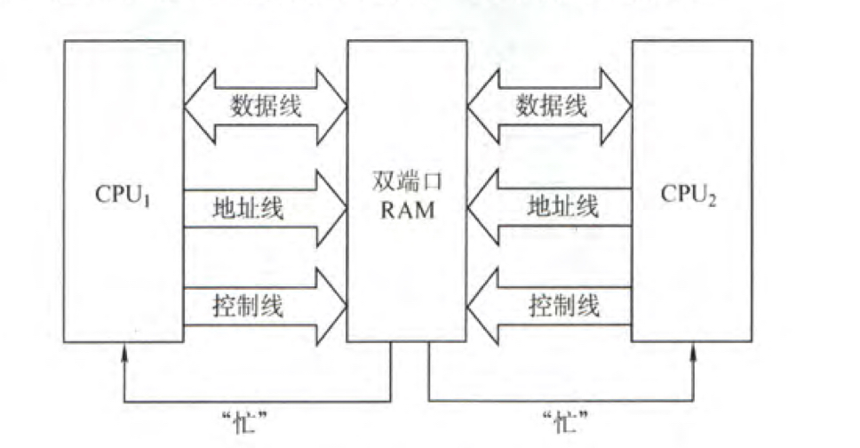
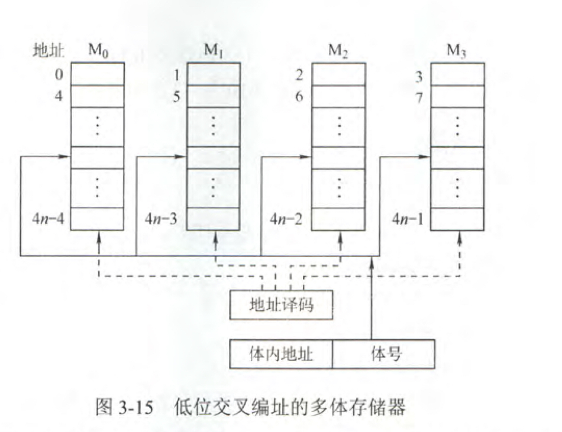
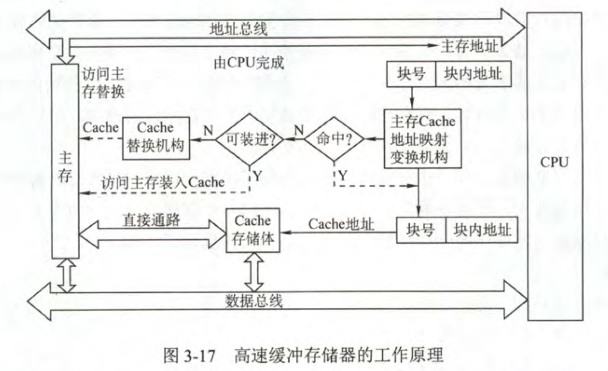

 　　【考查目标】
　　1、理解单处理器计算机系统中各部件的内部工作原理、组成结构以及相互连接方式，具有完整的计算机系统的整机概念。
　　2、理解计算机系统层次化结构概念，熟悉硬件与软件之间的界面，掌握指令集体系结构的基本知识和基本实现方法。
　　3、能够综合运用计算机组成的基本原理和基本方法，对有关计算机硬件系统中的理论和实际问题进行计算、分析，对一些基本部件进行简单设计;并能对高级程序设计语言(如C语言)中的相关问题进行分析。
　　
　

## 计算机系统概述
###计算机发展历程

第一台电子数字计算机：ENIAC (Electronic Numerical Integrator And Computer)

摩尔定律：价格不变时，集成电路上可容纳的晶体管数目约 18 个月会增加一倍。18个月后同样的钱可以买到性能是现在性能两倍的cpu。

计算机分类：
- 单指令流和单数据流系统（传统冯•诺伊曼结构）
- 单指令流和多数据流系统（向量处理系统）
- 多指令流和单数据流系统（不存在的）
- 多指令流和多数据流（多处理器系统）

计算机发展两极化：更小和更大。

### 计算机系统层次结构
#### 计算机系统的基本组成及软硬件关系

计算机系统：软件系统和硬件系统。两者在逻辑上等效（并不等价），同一功能硬件实现效率更高。

计算机系统分层结构如下图所示：

计算机硬件的基本组成

显然，冯诺伊曼计算机是指令执行的计算机系统，故其基本工作方式为控制流（指令流）驱动方式。

- 存储器
    - 存储字长：存储单元存储的二进制位数
    - 主存储器
        - MAR：用于**寻址**，位数与存储单元个数对应。长度与PC长度相等
        - MDR：长度与存储字长相等，即数据线的位数
          ps：现代计算机中MAR和MDR位于CPU中
    - 辅助存储器
- 运算器：算术运算和逻辑运算
    - Arithmetic Logical Unit ：算术逻辑单元
    - 通用寄存器：暂存操作数和中间结果，ACC、MQ、X、IX、BX等
    - 程序状态寄存器PSW
  - 控制器：指挥其他部件工作
      - PC：存放下一条执行的指令地址，取指后自增。
      - IR：存放当前执行的指令
      - CU：控制单元用来发出各种控制信号。

现代计算机：CPU=运算器+控制器

#### 计算机工作过程

1. 程序和数据装入主存
2. 从程序的起始地址运行程序
3. 从首地址取指、译指、运行，完成这条指令后并计算下一条指令的地址
4. 用新得到的指令地址继续取指、译指、执行直到程序结束为止。

### 计算机性能指标

- 吞吐量：单位时间内处理请求的数量。
- 响应时间：用户发送一个请求，系统对该请求作出响应并完成结果的时间。

- CPU时钟周期：CPU的节拍脉冲，是CPU中最小的时间单位。
- 主频（CPU时钟频率）：通俗一点就是单位时间有多少个时钟周期。
- CPI：执行一条指令所需的时钟周期数。这个属性是由硬件决定的，每个CPU在出厂时就已经决定了他的CPI，同一个CPU的CPI相等。而题目中给我们一段程序并提供指令比例和每条指令的CPI，让我们计算的是某段程序的平均CPI，所以如果通过执行不同的程序来测CPI的话，测得的计算机CPI可能是不同的。

- MIPS：Million Instructions Per Second。每秒执行多少百万条指令 也就是用主频除以CPI
- MFLOPS：MIllion Floating-point Operations Per Second，每秒执行多少百万次浮点运算，这个指标最适合用于科学计算的计算机中。

- 机器字长：计算机一次能处理的二进制位数。32bit计算机也就是一次能处理 32bit信息，一般等于内部寄存器的大小。
- 存储字长：主存每个存储单元存储的二进制 bit 数。**必须是字节的整数倍**。
- 指令字长：一条指令包含的二进制 bit 数。**长度一般取存储字长的整数倍方便存取**，如果指令字长取存储字长的2倍，那么取一条指令需要2次访存，即取指周期为存取周期的二倍。

**IR、MAR、MDR对任何程序猿都透明。**

## 数据的表示和运算
### 数制与编码
进制转换（略）

真值和机器数（略）

####Binary-Coded Decimal ：二进制编码的十进制数
- 8421码: 有权码。4bit ，每位的权值分别是8、4、2、1。它本质上还是十进制数，所以当两个8421码相加和大于9时需要修正一下，进位。
字符与字符串（略）

#### 校验码
1. 奇偶校验码
2. 海明校验码
3. CRC冗余校验
  [参考此博客](https://www.cnblogs.com/VersionP1/p/7779251.html)

### 定点数的表示和运算

### 定点数

定点数：计算机中约定机器数小数点位置，小数点的位置固定的数。

- 定点整数：小数点位置约定在最低位之后
- 定点小数：小数点位置约定在最高位之后

| 编码方式                                                     | 取值范围（n 位机器数，n从 0 开始数） | 最大值（以 8 位机器数为例）                 | 最小值                                     |
| ------------------------------------------------------------ | ------------------------------------ | ------------------------------------------- | ------------------------------------------ |
| 原码：最高位符号位，数据位为 2 进制真值                      | $ \ -2^{n} + 1$ ~ $ 2^{n} -1 $       | 符号位取 0 ，数据位全 1 。`0111 1111` : 127 | 符号位取 1，数据位全 1。`1111 1111` : -127 |
| 反码：最高位为符号位，数据位为原码取反                       | $ \ -2^{n} + 1$~ $ 2^{n} -1 $        | `0111 1111` : 127                           | `1000 0000`: -127                          |
| 补码：反码值 + 1 。权值公式为$-2^nx_n + \sum_{i=0}^{n-1}2^ix_i$ | $ \ -2^{n} $~ $ 2^{n} -1 $           | `0111 1111` : 127                           | `1000 0000` -128                           |
| 移码：补码符号位取反。                                       | $ \ -2^{n} $~ $ 2^{n} -1 $           | `1111 1111` : 127                           | `0000 0000`: -128                          |

注：无符号数的编码具有唯一性。**有符号数正数的原码、反码、补码相同**，移码与补码符号位相反。

#### 运算

##### 移位运算

* 算数移位：**左移一次为乘 2 ，右移一次为除以 2** 。
  * 算数移位的对象是带符号数，移位过程中符号位不变。
  * **正数移位直接添 0 ，负数原码反码移位直接添 0 ，补码左移添 0 ，右移添 1** 。

- 逻辑移位：添 0 
- 循环移位：带进位与不带进位的意思是数据位移动的时候带不带 CF 标志位。
  - 不带进位的循环移位：因移动而丢失掉的数据位要存储到 CF 标志位中。CF 标志位不参与循环。

##### 定点数加减运算溢出判断

溢出：运算结果超过机器可以表示的数。ps：产生进位并不等于溢出。

* 1 位符号位：两操作数符号同，结果与操作数符号不同，则溢出。
* 2 位符号位：运算结果符号位 S1 异或 S2，结果为 1 则溢出。
  * 01：正溢出
  * 10：负溢出
  * 00：结果为正数，无溢出
  * 11：结果为负数，无溢出
* 数据位最高位进位情况：与符号位进位不同则溢出。

#### 强制类型转换

C 语言中的类型转换结果保持机器数位值不变，只是改变了解释这些位的方式。

* **大字长变量向小字长变量**转换时**直接截断高位部分**
* 小字长变量向大字长变量转换时**保持低位不变，高位扩展为原数字的符号位**

### 浮点数

浮点数：小数点位置可变的数。 $ N = r^E \times M \text{, 浮点数格式定义。其中 M 为尾数，E 为阶数，r 为基数。} $

***IEEE 754标准***

$$
V = (-1)^S \times 1.M\times 2^{E-e} \text{,IEEE 754标准的浮点数真值}
$$

| 类型         | 数符 | 阶码 | 尾数 | 总位数 | 偏移量e |
| ------------ | ---- | ---- | ---- | ------ | ------- |
| 单精度浮点数 | 1    | 8    | 23   | 32     | 7FH     |
| 双精度浮点数 | 1    | 11   | 52   | 64     | 3FFH    |
| 临时浮点数   | 1    | 15   | 64   | 80     | 3FFFH   |

注：**单精度与双精度浮点数采用隐藏尾数最高位策略**，数据的最高位总是 1 ，隐藏最高位可以使尾数多表示 1 位有效位。

#### 浮点数的加减运算

#####1. 规格化两操作数

为了提高运算精度，规定尾数的最高位数必须是一个有效值。

- 单符号位规格化
  - 原码规格化后尾数**数据位最高位**为 1
  - 补码规格化后正数与原码同，负数数据位最高位为 0 ，形如  `1.0XXX XX..`
- 双符号位规格化
  - 正数：`00.1XXX XX..`
  - 负数：`11.0XXX XX..`

- 左规：尾数左移（小数点右移），阶数减小
- 右规：尾数右移（小数点左移），阶数增大

ps：基数不同时，浮点数的规格化形式也不同。当基数为 4 时，浮点数尾数最高两位不全为 0；基数为 8 时，位数最高三位不全为 0。

#####2.  对阶

使两操作数阶数相等，**小阶向大阶对齐**，阶数增大尾数右移。

##### 3. 尾数求和后规格化结果值

##### 4. 舍入

对阶和右规过程中，尾数低位可能会丢失引起误差。

- 0 舍 1 入法：尾数右移时被舍去的最高数值位为 0 则舍去；被舍去的最高数值位为 1 则在尾数的末位 +1
- 恒置 1 
- 最简单的舍入方法是直接截断不做处理

##### 浮点数溢出判断：阶码是否超过取值范围。

下溢时仅当作机器 0 处理，上溢时计算机必须中断运算操作并进行溢出处理。

## 存储器

常识：CPU-Cache-主存-辅助存储器构成计算机的三级存储系统

### 半导体随机存储器
#### SRAM：静态随机存储器
- 工作原理：触发器，所以即使信息被读出也不需要再生。
- 存取速度相比DRAM更快，所以价格贵得多，一般用来做cache
- 地址线引脚数：贵而且容量相对小，所以地址不需要分两次传，一次就行。

#### DRAM：动态随机存储器

- 工作原理：电容电荷存储信息。初中生都知道电容上的电荷只能维持一段时间，所以不需要读取，DRAM上的信息自己就消失了，所以每隔一段时间需要**刷新**。
- 价格相对SRAM较低，需要刷新，一般用来做主存
- 主存地址单元的个数就相对非常多了，所以DRAM采用了地址复用技术，地址线时原来的二分之一，而且地址信号分行、列两次传送

> - 集中刷新：利用一段固定时间依次对存储器的所有进行逐一再生，期间禁止对存储器的读写操作。
> - 分散刷新：把对每一行的刷新分散到各个工作周期，前一半正常读写，有一半用来刷新某一行，所以如果计算机的存取周期是芯片的存取周期二倍。
> - 异步刷新：将刷新周期除以行数得到两次刷新之间的时间间隔t，每隔t刷新一次。这样可以避免延长存取周期，也大大缩小了死时间。

#### ROM：只读存储器

ROM也是随机读取的存储器，信息一旦写入就固定不变了，即使断电也不会丢失，所以通常使用ROM存放一些固定不变的程序和数据，还有操作系统的固化。**RAM和ROM共同组成计算机主存的一部分**。

- MROM：不可改变
- PROM：一次可编程
- EPROM：可擦除可编程。可以把ROM中原来的数据全部擦掉再重新写。虽然它可读又可写，但绝对不可以替代RAM，因为写的速度很慢。
- FLASH Memory：可以在不加电的情况下长期保存信息，U盘就是用的flash芯片。
- Solid Memory：基于闪存的固态硬盘由控制单元和存储单元（FLASH）组成，速度快，功耗低，但是贵。

### 主存储器和CPU的连接

考试一般不会让画图，但是地址空间，字扩展、位扩展、字位扩展、芯片选择要会。

#### 双口RAM

双口RAM：有左、右两个独立的端口，分别具有两组相互独立的地址线、数据线和读写控制线，允许两个独立的控制器同时异步地访问存储单元。

当两个端口访问同一地址单元时，不可以同时对一个地址单元写入，会出现写入错误；也不可以两个端口一个在写一个读，会出现读出错误。

#### 多模块存储器

1. 单体多字存储器：一个存储体，每个存储单元可以存放n个字，同样总线宽度也是n个字。

2. 多体并行存储器

   1. 高位交叉编址：主存地址结构分为体号和体内地址两部分，它依然是顺序存储器！

   2. **低位交叉编织** ：主存地址结构低位为体号，高位位体内地址。程序连续存放在相邻体中，所以多体可以用流水线的方式并行存取。连续存取m个字所需的时间为 
      $$
      t = T + (m-1)r		 {\text{，T:存取周期 r：总线传输周期}}
      $$
      

### Cache ：局部性原理

- 时间局部性：现在用到的信息很可能是将来又要用到的，比如循环的判断语句。
- 空间局部性：未来要用到的信息与现在正在放访问的数据在存储空间上是邻近的。

那么我们就可以开辟一小片相对主存教高速的区域，专门用来存放某段时间内需要访问的数据，这就是cache，通常由SRAM构成，位于CPU内部。

着重要搞清楚三种主存地址映射结构、cache标记阵列这里主要是需要练习各种习题深入理解。

## 指令系统

### 指令格式

### 指令寻址方式

- 指令寻址
  - 顺序寻址：pc+1，自动形成下一条指令的地址
  - 跳跃寻址：转移类指令给出的下条指令地址。给出的地址传到PC中，跳跃与否还要受到PSW和操作数的控制。
- 数据寻址
  - 隐含寻址
    - 堆栈计算机中的0地址指令操作数来自栈顶和次栈顶
    - 一地址指令隐含约定目的地址的双操作数指令（规定ACC作为第二操作数的地址）
  - 立即数：无需访存
  - 直接寻址：一次访存
  - 间接寻址：两次访存
  - 寄存器寻址：访问寄存器
  - 寄存器间接：访问寄存器+主存
  - 相对寻址：pc+偏移量再访存
  - 基址寻址：BX+偏移量在访存。面向操作系统，解决程序逻辑空间与存储器物理空间的无关性。
  - 变址寻址：IX+偏移量再访存。面向用户，常用于数组处理，将数组首地址设置为A，不断改变IX的值形成数组中的任意数据的地址。
  - 堆栈寻址：硬堆栈（寄存器）和软堆栈（主存程序划定一段区域）。

### Complex Instruction Set Computer和Reduced Instructions Set Computer

CISC：指令系统复杂庞大，指令长度不固定，寻址方式也很多。各种指令都可以访存，但各种指令的使用频度相差很大，各种指令的执行时间相差也很大。控制器多采用微程序控制，控制器在CPU芯片内所占的面积占百分之50以上，难以优化编译生成高效的目标代码程序。

RISC：选取使用频率最高的一些指令，其余指令的功能由简单指令组合实现；指令长度固定，格式种类较少，寻址方式也少。只有Load和Store指令可以访存，其余指令都在寄存器之间进行，CPU中的寄存器数量很多。采用流水线技术，大部分指令在一个时钟周期内完成；以硬布线控制为主，只占CPU芯片面积的百分之十，重视编译优化工作。

