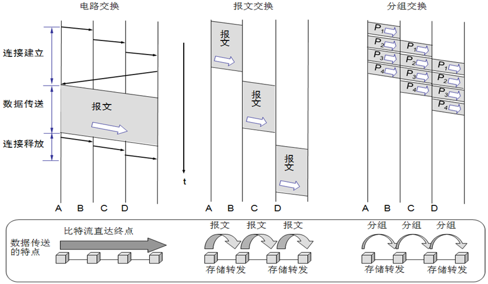
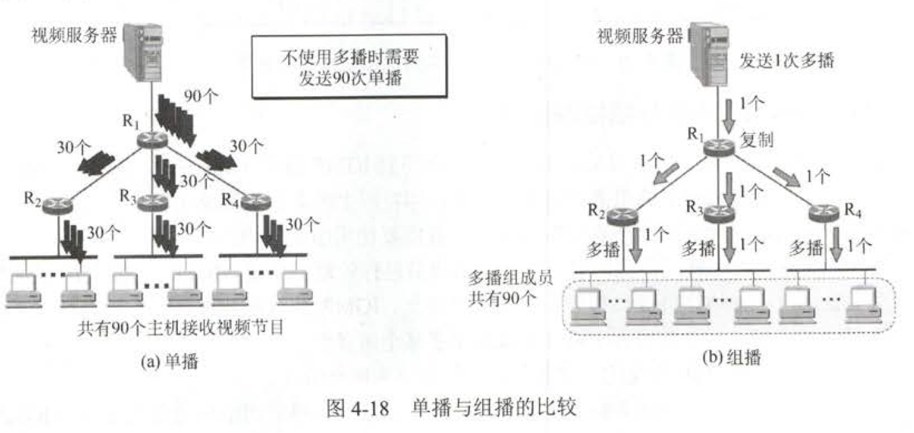
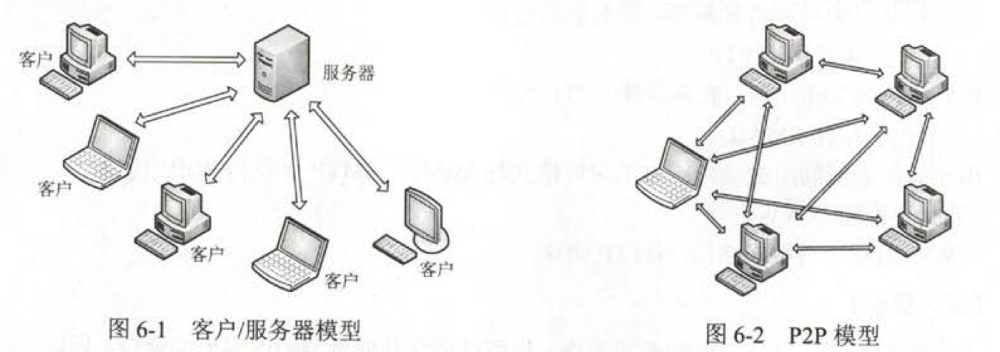
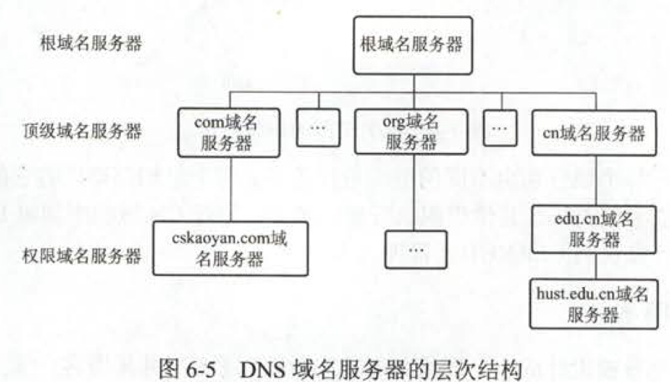
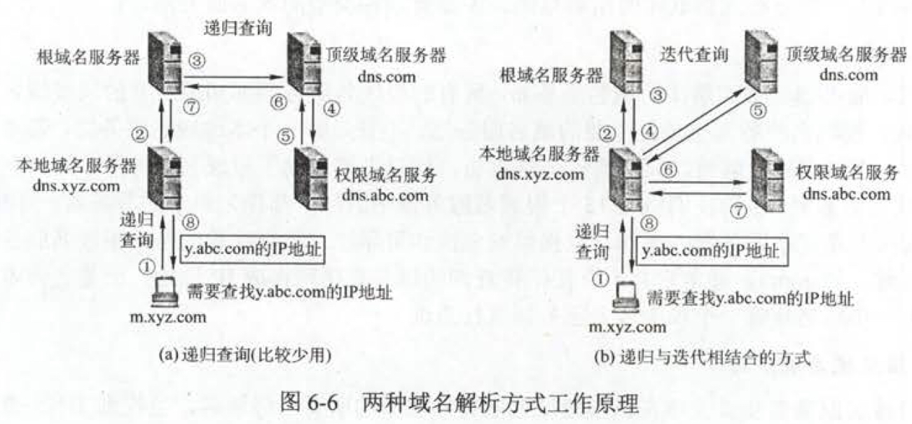
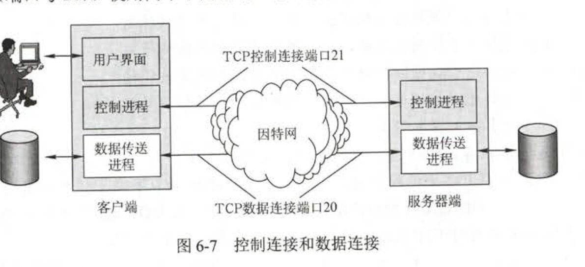
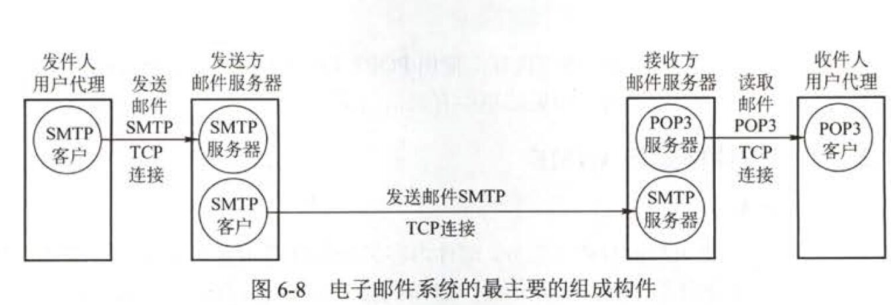

计算机网络
=================

* [物理层](#%E7%89%A9%E7%90%86%E5%B1%82)
  * [通信基础](#%E9%80%9A%E4%BF%A1%E5%9F%BA%E7%A1%80)
    * [基本概念与计算](#%E5%9F%BA%E6%9C%AC%E6%A6%82%E5%BF%B5%E4%B8%8E%E8%AE%A1%E7%AE%97)
    * [编码与调制](#%E7%BC%96%E7%A0%81%E4%B8%8E%E8%B0%83%E5%88%B6)
    * [三种数据交换方式](#%E4%B8%89%E7%A7%8D%E6%95%B0%E6%8D%AE%E4%BA%A4%E6%8D%A2%E6%96%B9%E5%BC%8F)
    * [数据报与虚电路](#%E6%95%B0%E6%8D%AE%E6%8A%A5%E4%B8%8E%E8%99%9A%E7%94%B5%E8%B7%AF)
  * [传输介质](#%E4%BC%A0%E8%BE%93%E4%BB%8B%E8%B4%A8)
  * [物理层设备](#%E7%89%A9%E7%90%86%E5%B1%82%E8%AE%BE%E5%A4%87)
* [数据链路层](#%E6%95%B0%E6%8D%AE%E9%93%BE%E8%B7%AF%E5%B1%82)
  * [任务](#%E4%BB%BB%E5%8A%A1)
  * [组帧](#%E7%BB%84%E5%B8%A7)
  * [差错控制](#%E5%B7%AE%E9%94%99%E6%8E%A7%E5%88%B6)
  * [流量控制](#%E6%B5%81%E9%87%8F%E6%8E%A7%E5%88%B6)
  * [介质访问控制](#%E4%BB%8B%E8%B4%A8%E8%AE%BF%E9%97%AE%E6%8E%A7%E5%88%B6)
    * [信道划分（静态划分）](#%E4%BF%A1%E9%81%93%E5%88%92%E5%88%86%E9%9D%99%E6%80%81%E5%88%92%E5%88%86)
    * [随机访问（动态分配、争用型）](#%E9%9A%8F%E6%9C%BA%E8%AE%BF%E9%97%AE%E5%8A%A8%E6%80%81%E5%88%86%E9%85%8D%E4%BA%89%E7%94%A8%E5%9E%8B)
    * [轮询访问（动态分配、集中控制）](#%E8%BD%AE%E8%AF%A2%E8%AE%BF%E9%97%AE%E5%8A%A8%E6%80%81%E5%88%86%E9%85%8D%E9%9B%86%E4%B8%AD%E6%8E%A7%E5%88%B6)
    * [错题](#%E9%94%99%E9%A2%98)
  * [局域网](#%E5%B1%80%E5%9F%9F%E7%BD%91)
    * [以太网](#%E4%BB%A5%E5%A4%AA%E7%BD%91)
    * [IEEE 802\.11](#ieee-80211)
    * [令牌环网的基本原理](#%E4%BB%A4%E7%89%8C%E7%8E%AF%E7%BD%91%E7%9A%84%E5%9F%BA%E6%9C%AC%E5%8E%9F%E7%90%86)
  * [广域网](#%E5%B9%BF%E5%9F%9F%E7%BD%91)
    * [Point to Point Protocol](#point-to-point-protocol)
    * [High\-level Data Link Control](#high-level-data-link-control)
  * [数据链路层设备](#%E6%95%B0%E6%8D%AE%E9%93%BE%E8%B7%AF%E5%B1%82%E8%AE%BE%E5%A4%87)
    * [网桥](#%E7%BD%91%E6%A1%A5)
    * [局域网交换机](#%E5%B1%80%E5%9F%9F%E7%BD%91%E4%BA%A4%E6%8D%A2%E6%9C%BA)
* [网络层](#%E7%BD%91%E7%BB%9C%E5%B1%82)
  * [网络层的功能](#%E7%BD%91%E7%BB%9C%E5%B1%82%E7%9A%84%E5%8A%9F%E8%83%BD)
  * [路由算法](#%E8%B7%AF%E7%94%B1%E7%AE%97%E6%B3%95)
    * [静态路由与动态路由](#%E9%9D%99%E6%80%81%E8%B7%AF%E7%94%B1%E4%B8%8E%E5%8A%A8%E6%80%81%E8%B7%AF%E7%94%B1)
    * [距离\-向量路由算法](#%E8%B7%9D%E7%A6%BB-%E5%90%91%E9%87%8F%E8%B7%AF%E7%94%B1%E7%AE%97%E6%B3%95)
    * [链路状态路由算法](#%E9%93%BE%E8%B7%AF%E7%8A%B6%E6%80%81%E8%B7%AF%E7%94%B1%E7%AE%97%E6%B3%95)
    * [层次路由](#%E5%B1%82%E6%AC%A1%E8%B7%AF%E7%94%B1)
  * [IPv4](#ipv4)
    * [Address Resolution Protocol](#address-resolution-protocol)
    * [Dynamic Host Configuration Protocol](#dynamic-host-configuration-protocol)
    * [ICMP](#icmp)
  * [IPv6](#ipv6)
  * [路由协议](#%E8%B7%AF%E7%94%B1%E5%8D%8F%E8%AE%AE)
    * [RIP路由协议（距离向量算法）](#rip%E8%B7%AF%E7%94%B1%E5%8D%8F%E8%AE%AE%E8%B7%9D%E7%A6%BB%E5%90%91%E9%87%8F%E7%AE%97%E6%B3%95)
    * [OSPF路由协议（链路状态算法）](#ospf%E8%B7%AF%E7%94%B1%E5%8D%8F%E8%AE%AE%E9%93%BE%E8%B7%AF%E7%8A%B6%E6%80%81%E7%AE%97%E6%B3%95)
    * [BGP路由协议](#bgp%E8%B7%AF%E7%94%B1%E5%8D%8F%E8%AE%AE)
  * [IP组播](#ip%E7%BB%84%E6%92%AD)
    * [IGMP与组播路由算法](#igmp%E4%B8%8E%E7%BB%84%E6%92%AD%E8%B7%AF%E7%94%B1%E7%AE%97%E6%B3%95)
  * [网络层设备：路由器](#%E7%BD%91%E7%BB%9C%E5%B1%82%E8%AE%BE%E5%A4%87%E8%B7%AF%E7%94%B1%E5%99%A8)
* [应用层](#%E5%BA%94%E7%94%A8%E5%B1%82)
  * [CS、P2P](#csp2p)
  * [Domain Name System](#domain-name-system)
  * [File Transfer Protocol: C/S](#file-transfer-protocol-cs)
  * [SMTP\\POP3](#smtppop3)
  * [World Wide Web](#world-wide-web)
    * [超文本传输协议HTTP](#%E8%B6%85%E6%96%87%E6%9C%AC%E4%BC%A0%E8%BE%93%E5%8D%8F%E8%AE%AEhttp)

【考查目标】

1. 掌握计算机网络的基本概念、基本原理和基本方法。
2. 掌握计算机网络的体系结构和典型网络协议，了解典型网络设备的组成和特点，理解典型网络设备的工作原理。
3. 能够运用计算机网络的基本概念、基本原理和基本方法进行网络系统的分析、设计和应用。

## 物理层

### 通信基础

#### 基本概念与计算

**基础概念**

- 数据：传送信息的实体
  - 模拟数据
  - 数字数据
- 信号：数据的电气的或电磁的表现，数据传输过程中的形式
  - 模拟信号：连续变化的数据
  - 数字信号：取值仅允许为有限的几个离散数值的数据 
- 码元：用 1 个固定时长的数字脉冲表示 1 位 k 进制数字，这个时长内的信号成为 k 进制码元， 时长称为码元宽度。
- 信道：产生和发送数据的源头
- 信宿：接收数据的终点
- 信道：信号的传输介质。不同于电路，信道可以看作是线路的逻辑部件。
- 基带传输：将数字信号 0 和 1 用两种不同的电压表示（基带信号），再送到数字信道传输。
- 宽带传输：将基带信号调制后形成频分复用模拟信号，送到模拟信道传输。
- 码元传输速率：单位时间内数字通信系统所传输的码元个数（信号变化的次数）。单位为 `Baud` 
- 信息传输速率：单位时间内数字通信系统传输的二进制码元个数（比特数）。
- 带宽：单位时间内从网络中的某一点到另一点所能通过的"最高数据率"。单位 1 Hz = 1 b/s

#### 编码与调制

- 调制：数据变换为模拟信号；
- 编码：数据变换为数字信号。

信号不是数据，是数据的表现形式。数据分为数字数据和模拟数据两种，信号分为数字信号和模拟信号两种，两两搭配共有 4 种编码方式。

- 数字数据转数字信号
  - 非归零码：低电平表示 0，高电平表示 1（或相反）。
    - 容易实现但没有检错功能，也无法判断一个码元的开始和结束。
  - **曼彻斯特编码**：一个码元分成两个相等间隔 ，向上跳变为 0，向下跳变为 1（或相反）。
    - 以太网的编码方式；
    - 1 bit 需由两个脉冲表示，即 1 码元携带 1/2 bit信息量；
    - 位中间的跳变既作时钟信号用于同步，又作数据信号。
  - 差分曼彻斯特编码：两码元间发生跳变为 0，不发生跳变为 1 。
    - 每个码元中间都有一次电平跳转，可以实现同步。
- 数字数据调制为模拟信号
- 模拟数据编码为数字信号
  - 抽样：对模拟信号进行周期性扫描，连续信号离散化。**采样的频率 >= 2*模拟数据的频带带宽**时，所得到的离散信号可以无失真地代表被抽样的模拟数据；
  - 量化：抽样得到的**电平幅值**转化成对应的**数字值**并取整数。
  - 编码：把量化的结果转换成**对应的二进制编码**。
- 模拟数据调制为模拟信号

#### 三种数据交换方式

- 电路交换：通信前两结点间必须建立一条专用的物理通信路径，该线路在整个数据传输期间一直被独占，直到通信结束后才释放。
  - 优点：通信时延小、有序传输、没有冲突、实时性强等；
  - 缺点：建立连接时间长、线路独占、灵活性差。
  - 应用场景：打电话。
- 报文交换：数据交换的单位是**报文（Message）**，在结点中采用存储转发的方式。
  - 优点：无需建立连接、多目标服务、线路利用率较高等；
  - 缺点：报文大小没有限制，发送时延和接收时延过长。
  - 应用场景：电报。
- 分组交换：数据交换以**分组（package）**为单位，把数据块分为大小合理的小数据块再加上必要再控制信息在结点间进行存储转发式传输。
  - 优点：无需建立连接、流水线方式传输、出错几率较小等；
  - 缺点：需要传输额外的信息量、分组在传输过程中可能会失序、丢失。
  - 应用场景：计算机之间的突发式数据通信。

#### 数据报与虚电路

- 数据报服务：尽最大努力的存储转发交换方式；
- 虚电路：分组发送前建立一条逻辑上相连的虚电路，通信结束后要释放虚电路，回收分配的相关资源。
  - 当网络中某个结点或某条链路出现故障而彻底失效时，则所有经过该结点或该链路的虚电路将经过破坏。
  - 包括永久性虚电路和交换型虚电路（会话结束释放）。

### 传输介质

- 双绞线：两根绞合、相互绝缘的铜导线组成。**绞合可减少相邻导线的电磁干扰**。
  - 非屏蔽双绞线UTP
  - 屏蔽双绞线STP
  - 远距离传输时，数字信号要使用**中继器**将失真的信号整形；模拟信号要使用**放大器**对衰减的信号进行放大。
- 同轴电缆
  - 基带同轴电缆：应用于局域网；
  - 宽带同轴电缆：应用于有线电视系统。
- 光纤：利用光的折射原理。
- 无线介质：无线电波、微波、红外线和激光等。

物理层接口特性：

- 机械特性：定义物理连接的边界点，如引脚数目、物理连接所采用的规格等；
- 电气特性：规定传输二进制位时，线路上信号的电压高低、阻抗匹配等；
- 功能特性：指出某条线上的某一点评的电压表示什么**意义**。
- 规程特性：定义各物理线上的**工作规程和时序关系**。

### 物理层设备

中继器（转发器）：将信号整形并放大再转发出去，其原理是**信号再生**。中继器没有存储转发功能，因此不能连接两个速率不同的网段。

**5-4-3规则**：在采用粗同轴电缆的 10BASE5 以太网规范中，互相串联的中继器个数不能超过 4 个，而且用 4 个中继器串联的 5 段通信介质中只能由 3 个段可以挂接计算机。

集线器：实质上是一个多端口中继器。Hub对接受到的信号进行整形放大，使之再生到发送时的状态，紧接着转发到其他所有处于工作状态的端口上。

集线器**不具备信号的定向传输能力**，也不能分割冲突域。

## 数据链路层

### 任务

- 为网络层提供服务：有无确认和有无连接组成的三种服务（没有有连接无确认的五福）；
- 链路管理；
- 帧定界、帧同步和透明传输；
- 流量控制：限制发送方的数据流量使其 <= 接收方的接受能力；
- 差错控制。

### 组帧

- 字符计数法：在帧头部设置一个计数字段表明帧内字符数。
  - 计数字段出错，收发双发失去同步。
- 字符填充的首位定界符法：使用特定字符界定一帧的开始（DLE STX）与结束（DLE ETX），当帧中出现DLE字符，发送在DLE前再插入 1 个DLE字符，接收方收到时会删除插入的DLE。
- 比特填充的首位标志法：发送方的数据链路层在信息位中遇到 5 个连续的 1 时，自动在其后插入一个 0；接收方每收到 5 个连续 1，则自动删除后面紧跟的 0 。
- 违规编码法：在**物理层**比特编码通常采用此方法，借用违规编码序列界定帧的起始和终止。

### 差错控制

利用编码技术进行差错控制，主要有自动重传请求和前向纠错两种方式。前者是接收端检测出差错时，通知发送端重发，直到收到正确的码字为止；后者接收端不仅能发现差错，而且能确定二进制数码的错误位置以加以纠正。

- 检错编码
  - 奇偶校验位
  - CRC冗余校验
- 纠错编码：海明码

### 流量控制

数据链路层的流量控制是限制**发送方**发送数据的速率。

接受端的接受窗口：每收到一个数据后，接收窗口就向后滑动一个位置并返回确认帧。

发送端的发送窗口：发出一个数据后设置一个计时器，**收到确认帧后发送窗口向后滑动**一个位置，如果超时则重新发送数据帧。

停止等待协议：发送窗口为1，接收窗口为1。

后退 N 帧：接收窗口为1。

故停止等待协议和后退 N 帧协议可以保证帧的有序接收。

当 n = 3 时，帧的序号为 0 - 7，此时若发送窗口 = 8，接收窗口每收到一个数据帧都会发送一个确认帧，窗口向前滑8个后指向下一组的 0 ，若 8 个确认帧全部丢失，发送端序号为 0 的数据帧会超时重发，接收端再收到序号为 0 的数据帧时会误以为是新的帧，此时就出现了差错。可以看到，若发送窗口 = 7 时就不会出现这种情况。

选择重传协议，新窗口序号和旧窗口序号不应该拥有同样的序号。故发送窗口 = 接收窗口 <= 2^(n-1)

可以看到当发送窗口与接收窗口的个数 = 5 时，发送端发送5个数据后等待，接收端收到数据帧后向后滑动 5 个并发送确认帧，此时接收窗口中会含有下一轮序号为 0 的数据帧，若确认帧丢失，发送端超时重传时又会出现新旧帧不分的错误。

可靠传输由**确认**和**超时重传**两种机制保证。确认即接收方发送给发送方的控制帧，高速发送方哪些帧被正确接收了；有时为了高效，将确认捎带在一个回复帧中。超时重传则是发送法在一定时间内没有收到确认帧将会重发该数据帧。

自动重传请求ARQ：接收方请求发送方重传出错的数据帧来恢复出错的帧。分为停等式 ARQ、后退 N 帧 ARQ 及选择性重传ARQ。

### 介质访问控制

任务：为使用介质的每个结点***隔离来自同一信道上其他结点所传送的信号***。

#### 信道划分（静态划分）

- 频分复用：将多种基带信号调制到不同频率载波上再进行叠加形成一个复合信号
- 时分复用：将一条信道分成若干时间片，轮流分配给多个信号使用
  - STDM 异步时分复用：动态分配时隙的时分复用
  - 4个用户使用线路传输速率为 8000b/s 的通信线路，TDM 每个用户最多2000b/s，STDM可以达到8000b/s
- 波分复用：光的频分多路复用。根据光的波长不同划分。
- 码分复用：靠不同的编码区分各路原始信号。
  - 比如说A、B、C三个站共享一个信道，A站发送的码片向量为 S，C 站想接受来自 A 站的数据，就把**结果的码片向量和 A 的码片向量做内积再除以码片向量的长度**，即可得到 A 发来的数据。

#### 随机访问（动态分配、争用型）

常用：ALOHA协议、CSMA协议、**CSMA/CD**协议、CSMA/CA协议。

- ALOHA ： 共享同一信道上的所有主机随时都可以发送数据，如果在一段时间没收到确认则认为发生了冲突。等待一段时间后再次发送数据直到发送成功。
- CSMA：监听信道，信道空闲才可发送
  - 1-坚持型：信道忙则持续监听信道
  - 非坚持型：信道忙则放弃监听，等待下一个随机时间再监听
  - p-坚持型：信道空闲以 p 概率发送数据，若信道忙采用非坚持的策略
- **CSMA/CD**                                                                                                                                                                                                                                                                                                                                                                                                                                                                                                                                                                                                                                                                                                                              
  - ***载波监听*** ：适配器从父节点获得一个网络层数据报，准备一个以太网帧并把该帧放到适配器缓冲器中。如果信道空闲开始传输，否则暂时不要发送。
  - ***碰撞检测*** ：传送过程中，适配器会一直检测来自其他适配器的信号能量是否出现。
  - ***冲突停发***：传输过程中如果检测到其他适配器的信号，停止传输并传输一个48bit的拥塞信号。
  - ***随机重发***：发送拥塞信号之后，采用截断**二进制指数退避算法**等待一段时间后回到终止前的状态继续发送。

- CSMA/CA(碰撞避免)：应用于无线局域网中

> 注：CSMA/CD中为了确保 **发送数据的同时能检测到可能存在的冲突**，需要在发送完帧之前就能收到自己发出去的数据。***最小帧长 = 总线传播时延 * 数据传输速率 * 2 ***
>
> 二进制指数退避算法（基本退避时间取争用期2τ）：k = min{重传次数，10}，从整数集合{0,1,2,3 …… 2^k-1}随机取出一个数 r，等待r倍的基本退避时间后重新发送。重传16次仍无法成功传输报告给高层。

#### 轮询访问（动态分配、集中控制）

通过一个集中控制的监控站，以循环的方式轮询每个结点再决定信号的分配。令牌在各节点中以某个固定次序交换，它是一组特殊的比特组合而成的帧。只有拿到令牌的计算机才能发送数据帧，所以不会冲突。

#### 错题

1. 从表面上看，FDM比TDM能更好地利用信道的传输能力，但现在的计算机网络更多地使用TDM而不是FDM，其原因是 **TDM可用于数字传输而FDM不行**。`FDM：模拟信号，TDM：数字信号`

### 局域网

局域网（Local Area Network, LAN）：在一个较小的地理范围内将各种计算机、外部设备和数据库系统等通过双绞线、同轴电缆等连接截止互相连起来组成资源和信息共享的计算机互联网络。

IEEE 802定义的局域网模型只对应 OSI 模型中的**数据链路层和网络层**。数据链路层拆分成逻辑链路控制 LLC 子层和介质访问控制 MAC 子层。

#### 以太网

以太网采用**总线型结构**，信息已**广播**方式发送；尽最大努力交互数据，对于差错的纠正由高层实现。

以太网传输介质：粗缆（10BASE5）、细缆（10BASE2）、双绞线（10BASE-T）和光纤（10BASE-FL）。

计算机与局域网的连接通过主机箱内插入一块网络接口板，又称网络适配器或网卡。全世界每个网卡在出厂时都有唯一的代码，即介质访问控制 MAC 地址。网卡工作在物理层。

MAC地址：6B，高 24bit 为厂商代码，低 24bit 为厂商自动分配的网卡序号。

《以太网MAC帧格式》

PS：MAC帧不需要帧结束符；以太网 MAC 帧既要加首部也要加尾部，因为其在数据链路层传输。

- 100BASE-T以太网：支持半双工和全双工。
- 吉比特以太网：允许在 1Gb/s 下用全双工和半双工两种方式。
- 10吉比特以太网：只工作在全双工方式。

#### IEEE 802.11

无线局域网的一系列协议标准，采用CSMA/CA协议进行介质访问控制。

PS：在无线局域网中，即使冲突了也要把整个帧发送完毕。

- 有固定基础设施的无线局域网
- 无固定基础设置的无线局域网字组织网络

#### 令牌环网的基本原理

令牌环网的每一站通过电缆与环接口干线耦合器 TCU相连。在令牌环网中有一个令牌沿着环形总线在入网结点计算机间依次传递。

1. 网络空闲时，环路中只有令牌帧循环传递；
2. 令牌传递到要发送数据的站点时，该站点修改令牌的标志位，并在令牌中附加自己要传输的信息。这样令牌就变成了**数据帧**，然后将这个数据帧发送出去；
3. 数据帧沿着环路传输，接收到的站点一边转发数据一边查看帧的目的地址，和自己地址相同就接受并处理；
4. 数据帧沿着环路转一圈后，源站点接受到自己发出的数据帧便不再进行转发。
5. 源站点发送完之后重新产生一个令牌，并将令牌传给下一个站点。

### 广域网

广域网由一些结点**交换机**以及连接这些交换机的链路组成。广域网结点间都是点对点连接，但为了提高网络的可靠性，一个结点交换机往往和多个交换机相连。

#### Point to Point Protocol

PPP是适用串行线路通信的**面向字节**的协议，该协议应用在直接连接两个结点的链路之上。用来通过拨号或专线方式建立点对点连接发送数据，使其成为各种主机、网桥和路由器之间简单连接的一种共同的解决方案。

- 链路控制协议 LCP：建立、配置、测试和管理数据链路。
- 网络控制协议 NCP：PPP允许采用多种网络层协议，每个不同的网络层协议用一个相应的 NCP配置，为网络层协议建立和配置逻辑连接。
- 一个将 IP 数据报封装到串行链路的方法

PS：PPP是不可靠的传输协议，只支持全双工链路。

#### High-level Data Link Control

高级数据链路控制协议是**面向比特**对数据链路层协议。该协议使用 0 bit填充法；全双工个通信；所有帧采用 CRC 校验；对信息帧进行数据编号；传输控制功能与处理功能分离。

- 非平衡配置：由一个主站控制整个链路的工作；
- 平衡配置：链路两端的两个站都是复合站，每个复合站都可以平等地发起数据传输，不需要对方的许可。

数据操作方式：

- 正常响应方式（非平衡）：主站向从站传输数据，从站进行响应传输。**从站只有在收到主站许可后**，才可进行响应；
- 异步平衡方式：每一个复合站都可以进行对另一站的数据传输；
- 异步响应方式（非平衡）：从站没有接到主站允许也可以进行传输。

HDLC帧分为三类：信息帧（I）、监督帧（O，用于流量控制和差错控制）和无编号帧（U，提供对链路的建立和拆除等控制功能）

PS：HDLC可以提供可靠传输。

### 数据链路层设备

#### 网桥

两个或多个以太网通过网桥连接起来后成为一个更大的以太网，而原来的每个以太网可成为一个网段。即**网桥可以隔离碰撞域**。

- 具备寻址和路径选择能力，以确定帧的传输方向；
- 从源网络接受帧，以目的网络的介质访问控制协议向目的网络转发该帧；
- 在不同或相同类型的 LAN 之间存储并转发帧；
- 对收到的帧不做任何修改，或只对帧的封装格式作很少的修改；
- 通过帧翻译互联不同类型的局域网，即把原协议内容的信息段的内容作为另一种协议的信息部分封装在帧中；
- 缓冲接收方来不及接收的帧。

广播风暴：传播过多的广播信息而产生网络拥塞。

- 透明网桥：选择的不是最佳路由；
- 源路由网桥：选择的是最佳路由。

PS：最佳路由是发送帧往返时间最短的路由。

#### 局域网交换机

交换机本质上是多端口网桥，每个端口就是一个冲突域。

虚拟局域网VLAN：将交换机的多个端口划分为一个冲突域。**VLAN不仅可以隔离冲突域，也可以隔离广播域。**

- 直通式交换机；只检查帧的目的地址，接收后几乎立刻就能发出去。但无法支持不同速率的端口的交换。
- 存储转发式交换机：先将接收到的帧缓存到高速缓存器中，并检查数据是否正确，确认无误后通过查找表转换成输出端口将该帧发送出去。有错则丢弃。

## 网络层

### 网络层的功能

- 异构网络互联：通过使用 IP 协议，使互联起来的各种物理网络的异构性看起来好像是一个统一的网络。
- 路由与转发：按照分布式算法，根据从各相邻路由器所得到的关于整个网络的拓扑的变化情况，动态地改变所选择的路由；根据转发表将用户的 IP 数据报从合适的端口转发出去。 
- 拥塞控制：确保通信子网能够传送待传送的数据，不同于流量控制，是一个全局性的问题。
  - 开环控制：设计网络时事先将有关发生用色的因素考虑周到；
  - 闭环控制：基于反馈环路的概念，通信过程中动态调整拥塞。

### 路由算法

#### 静态路由与动态路由

- 静态：管理员手动配置；
- 动态：通过相互联接的路由器之间彼此交换信息，按照一定的算法优化；并且信息在一定时间间隙里不断更新，以适应不断变化的网络。

#### 距离-向量路由算法

- 定时发送
- 向相邻结点发送
- 自己的整个路由表
- 通过迭代计算一条路由中的站段数或延迟时间

PS：距离是一个抽象的概念，比如 RIP 使用跳数作为距离的度量。

#### 链路状态路由算法

- 发生变化时发送；
- 向所有结点发送（泛洪法）；
- 只发送与路由器相邻的所有路由器的链路状态；
- 每个结点以广播的方式交谈。

PS：每个结点知道全部的结点信息独自计算，不同于距离-路由向量算法，依靠相邻结点的计算结果。

#### 层次路由

因特网将互联网划分为许多较小的自治系统，每个自治系统可以自主决定本系统内采用何种路由选择协议。

- 内部网关协议（IGP）：自治系统内部使用，比如RIP、OSPF等；
- 外部网关协议（EGP）：自治系统之间使用，比如BGP；

### IPv4

《理解》

#### Address Resolution Protocol

每个路由器依据转发表转到目标网络后，在网络内部通过数据链路层的 MAC 地址以广播方式寻址。

ARP 解决同一个局域网上的主机或路由器的 IP 地址和硬件地址的映射问题。

工作原理：局域网内的某主机 A 向 B 发送 IP数据报时，**首先在自己的 ARP 高速缓存表中查找有没有 B 的 MAC 地址**，有则写入 MAC 帧目的 MAC 字段并发送 MAC 帧；否则就使用目的 MAC 地址为 **FF-FF-FF-FF-FF-FF**的帧来封装**广播** ARP 请求分组。主机 B 收到该请求后以**单播**的方式向 A 发出 ARP响应分组。

由于 ARP 协议看到了 IP 地址，所以其工作在网络层。

#### Dynamic Host Configuration Protocol 

DHCP 用于给主机动态分配 IP 地址，是**基于 UDP 的应用层协议**。

工作原理：需要 IP 地址的主机在**启动时**向 DHCP服务器广播发送**发现报文**；DHCP服务器收到后回答此广播报文。DHCP服务器先在其数据库中查找该计算机的配置信息，若找到，则返回找到的信息；否则从服务器的IP地址池中取一个分配给该计算机，该报文成为 **提供报文**。

客户机收到提供报文后，如果接受 DHCP 提供的相关参数，就发送给 DHCP 服务器请求报文，请求提供 IP 地址，DHCP 服务器广播 DHCP确认消息，将 IP 地址分配给客户机。

网络上可以配置多台 DHCP 服务器，主机可以挑选其中一个 DHCP 服务器提供的 IP地址。

#### ICMP

- ICMP 差错报文
  - 终点不可达：路由器或主机无法交互数据时发送给源主机；
  - 源点抑制：路由器或主机由于拥塞而丢弃数据报，告诉源点把发送速率降低一点；
  - 时间超过：TTL = 0 的报文，丢弃 + 发送给源点时间超过报文；
  - 参数问题：丢弃 + 发送给源点参数问题报文；
  - 路由重定向：高速源主机下次将数据报发给别的路由器；
- ICMP 询问报文：Ping 和 Tracert

### IPv6

- 长度为 128 bit，解决 IP 地址耗尽问题。
- 与其他因特网协议兼容
- 目的地址
  - 单播：传统点对点通信；
  - 多播：分组被交付到一组计算机的每一个；
  - 任播：目的站是一组计算机，但数据报在交付时只交付其中一个，通常是距离最近的一个。

### 路由协议

#### RIP路由协议（距离向量算法）

- 网络中的每一个路由器维护从它自己到每一个目的网络的距离记录；
- 跳数规定从一路由器到直接连接的网络距离为 1；每经过一个路由器，路由跳数 + 1；
- 允许一条路径最多包含 15 个路由器；16 表示不可达；
- 默认每 30 秒广播一次 RIP 路由更新信息；
- RIP 不支持子网掩码的 RIP 广播；RIP2 支持变长子网掩码和 CIDR；

当网络出现故障时，会出现慢收敛现象，即需要较长时间才能将此信息传送到所有路由器。

**RIP 是基于 UDP 的应用层协议。**

#### OSPF路由协议（链路状态算法）

- 使用洪泛法向本自治系统的所有路由器发送信息；
- 发送信息是链路状态，链路状态信息指的是与相邻路由器的度量；
- 当链路状态发生变化时，用洪泛法更新；
- 如果到同一个目的网络有多条相同的代价，可以将通信量分配给这几条路径，这叫做多路径间的**负载平衡**。

**OSPF 是网络层协议，直接使用 IP 数据报传输**。

#### BGP路由协议

BGP寻找一条能够到达目的网络且比较好的路径。

- 交换路由信息的节点数量级是自制系统的数量级；
- 每一个自治系统中的 BGP 发言人的数目很少，所以自治系统之间的路由选择并不复杂；
- 支持CIDR，路由表包括：**目的网络前缀**、下一跳路由器和到达该目的网络所要经过的各个自治系统序列；

| 协议     | RIP          | OSPF                     | BGP                                      |
| -------- | ------------ | ------------------------ | ---------------------------------------- |
| 类型     | 内部         | 内部                     | 外部                                     |
| 路由算法 | 距离-向量    | 链路状态                 | 路径-向量                                |
| 传递协议 | UDP          | IP                       | TCP                                      |
| 路径选择 | 跳数最少     | 代价最低                 | 较好、非最佳                             |
| 交换结点 | 相邻路由器   | 网络中所有路由器         | 相邻路由器                               |
| 交换内容 | 自己的路由表 | 相邻所有路由器的链路状态 | 第一次交换整个路由表；以后只交换变化部分 |

### IP组播

源主机一次发送的单个分组可以抵达用一个组地址标识的若干台目标主机，并被它们正确接收。

在IPv4中，这些地址在 D 类地址空间中分配；IPv6 也有一部分地址空间保留给组播组。

主机使用 IGMP 协议加入组播组，通过扩展路由器的路由选择和转发功能，可以在许多路由器互联的支持硬件组播的网络上实现因特网组播。

主机组播时只发送一份数据，只有数据在传送路径出现分叉时才将分组复制后继续转发。

IP 组播使用 D 类地址格式，地址范围是`224.0.0.0~239.255.255.255`，每一个D类IP标志一个组播组。

**组播地址只能用于目的地址，不可用于源地址**。

- 在本局域网上进行硬件组播
- 在因特网范围内进行组播

在每一个 IP 地址中，只有后 23bit 可以用作组播，中间 5 bit 不作映射。硬件组播拥有的以太网组播地址范围时从 01-00-5E-00-00-00 到 01-00-5E-7F-FF-FF。

#### IGMP与组播路由算法

IGMP协议是让连接在本地局域网上的组播路由器知道本局域网上是否有主机参加或退出了某个组播组。

组播路由选择实际上就是要找出 **以源主机为根节点的组播转发树**，组播转发树上的路由器 **不会收到重复的组播数据报**。

### 网络层设备：路由器

路由器是一种具有多个输入输出端口的专用计算机，其任务是连接不同的网络并完成路由转发。

同一网络中的数据传输无需路由器参与，跨网路通信必须通过路由器进行转发。

 

| 目的网络IP地址   | 子网掩码 | 下一条IP地址 | 接口 |
| ---------------- | -------- | ------------ | ---- |
| x.x.x.x          | x.x.x.x  | — 直连       | L0   |
| x.x.x.x          | x.x.x.x  | x.x.x.x      | L1   |
| 默认路由 0.0.0.0 | 0.0.0.0  | x.x.x.x      | L3   |

默认路由比其他项目优先级低。

## 应用层

### CS、P2P

### Domain Name System

### File Transfer Protocol: C/S

- FTP 服务器打开 21 号控制端口；
- 等待客户进程发起连接请求；
- 启动从属进程来处理客户进程发来的请求；请求处理完毕后终止；
- 回到等待状态。

- 服务器监听在 21 号端口，等待客户连接，建立在这个端口上的连接称为控制连接。
- 服务器端的控制进程在收到 FTP 客户发来的文件传输请求后就创建“数据传送进程”和“数据连接”。

### SMTP\POP3

### World Wide Web

- Url : 统一资源定位符
  - <协议>://<主机>:<端口>/<路径>
- HTTP：超文本传输协议
- HTML：超文本标记语言

#### 超文本传输协议HTTP

HTTP 既可以使用非持久连接，也可以使用持久连接（HTTP/1.1)。

- 对于非持久连接，每一个网页元素对象的传输都需要单独建立一个 TCP 连接。

- 持久连接就是万维网服务器在发送响应后依然保持这条连接。
  - 非流水线：客户收到前一个响应后才能发出下一个请求
  - 流水线：客户每遇到一个对象引用就立即发出一个请求，因而客户可以连续发送各个引用对象的要求。

| 应用程序   | FTP数据连接 | FTP控制连接 | TELNET | SMTP | DNS  | TFTP | HTTP | POP3 | SNMP |
| ---------- | ----------- | ----------- | ------ | ---- | ---- | ---- | ---- | ---- | ---- |
| 使用协议   | TCP         | TCP         | TCP    | TCP  | UDP  | UDP  | TCP  | TCP  | UDP  |
| 熟知端口号 | 20          | 21          | 23     | 25   | 53   | 69   | 80   | 110  | 161  |

