计算机网络体系结构（概述）
=================

* [计算机网络发展历史](#%E8%AE%A1%E7%AE%97%E6%9C%BA%E7%BD%91%E7%BB%9C%E5%8F%91%E5%B1%95%E5%8E%86%E5%8F%B2)
* [计算机网络和因特网的概念及其应用](#%E8%AE%A1%E7%AE%97%E6%9C%BA%E7%BD%91%E7%BB%9C%E5%92%8C%E5%9B%A0%E7%89%B9%E7%BD%91%E7%9A%84%E6%A6%82%E5%BF%B5%E5%8F%8A%E5%85%B6%E5%BA%94%E7%94%A8)
* [计算机网络的组成](#%E8%AE%A1%E7%AE%97%E6%9C%BA%E7%BD%91%E7%BB%9C%E7%9A%84%E7%BB%84%E6%88%90)
  * [物理结构上看](#%E7%89%A9%E7%90%86%E7%BB%93%E6%9E%84%E4%B8%8A%E7%9C%8B)
  * [工作方式(逻辑)上看](#%E5%B7%A5%E4%BD%9C%E6%96%B9%E5%BC%8F%E9%80%BB%E8%BE%91%E4%B8%8A%E7%9C%8B)
  * [从功能结构上看](#%E4%BB%8E%E5%8A%9F%E8%83%BD%E7%BB%93%E6%9E%84%E4%B8%8A%E7%9C%8B)
* [计算机网络分类](#%E8%AE%A1%E7%AE%97%E6%9C%BA%E7%BD%91%E7%BB%9C%E5%88%86%E7%B1%BB)
  * [按照网络的作用范围](#%E6%8C%89%E7%85%A7%E7%BD%91%E7%BB%9C%E7%9A%84%E4%BD%9C%E7%94%A8%E8%8C%83%E5%9B%B4)
  * [按传输技术分](#%E6%8C%89%E4%BC%A0%E8%BE%93%E6%8A%80%E6%9C%AF%E5%88%86)
  * [按拓扑结构分](#%E6%8C%89%E6%8B%93%E6%89%91%E7%BB%93%E6%9E%84%E5%88%86)
  * [按使用者分](#%E6%8C%89%E4%BD%BF%E7%94%A8%E8%80%85%E5%88%86)
* [网络接入方式](#%E7%BD%91%E7%BB%9C%E6%8E%A5%E5%85%A5%E6%96%B9%E5%BC%8F)
  * [局域网接入](#%E5%B1%80%E5%9F%9F%E7%BD%91%E6%8E%A5%E5%85%A5)
  * [电话拨号接入](#%E7%94%B5%E8%AF%9D%E6%8B%A8%E5%8F%B7%E6%8E%A5%E5%85%A5)
  * [数字用户线路(Digital Subscriber Line,DSL)接入](#%E6%95%B0%E5%AD%97%E7%94%A8%E6%88%B7%E7%BA%BF%E8%B7%AFdigital-subscriber-linedsl%E6%8E%A5%E5%85%A5)
  * [有线电视的线缆接入](#%E6%9C%89%E7%BA%BF%E7%94%B5%E8%A7%86%E7%9A%84%E7%BA%BF%E7%BC%86%E6%8E%A5%E5%85%A5)
  * [光纤接入(OAN: Optical Access Network)](#%E5%85%89%E7%BA%A4%E6%8E%A5%E5%85%A5oan-optical-access-network)
  * [WLAN无线局域网接入](#wlan%E6%97%A0%E7%BA%BF%E5%B1%80%E5%9F%9F%E7%BD%91%E6%8E%A5%E5%85%A5)
  * [无线网接入](#%E6%97%A0%E7%BA%BF%E7%BD%91%E6%8E%A5%E5%85%A5)
  * [卫星接入](#%E5%8D%AB%E6%98%9F%E6%8E%A5%E5%85%A5)
* [计算机网络标准化工作组织](#%E8%AE%A1%E7%AE%97%E6%9C%BA%E7%BD%91%E7%BB%9C%E6%A0%87%E5%87%86%E5%8C%96%E5%B7%A5%E4%BD%9C%E7%BB%84%E7%BB%87)
    * [ISP和骨干网](#isp%E5%92%8C%E9%AA%A8%E5%B9%B2%E7%BD%91)
* [计算机网络的性能指标](#%E8%AE%A1%E7%AE%97%E6%9C%BA%E7%BD%91%E7%BB%9C%E7%9A%84%E6%80%A7%E8%83%BD%E6%8C%87%E6%A0%87)
* [计算机网络分层结构](#%E8%AE%A1%E7%AE%97%E6%9C%BA%E7%BD%91%E7%BB%9C%E5%88%86%E5%B1%82%E7%BB%93%E6%9E%84)
  * [协议与划分层次](#%E5%8D%8F%E8%AE%AE%E4%B8%8E%E5%88%92%E5%88%86%E5%B1%82%E6%AC%A1)
  * [OSI/RM(Open System Interconnection Reference Model)参考模型](#osirmopen-system-interconnection-reference-model%E5%8F%82%E8%80%83%E6%A8%A1%E5%9E%8B)
  * [TCP/IP协议栈：事实上的国际标准](#tcpip%E5%8D%8F%E8%AE%AE%E6%A0%88%E4%BA%8B%E5%AE%9E%E4%B8%8A%E7%9A%84%E5%9B%BD%E9%99%85%E6%A0%87%E5%87%86)
  * [教学中使用的混合模型](#%E6%95%99%E5%AD%A6%E4%B8%AD%E4%BD%BF%E7%94%A8%E7%9A%84%E6%B7%B7%E5%90%88%E6%A8%A1%E5%9E%8B)

计算机网络是**计算**和**通讯技术**的一种融合。计算机已将**计算、通讯和控制(Computing, Communication and Control)**三位一体，它不再仅仅是一个计算工具，更是一个通讯和控制的平台。

### 计算机网络发展历史

**计算机网络**

* 第一代：远程终端连接
* 第二代：计算机网络(局域网)
* 第三代：网络互连(广域网，Internet)
* 第四代：信息高速公路

**互联网基础结构发展的三个阶段**
* 第一阶段：ARPANET(当时只是单个的分组交换网)向互连网发展的过程。
* 第二阶段：建成了三级结构的互联网
* 第三阶段：形成了多层次的ISP结构的互联网

***计算机发展过程中的四个定律***

- 硬件发展的摩尔定律：每18个月CPU的处理速度就会加倍
- 贝尔定律：如果保持性能不变，每18个月器件的价格或者体积就会减半
- 计算和带宽效应的麦特卡夫定律：有更多的用户上网，所以这个“网”创造的价值越来越大
- 吉尔德定律预测：在未来的25年，主干网的带宽将每6个月增加1倍。其增长速度超过摩尔定律预测的CPU增长速度的三倍。

### 计算机网络和因特网的概念及其应用

三网融合：电信网络、有线电视网、计算机网络。三网融合不是三大网络的物理合一，而主要指高层业务应用的融合。四网融合再加上电网，电力光纤入户。

***互连网***：把多个网络通过路由器连接在一起。

***计算机网络***：是通过同一种技术相互连接起来的一组自主计算机的集合。

***Internet***是一种计算机网络，是由多个网络构成的网络。Internet也是全球唯一的、使用TCP/IP协议的由计算机网络互联构成的开放的计算机网络。

**Web**是运行在Internet之上的一个分布式系统。

> Internet只是互连网中最大的一个，但并不是全球唯一的互连网络，例如在欧洲，跨国的互联网络就有“欧盟网”（Euronet）,“欧洲学术与研究网”（EARN），“欧洲信息网”（EIN），在美国还有“国际学术网”（BITNET），世界范围的还有“飞多网”（全球性的BBS系统）等。

应用：电子商务、电子政务、远程医疗、开放教育、网络战争等

### 计算机网络的组成

#### 物理结构上看：

计算机系统(用户端设备)、数据通信系统(传输/交换设备和链路)、网络软件

- 终端设备：主机(host)、端系统
- 通信链路：电缆、光纤、无线、卫星……
- 交换设备：路由器(转发数据包)

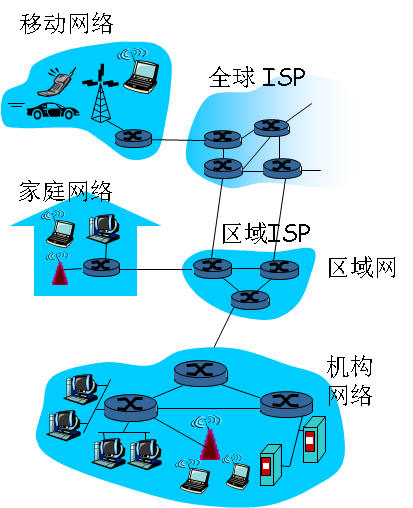

#### 工作方式(逻辑)上看：

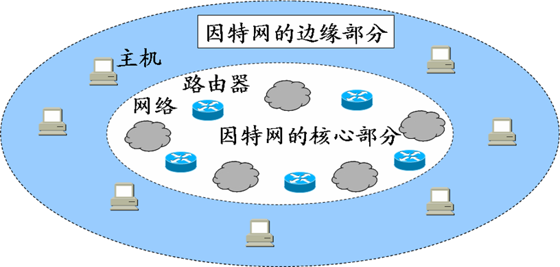

***边缘部分(端系统)***：由所有连接在Internet上的主机组成。这部分是**用户直接使用**的

	* 端系统中运行的程序间的通信方式：***Client/Server***(发送邮件、查阅资料)、***Peer-to-Peer***(比如QQ聊天、迅雷下载、在线影视等)
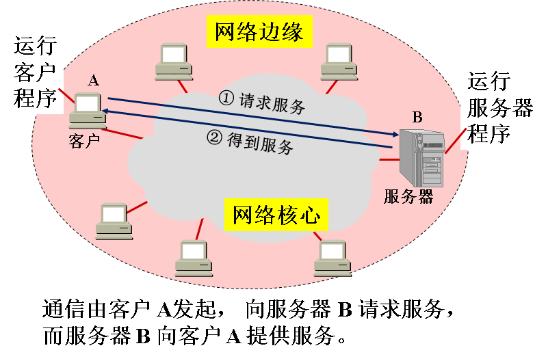
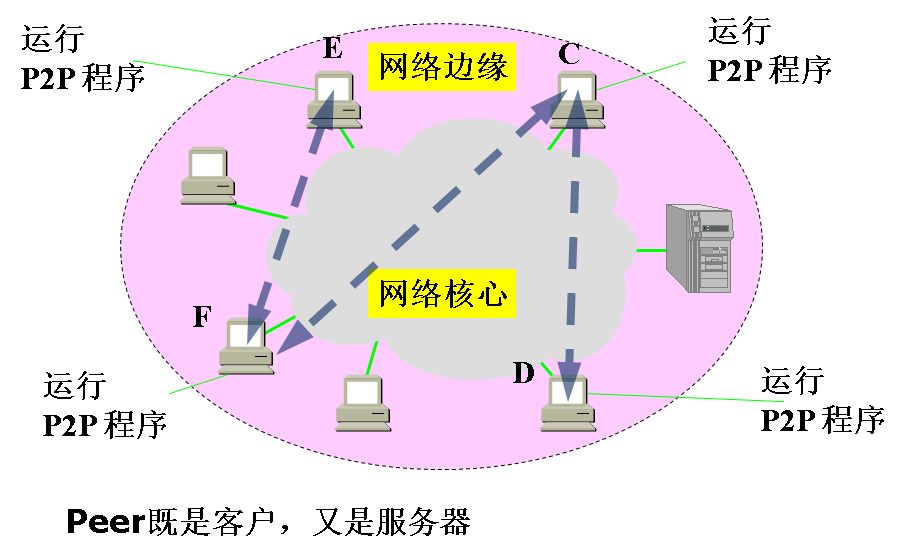

***核心部分***：由大量的网络和连接这些网络的路由器组成。这部分**是为边缘部分提供服务**的。

***交换***：把一条一条的电话线转接到另一条电话线，使他们连通起来。从通信资源的分配角度来看，就是按照某种方式动态的分配传输线路的资源。

* ***电路交换(面向连接)***：电话网为代表，每次呼叫采用固定路径。
	* 必须经历`建立连接`->`通话`->`释放连接`三个步骤。
	* 通话的全部时间内，通话的两个用户始终占用端到端的通信资源。
	* 连接方式
		* 两部电话机：一对电线
		* N部电话机，无交换需N(N-1)/2
		* 使用交换机：电话机数量增多时使用交换机完成全网的交换任务
* 报文交换：整个报文先传送到相邻结点，全部存储下来后查找转发表，转发到下一个结点。
* *报文交换*：完整的报文以存储转发的方式从源节点发送到目的节点。
* ***分组交换(存储转发)***：因特网为代表，每个数据包单独选择路由传输。
	* 在发送端把一个报文(要发送的整块数据message)划分为一个个等长的数据段
		* 在每一个数据段前面加上首部header之后构成分组(packet，也叫包)。
		* 依次把各分组发送到接收端
		* 接收端收到分组后剥去首部还原成报文
	* **路由器的处理过程**
		1. 把收到的分组放入缓存
		2. 查找转发表，找到某个目的地址对应从哪个端口转发
		3. 把分组送到适当的端口转发出去
	* 优点
		* 高效：*动态分配*传输带宽，对通信链路*逐段占用*
		* 灵活：以分组为传送代为查找路由
		* 迅速：不必先建立连接就能想其他主机发送分组
		* 可靠：保证可靠性的网络*协议*，*分布式的路由选择协议*有很好的生存性
	* 问题
		* 分组在各节点存储转发时需要排队，会造成一定的时延
		* 分组必须携带的首部也带来一定的开销

#### 从功能结构上看 

* ***通信子网***：网络中实现*网络通信*功能的设备及软件的集合
	* 通信设备
	* 通信协议
	* 通信控制软件等
* ***资源子网***：网络中实现*资源共享*功能的设备及软件的集合
	* 网络的服务器
	* 用户计算机
	* 网络打印机等

### 计算机网络分类

#### 按照网络的作用范围

* ***广域网(Wide Area Network)***
	* 覆盖范围通常为`几十到几千公里`，一个国家、地区，或几个洲，也称远程网。
	* 组成
		* 主机
		* 通信子网：通信线路连接交换节点，往往是电信部门提供的公共通信网。
	* 一般是*点到点*，一条通信线路只连接一对结点，一端的节点发送的数据只有唯一的另一端节点接收。分组从源结点经网络传送到目的结点要经过多个中间节点。
	* 多使用**分组交换**技术，数据分隔为若干个包，通过存储转发的方式逐个结点转发过去。
	* 连接广域网各节点交换机的链路一般都是高速链路，具有较大的通信容量。

* ***局域网(Local Area Network)***
	* 地理上局限在较小的范围
	* 一般用微信计算机或工作站通过高速通信线路相连
	* 连接速率高，目前可达10Gbps——万兆以太网

* **城域网(Metropolitan Area Network)**：几个街区或一个城市。
	* 作用距离为`5~50`km，规模介于LAN和WAN之间。
	* 公共网络性质，面向多用户提供数据、语音、图像等多业务的传输服务
	* 最著名的城域网的例子是有线电视网。
		* 有线电视网络上传输的是模拟信号；一个信道分成若干个频段，播放不同的电视频道节目。
		* 数据通信则网络要改造成双向的
	* LAN功能的不断提高和WAN技术的发展，他们都广泛的渗透和应用到MAN领域
		* LAN的渗透：迅速发展的以太网技术从LAN扩展到MAN领域。千兆位、万兆位以太网是MAN可以使用的技术。
		* WAN的渗透：WAN中使用的同步光纤网\同步数字分级结构SONET\SDH，波分多路复用WDM和异步传输模式ATM技术以及LAN中的光纤分布数据结构FDDI技术也都是MAN常常选用的技术。

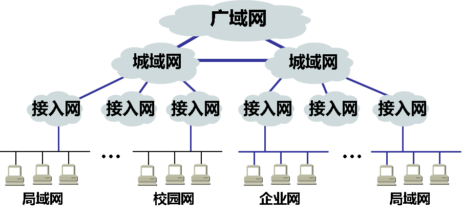

* 个人区域网PAN(Personal Area Network)：个人工作的地方属于个人使用的电子设备用无线技术连接起来的网络，也叫无线个人区域网WPAN(Wireless PAN)。

***WAN与LAN的比较***

1. LAN只有物理层和数据链路层，重点是数据链路层如何**解决共享信道的多点接入控制**，而WAN通信协议结构还要加上网络层，重点是网络层，除了上述的**分组转发**外，还有**路由选择**问题。
2. LAN的网络拓扑一般比较单纯规整；而WAN比较复杂，多为网状和树形或者他们的混合。
3. WAN常采用多路复用技术，提高传输线路的利用率；LAN不使用。

#### 按传输技术分

* 广播式网络：LAN、WAN中的无线，卫星通信网
* 点对点网络：是否使用分组存储转发与路由选择机制是它与广播式网络的区别

#### 按拓扑结构分

拓扑结构：计算机网络中各种设备通过传输介质互相连接，形成的物理布局。
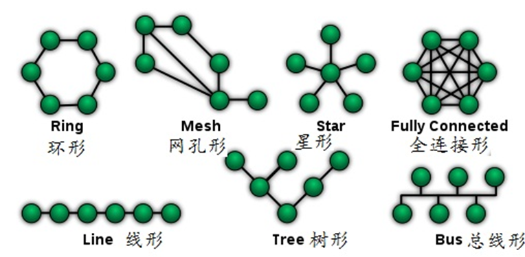

* 星型
	* 简单延迟小
	* 成本高
	* 中心节点对故障敏感
* 总线型
	* 简单，节省线路
	* 重负载效率低
* 环形
* 网状
	* 可靠性高
	* 复杂

#### 按使用者分

* 公用网：电信公司出资建造的大型网络，所有愿意按电信公司的规定缴纳费用的人都可以使用这种网络。
* 专用网：为满足某个部门或单位特殊业务工作的需要而建造的网络。

### 网络接入方式

#### 局域网接入

1. 局域网通过路由器连接到Internet，LAN用户通过双绞线连接电脑网卡和交换机/路由器接口，即可通过局域网接入Internet。
2. 小区宽带接入：FTTx+LAN，实现千兆到小区(大楼)中心交换机，中心交换机和楼道交换机以百兆光纤或五类双绞线相连，楼道内采用综合布线，实现不同速率宽带接入，提供高速局域网以及互联网络服务。

| 英文简称     |    全拼 |  翻译   |
| :-------- | ----:----| :------: |
| FTTC    |   Fiber To The Curb |  光纤到路边  |
| FTTZ    |   Fiber To The Zone |  光纤到小区  |
| FTTB    |   Fiber To The Building |  光纤到大楼  |
| FTTH    |   Fiber To The Home|  光纤到家庭  |
| FTTD    |   Fiber To The Desktop |  光纤到桌面  |
| FTTP    |   Fiber To The Premise |  光纤到所在地  |

#### 电话拨号接入

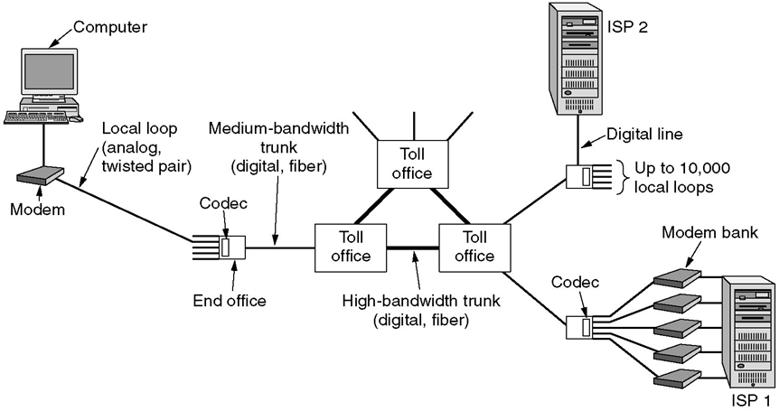

* **窄带接入**方式：经过调制解调器和普通模拟电话线与公用交换电话网连接。速率不超过56Kbps
* 经过专用终端设备和数字电话线，与综合业务数字网(Integrated Service Digital Network,ISDN)连接。

#### 数字用户线路(Digital Subscriber Line,DSL)接入

> 基于普通电话线的宽带技术，在同一铜线上分别传送数据和语音信号，数据信号并不通过电话交换机设备，并且不需要拨号，一直在线，属于专线上网方式。DSL包括非对称数字用户线路ADSL(Asymmetric DSL, 下行速率8Mb/s，上行速率1Mb/s)、速率自适应数字用户线路RADSL(Rate Automatic DSL)、高速率数字用户线路HDSL(High-speed DSL)、高速数字用户线路VDSL(Very-high-bit-rate DSL,最大下行速率55Mbps，上行速率19.2Mbps)

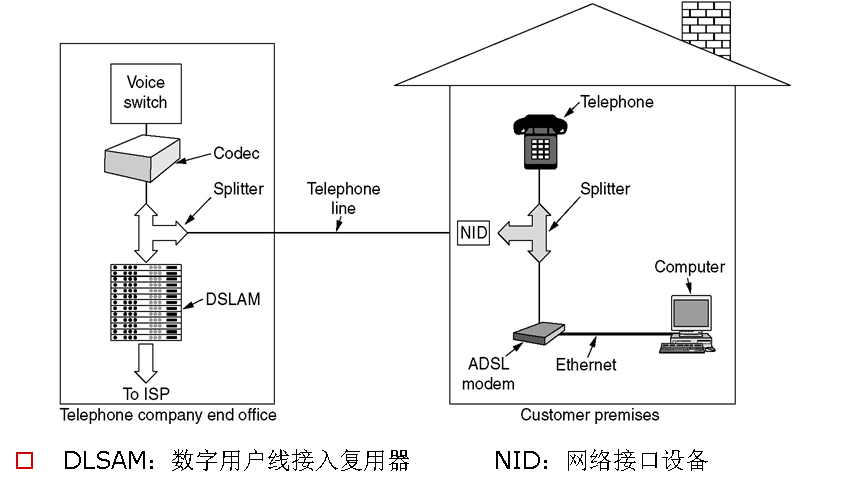

#### 有线电视的线缆接入

* 基于有线电视的线缆调制调节器(Cable Modem)接入方式可达到下行8Mb/s、上行2Mb/s的高速率接入。
* 基于有线电视网络的高速互联网接入系统有两种信号上行信号传送方式
	* 通过CATV(Community Antenna Television)网络本身采用上下行信号分频技术来实现
	* 通过CATV网传送下行信号，通过普通电话线路传送上行信号

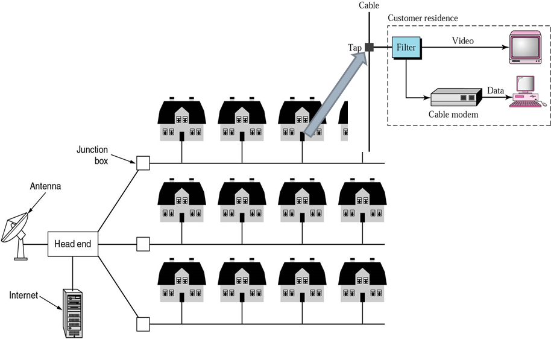

#### 光纤接入(OAN: Optical Access Network)

* 光纤传输技术：本地交换局和用户之间全部或部分采用光纤传输通信系统
* 光纤到户FTTH方式将光网络单元(ONU)安装在用户处
* 光纤具有宽带、远距离传输能力强、保密性好、抗干扰能力强等优点，是未来接入网的主要实现技术

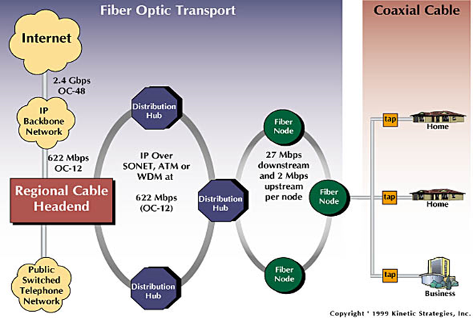

#### WLAN无线局域网接入

* 使用无线射频(RF)技术越空收发数据，减少使用的电线连接
* 一般作为已存在有线网络的一个补充方式，装有无线网卡的计算机通过无线手段方便接入互联网
* WIFI(Wireless Fidelity): IEEE 802.11

#### 无线网接入

* Bluetooth：短距离的无线通讯技术
* WiMax：宽带无线接入
* 2.5G移动通信技术：通过GPRS(General Packet Radio System)或CDMA(Code-Division Multiple Access)接入
* 3G：将无线通信与国际互联网等多媒体通信结合的新一代移动通信系统
* 4G第四代移动通信技术：3G与WLAN于一体

#### 卫星接入

* 利用宽带卫星的双向传输
* 利用卫星的高速下载和地面反馈的外交互方式

***小结***

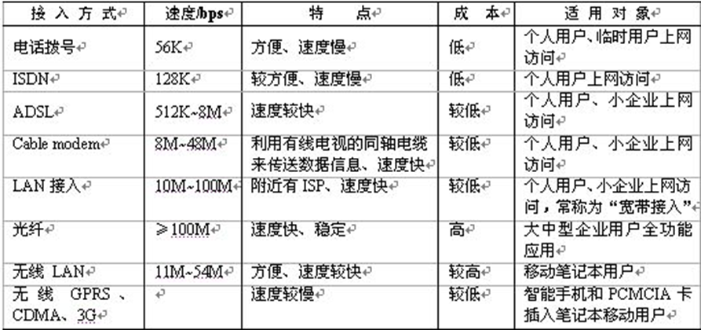

### 计算机网络标准化工作组织

* Internet标准以RFC(Request For Comments)文档形式发布
* ISO：OSI七层协议
* ITU(国际电信联盟)：远程通信标准
* IEEE:802标准

##### ISP和骨干网

ISP(Internet Service Provider)：进行商业活动的公司，用户付费享受相应的互联网服务。

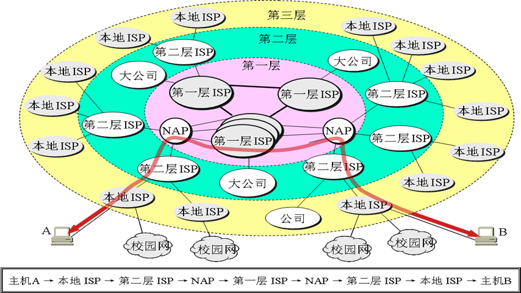

**骨干网**：把城市之间连接起来的网，是国家批准可以直接和国外连接的互联网。其他有接入功能的ISP通过骨干网连到国外。

### 计算机网络的性能指标

1. *速率*：连接在计算机网络上的*主机在数字信道上传输数据的速率*，单位为`b/s,Kb/s,Mb/s,Gb/s`等，往往指*额定速率或标称速率*
2. *带宽(Bandwidth)*：本来信号具有的频带宽度，单位`Hz`。现在为数字信道所能传送的**最高数据率**，单位是`b/s`。
	* 数字信号流随时间的变化：在时间轴上信号的宽度随带宽的增大而变窄

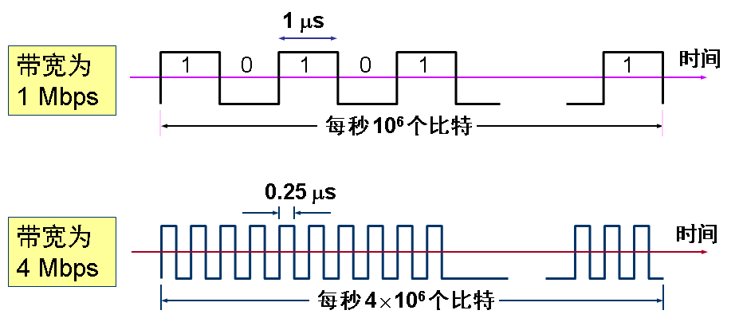

3. *时延(Delay或Latency)*
  1. 发送时延(Transmission Delay)：发送数据时，数据块从节点进入到传输媒体所需的时间。从发送数据帧的第一个比特算起，到该帧的最后一个比特发送完毕所需的时间。`发送时延=数据块长度/信道带宽`
  2. 传播时延(Propagation Delay)：电磁波在信道中在信道中传播一定的距离需要花费的时间。`传播时延=信道长度/电磁波在新岛上的传播速率` 
  3. 处理时延：交换节点为存储转发而进行的一些必要的处理所花费的时间
  4. 排队时延：节点缓存队列中分组排队所经历的时延。
  5. `总时延=发送时延+传播时延+处理时延+排队时延`
  6. 对于高速网络链路，我们提高的仅仅是数据的**发送速率**而不是比特在链路上的传播速率。提高发送速率仅仅减少的是发送时延。
  7. “光纤信道的传输速率高”其实是指以很高的速率向光纤信道发送数据，**而光纤的传播速率实际上比铜线还要低。**

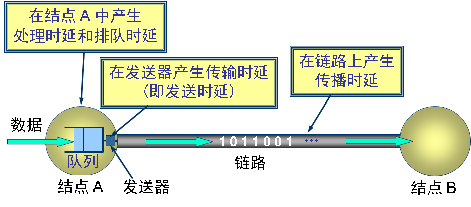

4. *吞吐量(Throughput)*：单位时间能够成功传输的数据量(瞬间、平均)，单位`bps`
	* 通信链路的带宽一般是指链路上每秒所能传送的比特数，以太网的带宽是10Mbps
	* 吞吐量受网络的带宽或网络的额定速率性质。受各种低效率因素的影响，一段带宽为10Mbps的链路连接的一对节点可能只打到2Mbps的吞吐量。

5. 时延带宽积=`传播时延 * 带宽`。就相当于信道的体积。
6. 往返时间(Round-Trip Time)：比如A向B发送数据，B确认后向A发送确认数据，A在收到之后才能继续向B发送时间。比起上面四种时延再加上确认时间RTT。
7. 利用率
	* 信道利用率：某信道有百分之几的时间是被利用的。
	* 网络利用率：全网络的信道利用率的加权平均值。
	* `网络当前时延D=网络空闲时延D0/(1-利用率U)` 信道或网络的利用率过高会产生非常大的时延。

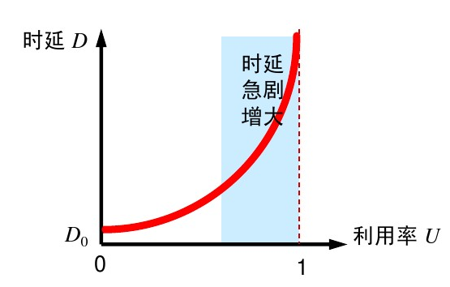

### 计算机网络分层结构

#### 协议与划分层次

***协议***定义了在两个或多个通信实体之间交换的*报文格式和次序*，以及在*报文传输和接收或其他时间方面所采取的动作*。使用网络的应用程序并不直接同网络硬件打交道，而是与按给定规则进行通信的协议软件打交道。

* ***协议三要素***
	* 语法：数据与控制信息的结构或格式
	* 语义：需要发出何种控制信息，完成何种动作以及做出何种响应
	* 同步：事件实现顺序的详细说明

***计算机网络的体系结构***就是这个计算机网络及其构建所应完成的功能的精确定义(各层及其协议的集合)。

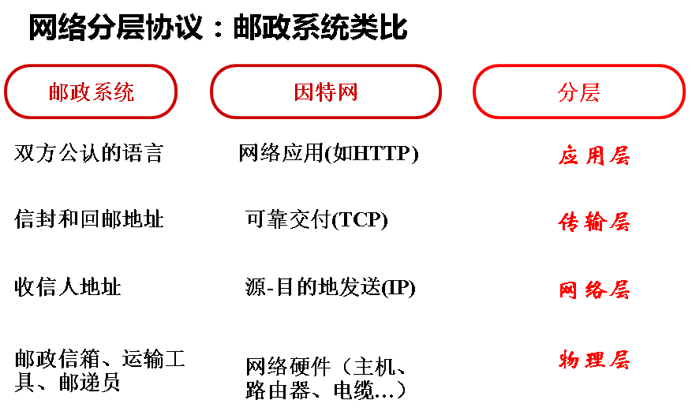

分层的优点：
* 各层之间是独立的。仅仅需要知道他的下一层借口所提供的服务，各层的服务也都不同。
* 灵活性好。当任何一层变活不会影响其他层。
* 结构上可分割开。
* 易于实现和维护
* 能促进标准化工作

#### OSI/RM(Open System Interconnection Reference Model)参考模型

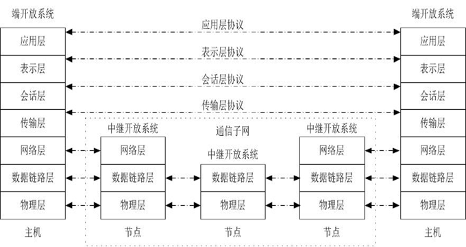

法律上的国际标准。

#### TCP/IP协议栈：事实上的国际标准

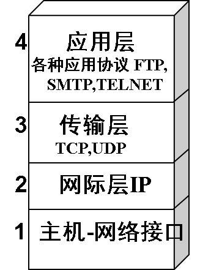

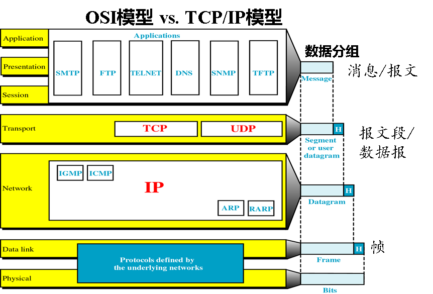
TCP/IP是一个四层协议，但实际上最下层的网络接口层并没有什么具体内容。因此在学习网络时综合OSI和TCP/IP的优点，采用一种只有五层协议的体系结构，既简洁又能将概念阐述清楚。

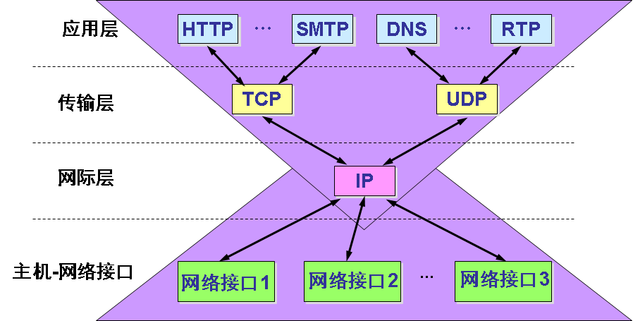

***IP Over Everything***：TCP/IP协议允许IP协议在各式各样的网络构成的互联网上运行
***Everything Over IP***：TCP/IP协议可以为各式各样的应用提供服务

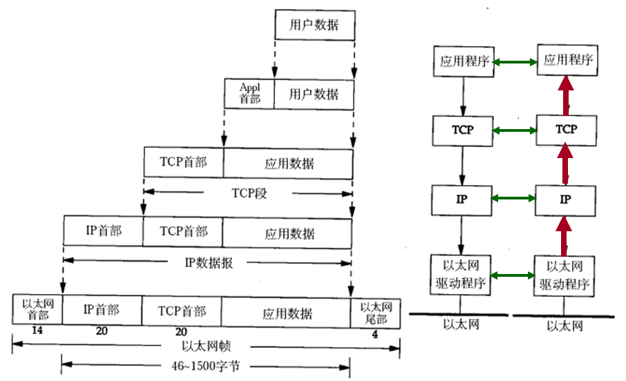
* 目标协议软件按层次组织
* 每台计算机上的协议软件被分成许多模块，每个模块对应一层
* 分层决定了模块间的相互作用，当协议软件发送或接受数据时，每个模块只与它紧邻的上下层模块通信。
* **送出的数据向下，接受的数据向上**
* ***封装***：对某层实体来说，需要在上层数据之前增加一些控制信息，然后传送给同层的对等实体。

***实体(Entity)***：任何可发送或接受信息的硬件或软件进程
***协议是水平的***：控制两个对等实体(peer entity)进行通信的规则的集合
***服务是垂直的***：服务是由**下层向上层**通过层间接口提供的。
在协议的控制下，两个对等实体间的通信使本层能够向上一层提供服务。本层的服务用户只能看见服务而无法看见下面的协议。

服务访问点SAP(Service Access Point)：同一系统相邻两层的实体进行交互的地方。
服务原语：相邻两层实体之间交互的语言或命令

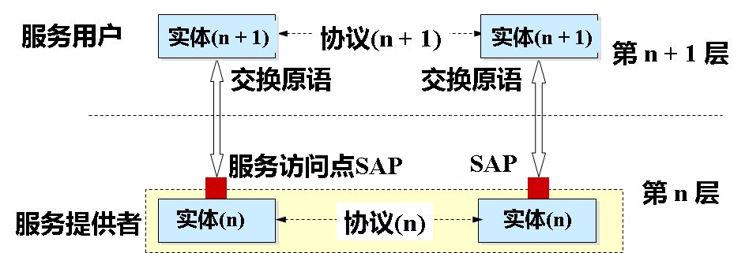

协议必须把所有不利的条件事先都估计到，不能假定一切都是正常和理想的。看一个计算机网络协议是否正确，必须仔细检查这个协议能否应付各种异常情况。
#### 教学中使用的混合模型

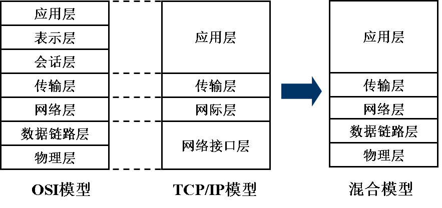

* 应用层(Application layer)
	* 任务：**通过应用进程间的交互来完成网络应用**。
	* 协议：定义应用进程间通信和交互的规则
	* 常见协议：DNS HTTP SMTP等
	* 数据单元：报文(Message)

* 运输层(transport layer)
	* 任务：向两台主机中进程之间的通信提供**通用的数据传输服务**(通用的意思是多种应用可以使用同一个运输层服务)
	* 复用：多个应用层进程可同时使用下面运输层的服务
	* 分用：运输层把收到的信息分别交付给应用层中的相应进程
	* 协议：
		* ***传输控制协议TCP(Transmission Control Protocol)***：提供面向连接、可靠的数据传输服务，数据单位为**报文段(Segment)**
		* ***用户数据报协议UDP(User Datagram Protocol)***：提供无连接的、尽最大努力的数据传输服务，数据单位为**用户数据报(Datagram)**

* 网络层(network layer)
	* 任务：为分组交换网上的不同主机提供通信服务。
	* 数据单位：把运输层产生的segment或datagram封装成**pocket**或**package**进行传送。分组也叫**IP数据报**。
	* 协议：**IP(Internet Protocol)协议**

* 数据链路层(data link layer)
	* 任务：在两个相邻结点之间传送数据时，数据链路层将网络层交下来的IP数据报**组装成帧**，在两个相邻节点之间传送**帧**。
	* 数据单位：帧(frame)，包含数据和必要的控制信息(差错控制、同步信息、地址信息等)
* 物理层(physical layer)
	* 数据单位：bit
	* 任务：考虑用多大的电压代表0或1以及接收方如何识别出所发送的比特。
	* 注：双绞线、光缆、无线信道等传递信息所用的物理媒体不属于物理层。
