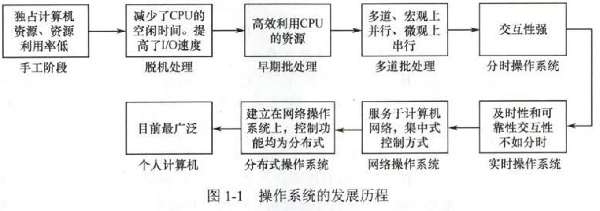
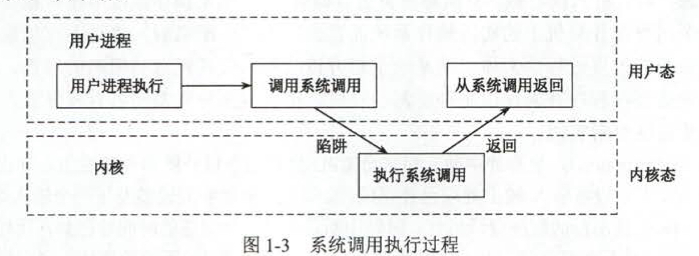
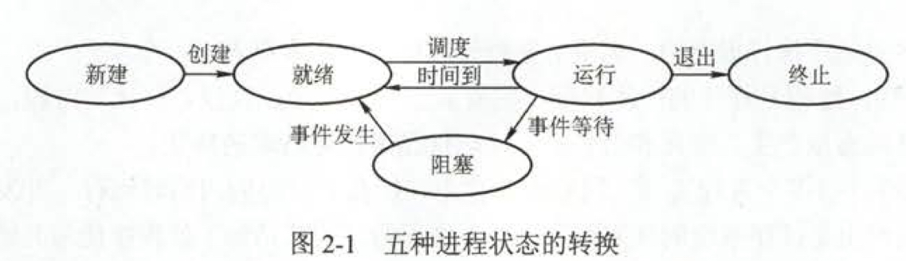
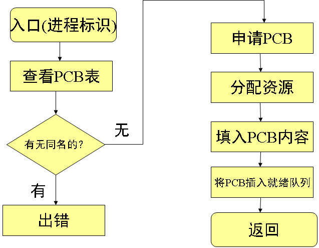
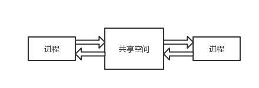
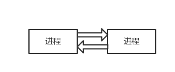
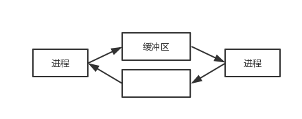
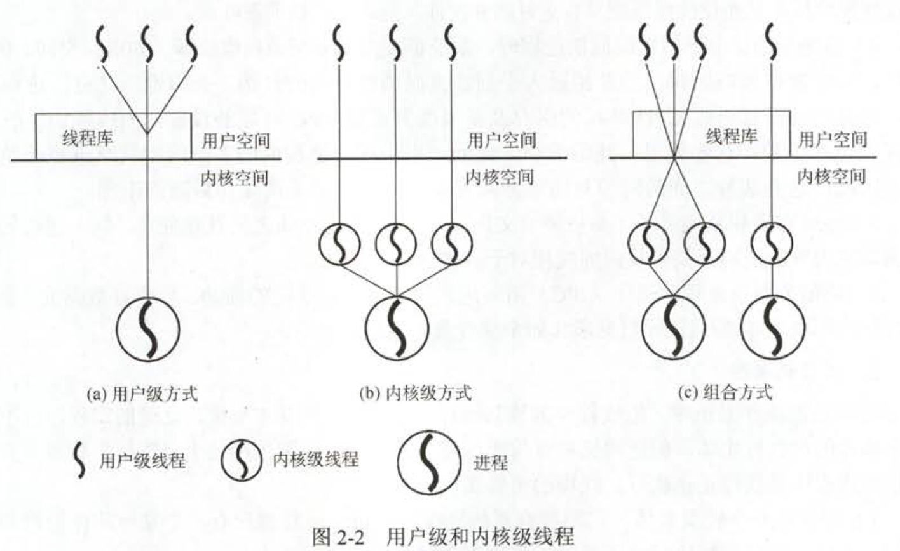
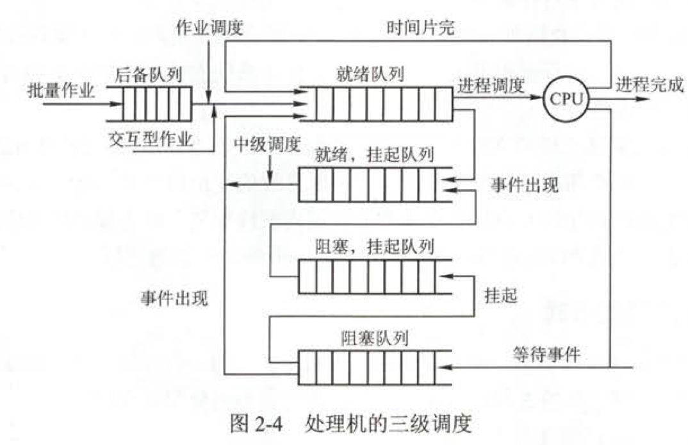

# 操作系统

【考查目标】

1. 掌握操作系统的基本概念、基本原理和基本功能，理解操作系统的整体运行过程。
2. 掌握操作系统进程、内存、文件和I/O管理的策略、算法、机制以及相互关系。
3. 能够运用所学的操作系统原理、方法与技术分析问题和解决问题，并能利用C语言描述相关算法。

## 概述

操作系统：控制和管理整个计算机系统的硬件和软件资源，并合理地组织调度计算机的工作和资源的分配，以提供给用户和其他软件方便的接口和环境的**程序集合**。

- 并发（Concurrrence）：多个事件同一时间间隔内发生；本质上是多个程序分时地交替执行；
- 共享（Sharing）：系统中的资源可供内存中多个并发执行的进程共同使用；
  - 互斥共享方式：同一时刻只允许一个进程访问该资源，该资源称为临界资源。比如打印机、磁带机等；
  - 同时访问方式：允许在一段时间内由多个进程同时对它们进行访问，这种访问微观上也是分时共享。
- 虚拟（Virtual）：把物理上的一个实体虚拟为逻辑上的若干个对应物。比如Spooling技术、虚拟存储器等；
- 异步（Asynchronism）：多道程序环境下，多个程序并发执行，但资源有限，所以**进程以不可预知的速度向前推进**。

操作系统提供的用户接口：

- 命令接口：用户用来组织和控制作业执行的命令；
  - 联机命令接口：用户通过控制台或终端输入操作命令，`用户输入 -> OS命令解释程序 -> 完成功能 -> 用户输入下一条`，用于分时系统或实时系统；
  - 脱机命令接口：由一组作业控制命令组成，脱机用户不能直接干预作业运行，`事先组织一组作业控制命令 -> 连同作业一起提交给操作系统 -> OS命令解释程序逐条解释执行`
- 程序接口：编程人员使用它们来请求操作系统服务，简称系统调用。
  - 设备管理：完成设备的请求与释放；
  - 文件管理：完成文件的读、写、创建及删除等功能；
  - 进程控制：完成进程的创建、撤销、阻塞及唤醒等功能；
  - 进程通信：进程间的消息传递或信号传递等功能；
  - 内存管理：内存分配、回收以及获取占用内存区大小及始址等功能。



计算机系统中，CPU执行两种程序：操作系统内核程序和外层应用程序。

特权指令：计算机中不允许用直接执行的指令，如I/O指令、置中断指令等。

***操作系统内核***：计算机上配置的底层软件。

- 时钟管理：通过时钟管理向用户提供标准的系统时间；
- 中断机制：保护和恢复**中断现场的信息**，转移控制权到相关的处理程序；
  - 注意中断现场的保护是由硬件（中断隐指令）实现的，操作系统负责保护中断现场状态寄存器等信息。
- 原语：具有原子性、处于最底层且调用频繁的程序；
  - 原语在执行过程中不可以被中断，执行结束后再打开中断。
- 系统控制的数据结构及处理：登记状态信息的数据结构，比如PCB、JCB、设备控制块、缓冲区、空闲区登记表等。

核心态（管态）与用户态（目态）是操作系统的两种运行级别。核心态运行操作系统程序，用户态运行用户程序。核心态指令实际上包括系统调用类指令和一些针对时钟、中断和原语的操作指令。



**CPU状态之间的切换**：

- 用户态到核心态：中断或异常
  - 系统调用：用户态进程主动要求切换到内核态，用户进程通过系统调用申请操作系统提供的服务程序完成工作。
    - 系统调用发生在用户态，运行在核心态。
  - 异常（内中断）：执行用户态程序时发生了某些事先不可知的异常。异常不能被屏蔽，一旦出现应立即处理。
  - 外围设备的中断：当外围设备完成用户请求的操作后，会想CPU发出响应的中断信号。CPU会暂停执行下一条指令的执行而去执行与中断信号对应的处理程序。
- 核心态到用户态：设置程序状态字PSW。

PS：如果程序的运行由用户态转到核心态，会用到访管指令。**访管指令应用在用户态，所以不可能是特权指令**。

## 进程管理

### 进程

1. **定义**：进程是进程实体的运行过程，是系统进行*资源分配*的一个*基本单位*。
   - 程序段
   - 数据
   - PCB：程序控制块，是进程存在的唯一标志。
2. **特征**
   - *动态性*：由创建而产生，由调度而执行，由撤销而消亡。
   - *并发性*：多个进程实体同存于内存中，且在一段时间内同时运行。程序并不具有。
   - *独立性*：进程实体是一个能独立运行、独立获得资源和独立接受调度的基本单位。
   - *异步性*：进程按各自独立的、不可预知的速度向前推进。
3. **进程和程序的比较**
   - 程序是有序代码的集合，是一个*静态*的概念。进程是程序的一次执行过程，是一个*动态*概念。
   - 进程是一个状态变化的过程，是*有生命期*的。而程序是*永久*的，可以长久保存。
   - 组成不同。进程由*数据段*、*数据*、*PCB*组成，而程序只是*代码的有序集合*
   - 进程与程序是密切相关的。通过多次执行，**一个程序可对应多个进程**。但进程与它本身所运行的程序只能是一对一的关系。
   - 进程能更真实的描述*并发*，程序不能。
   - *进程可以创建其他进程*，程序不能形成新的程序

 **进程的状态与转换**

- 运行态：进程正在处理机上运行。单处理机环境下，每一时刻最多只有一个进程处于运行态。
- 就绪态：进程获得除了处理机之外的一切资源。
- 阻塞态（等待态）：进程正在等待某一事件而暂停运行，比如申请临界资源或等待I/O完成等。
  - 处于阻塞态的进程，即使CPU空闲也不能运行。
- 创建态：进程正在被创建，所需的资源（申请PCB、填写控制信息、分配资源等）尚不能得到满足；
- 结束态：达到自然结束点或出现了无法克服的错误（回收资源、PCB等）。



- 就绪态 -> 运行态：被调度后获得处理机资源（获得处理机时间片）；
- 运行态 -> 就绪态：
  - 时间片完；
  - 可剥夺系统中被更高优先级的进程就绪剥夺处理机；
- 运行态 -> 阻塞态：是进程的**主动**行为
  - 进程请求某一资源的使用和分配；
  - 等待某一操作结束；
- 阻塞态 -> 就绪态：**被动**行为
  - 进程请求的资源得到满足；
  - 等待的操作进行结束

**进程的创建**

`一个进程可以创建另一个进程`

1. 申请空白PCB，获得唯一的数字标识符
2. 分配资源，包括各种物理和逻辑资源
3. 初始化PCB：标识信息、处理机状态、控制信息
4. 如果进程就绪队列能够接纳新进程，插入就绪队列



**进程的终止**

1. 根据标识符从PCB集合中检索出该进程PCB，读出该进程的状态
2. 若执行态，立即终止该进程的执行，并置调度标志为真，用于指示该进程被终止后应重新进行调度
3. 若有子孙进程，所有子孙进程也终止
4. 被终止进程拥有的所有资源归还父进程或系统
5. 进程(PCB)从队列(链表)中移出

**进程的阻塞和唤醒**


#### 进程通信

进程通信指的是进程间的信息交换，PV操作是低级通信方式，高级通信方式是指以较高的效率传输大量数据的通信方式。

1. 共享存储（Shared-Memory System）



在通信的进程之间存在一块可直接访问的共享空间，进程通过在共享空间进行读、写操作进行信息交换。共享空间的读写需要互斥同步工具，基于数据结构的共享是低级方式，基于存储器的共享是高级方式。

进行运行期间一般不能访问其他进程的空间，需要特殊的系统调用实现；而进程内的线程是自然共享进程空间的。

2. 消息传递



进程间的数据交换以格式化的 Message 为单位，通过系统提供的 send 发送消息原语和  receive 接收消息原语实现。

**实现方式**

- 直接消息传递系统

```
	send(receiver,message); //发送一个消息给接收进程
	receive(sender,message);//接收sender发来的消息
```

- 信箱通信(间接通信方式)

```
	send(mailbox,message);//将一个消息发送到指定邮箱
	receive(mailbox,message);//从指定邮箱中接收一个消息
```

3. 管道通信



管道：用于连接一个读进程和一个写进程以实现它们之间通信的一个**共享文件**。

输入进程以字符流形式将大量的数据送入管道；输入进程从管道中接收数据。管道拥有互斥、同步和确认对方存在的协调能力。

- 限制管道的大小。
- 半双工通信，某一时刻只能单向通信。
- 没有读完不能写，没有写满不能读。

#### 线程

引入线程之后，线程是操作系统**独立调度的基本单位**，线程自己**不拥有系统资源**，只拥有一点在运行中必不可少的资源，但它可与同属一个进程的其他线程共享所有资源。

同一进程中的多个线程间可以并发执行，一个线程可以创建和撤销另一个线程。一个线程被创建后便开始了它的生命周期，只至终止会经理阻塞态、就绪态和运行态等各种状态变化。

线程分为用户级线程和内核级线程。



**用户级线程中，内核意识不到线程的存在**。通常，应用程序从单线程开始，在该线程中开始运行，在其运行的任何时刻，可以通过调用线程库中的派生例程创建一个在相同进程中运行的新线程。

内核级线程中，线程管理的所有工作由内核完成。应用程序只有一个到内核级线程的编程接口。

组合方式中，线程创建在用户空间完成，调度和同步也在用户空间中进行。应用程序中的线程映射到一些内核级线程上。

**多线程模型** ：实现用户级线程和内核级线程的连接方式。

- 多对一：多个用户级线程映射到一个内核级线程中。
  - 线程管理在用户空间完成；
  - **当一个线程被阻塞时，整个进程都会被阻塞**。
- 一对一：一个用户级线程映射到一个内核级线程。
  - 一个线程阻塞，进程不会被阻塞；
  - 创建线程的同时需要建立映射，开销较大；
- 多对多：n个用户级线程映射到m个内核级线程 （n >= m）

### 处理机调度



- 作业调度（高级）：外存到内存之间的调度，从外存上处于后备状态的作业中挑选一个或多个并分配资源使其具有**竞争处理机的权利**，对于每个作业只调入一次、调出一次。
- 内存调度（中级）：将暂时不能运行的进程从内存调到外存，把外存上已具备运行条件的就绪进程重新调入内存，挂在就绪队列上。即主存管理中的交换技术。
- 进程调度（低级）：按照某种方法和策略从**就绪队列**中选取一个进程分配处理机给它。

作业调度往往发生在一批作业已运行完毕并推出系统，又需要重新调入一批作业进入内存时，大约几分钟一次；而进程调度是最基本的调度，运行频率也最高。

进程调度分为**非剥夺式**调度和**剥夺式**调度。第一种方式下，一旦把CPU分配给一个进程，那么该进程就会保持CPU直到终止或转换到阻塞态；而抢占式可以在一个进程执行过程中，为某个更重要或更紧迫的程序分配CPU资源。

**调度的基本准则**

- CPU利用率 = CPU有效工作时间 / (CPU有效工作时间+ CPU 空闲等待时间)；
- 系统吞吐量：单位时间内CPU完成作业的数量；
- 周转时间：作业从**提交**到**完成**的时间；
  - 带权周转时间：周转时间/实际运行时间；
- 等待时间：进程处于等待CPU状态时间之和；
- 响应时间：用户提交请求都系统首次产生响应所用的时间。

**调度算法**

1. FCFS先来先服务调度算法：从后备作业队列（进程就绪队列）调度队头进程，非抢占式算法。

FCFS对长作业有利，对短作业不利；I/O繁忙型作业由于要频繁访问IO端口，每次访问都要放弃CPU，等I/O访问完后要重新等待下一次调度（此时排到了就绪队列的队尾），所以要等待很久才能重新被调度。因此先来先服务**有利于CPU繁忙型作业而不利于I/O繁忙型作业**。

2. SJF调度算法：根据就绪队列中作业（进程）运行时间长短调度，选择最短的。

该算法对长作业十分不利，很容易产生“饥饿”现象；SJF调度算法的平均等待时间和平均周转时间最少。

3. 优先级调度算法：从后备作业队列（进程就绪队列）中选择优先级最高的作业（进程）。

- 抢占式：高优先级可以抢占正在执行的作业（进程）CPU资源；
- 非抢占式：不可被抢占；

静态优先级一旦分配，在执行过程中不变；动态优先级在执行过程中动态改变。

4. 高响应比优先调度算法（作业调度）

高响应比优先算法是结合了FCFS和SJF的算法。优先级相当于响应比RP。


- 作业等待时间相同，服务时间越短，优先级越高，类似SJP算法
- 服务时间相同时，作业的优先权决定于其等待的时间，类似FCFS算法
- 对于长作业的优先级，可以随着等待时间的增加而提高

5. 时间片轮转调度算法（进程调度）：就绪队列中的队头进程每运行一个时间片就让出CPU，并返回到就绪队列的末尾继续排队。

如果时间片足够大，以至于所有进程都能在一个时间片内执行完成，那么此时就相当于FCFS；如果时间片过小，处理机将需要频繁切换进程，增大了调度开销。

6. **多级反馈队列调度算法**：既能使高优先级的作业得到响应又能使短作业（进程）迅速完成。
   1. 设置多个就绪队列，为各个队列赋予不同的优先级。赋予各个队列进程执行时间片的大小的也不同，**优先权越高的队列中，执行时间片就越小**。
   2. 只有在优先级高的队列中没有进程时才会到下一个队列。
   3. 当一个新进程进入内存后，将其放入第一队列队尾，按FCFS排队等待调度。当轮到它执行是，若在该时间片内完成便撤离系统，否则把该进程转入下一队列队尾，直至完成。
   4. 在低优先级的队列中的任务在运行时，又有新到达的任务，那么在运行完这个时间片后，CPU马上分配给新到达的任务，即算法支持抢占式。


