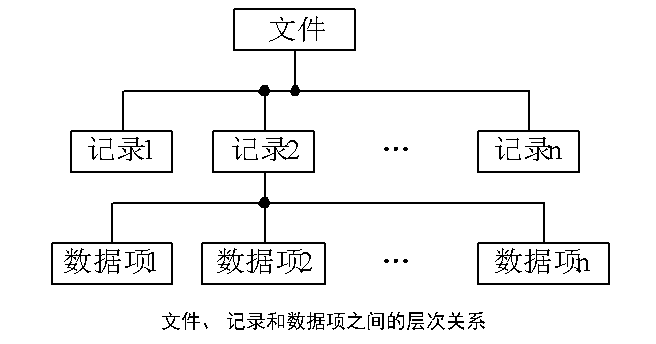
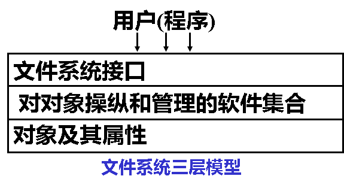
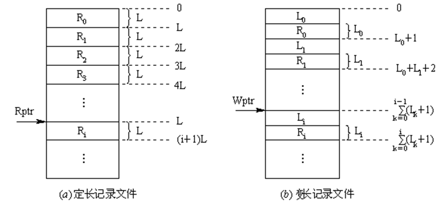
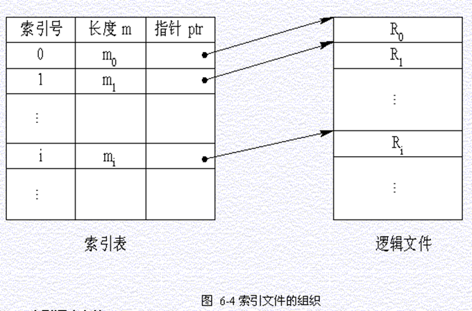
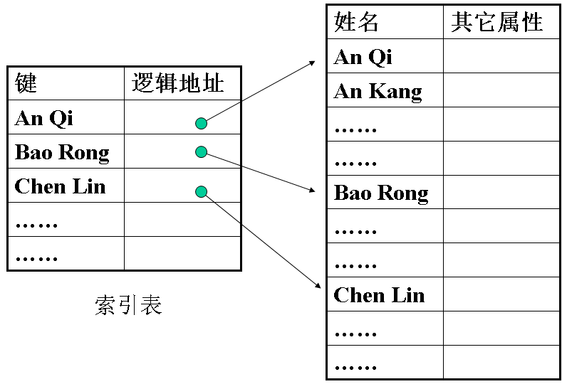
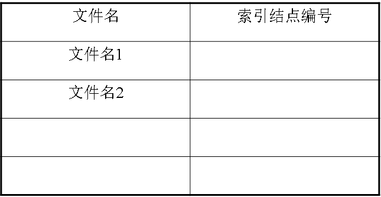
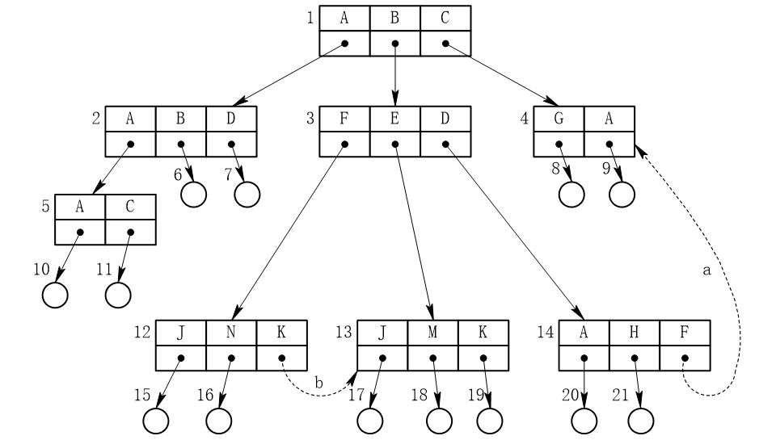

## 文件管理

 ***数据项***

* 基本数据项：描述一个对象某种属性的字符集。`数据组织中可以命名的最小逻辑单位`。比如学生的学号、姓名、年龄等
* 组合数据项：若干个基本数据项组成的。比如工资项由基本工资和奖金等组成

***记录***：描述一个对象在某方面的属性。

*关键字*：唯一表示一个记录的数据项

***文件***：由创建者定义具有文件名的一组相关元素的集合。

* 文件类型
* 文件长度
* 文件的物理位置
* 建立时间：最后一次的修改时间

*分类*
1. 用途
	* 系统文件
	* 用户文件
	* 库文件：允许用户调用但不可修改
2.  文件中数据
	* 源文件
	* 目标文件
	* 可执行文件
3. 存取控制
	* 只执行文件
	* 只读文件
	* 读写文件

***文件系统***

*管理对象*：文件、目录、磁盘存储空间

*文件操作*：创建、删除、读、写、设置文件读/写位置

*文件的打开和关闭操作*：将文件的属性从外存拷贝到内存打开文件表的一个表项中。关闭就是断开内外存连接。

#### 文件的逻辑结构

***分类***

* 有结构文件
	* 定长记录
	* 变长记录
* 无结构文件(流式文件)：源程序、可执行文件、库函数等

*按文件的组织方式分类*

* 顺序文件：记录按某种顺序排列的文件
* 索引文件：为可变长记录文件建立一张索引表
* 索引顺序文件：为一组记录中的第一个记录建立索引表

***顺序文件***：便于批量存取，不方便增加删除记录

* 串结构：按存入时间的先后排序
* 顺序结构：用户定义的关键字

***记录寻址***：隐式和显式

***索引文件***：按关键字建立索引，由主文件和索引表构成

***索引顺序文件***：一级和多级。变长记录顺序文件中的所有记录分组，为顺序表建立索引文件。

#### 文件目录

***要求***：

* 实现按名存取
* 提高对目录的检索速度
* 文件共享
* 允许文件重名

***文件控制块FCB***：描述文件相关信息

*索引结点*：文件名和描述信息分开，描述信息单独形成索引结点这样的数据结构。包括磁盘索引结点和内存索引结点

*简单文件目录*：单级和两级

***树形结构目录***

*目录查询方法*：线性检索法、Hash方法(系统把文件名变换为文件目录的索引值再查找)

>*冲突*：把n个不同文件名转换为相同的Hash值。
>解决方法：    (1) 该目录项为空则未找到
>(2) 文件名(或子目录名)匹配则找到
>(3) 该目录项非空则发生冲突,将Hash值加一常数(与目录长度互质)继续查找

#### 文件共享

