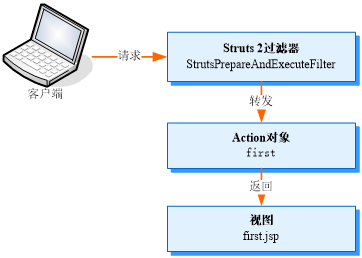

# JSP复习

*CSS常用的选择器*：

* 标记选择器
* 类别选择器
* ID选择器

## JSP(Java Server Pages)和Servlet

>Jsp:JSP全称Java Server Pages，是一种动态网页开发技术。它使用JSP标签在HTML网页中插入Java代码。标签通常以<%开头以%>结束。
>JSP是一种Java servlet，主要用于实现Java web应用程序的用户界面部分。网页开发者们通过结合HTML代码、XHTML代码、XML元素以及嵌入JSP操作和命令来编写JSP。

>Servlet:Java Servlet 是运行在 Web 服务器或应用服务器上的程序，它是作为来自 Web 浏览器或其他 HTTP 客户端的请求和 HTTP 服务器上的数据库或应用程序之间的中间层。

`include指令`：静态包含，被包含文件中所有内容会被原样包含到该jsp文件中。将两个页面组合成一个页面后编译，最后返回结果页面。

`<jsp:include>`：将被包含页面编译处理后将*结果*包含在该jsp页面中。Web容器编译时先编译被包含文件，然后将结果包含在该jsp文件中再编译一次将最终结果返回给浏览器。

***JSP内置对象***

1. request：封装了客户端提交的Http请求信息。（获取请求参数的值/获取cooike数据等）
2. respond：适用于响应客户端请求信息。（重定向网页、设置Http响应报头和缓冲区配置等）
3. session：同一个应用程序中每个客户端的各个页面中共享数据。（保存用户/管理员信息和购物车等信息）
4. application：同一个应用程序中各个用户间共享数据。（计数或聊天室）
5. out：向客户端输出各种类型的数据
6. page：操作jsp页面自身（很少用）
7. config：读取服务器的配置信息
8. exception：操作jsp文件执行时发生的异常信息
9. pageContxt：获取jsp的其他内置对象


forword：服务器端请求的转发，客户端浏览器并不知道跳转过程。是能作为服务器内部的一个操作在同一个应用内数据共享。

redirect：客户端向服务器端发出两次request，接受两次respond，利用respond对象sendRedirect方法在java代码中实现。地址栏的请求路径会发生变化。不仅可以重定向到当前应用的资源，也可以重定向其他应用的资源

JavaBean：其实就是java类，可自行设置JavaBean的生命周期，存在于page、request、session、application四种范围之内。

***Servlet生命周期***

- 加载：Web客户请求Servlet服务或Web服务启动时
- 容器环境创建Servlet实例并把这些实例驾到Servlet实例池中
- 初始化：HttpServlet.init(ServletConfig config)
- 容器环境封装HTTP请求和Servlet生成的响应
- 传递：容器环境把封装好的对象传递给HttpServlet.service() 方法，此方法可被多次调用，各调用过程互不干扰，比如doPost、doGet等
- 定制的Java Servlet读取请求后执行处理并生成响应数据
- 销毁：Web服务器和容器关闭时调用drstory方法，释放资源

Servlet过滤器需要实现的三个方法：`init()``destory()``doFliter()`过滤业务的处理逻辑。

## EL和JSTL

***EL***：`\${expression}`

使用步骤：

- 编写一个Java类，编写公用的静态方法，用于实现自定义EL函数功能
- 编写`.tld`标签库描述文件声明函数，
- 在jsp页面中引用标签库并调用定义的EL函数实现相应功能

```java
${ student }  <!-- 相当于执行了 student.toString(); -->  
${ student.name }  <!-- 相当于执行了 student.getName(); -->  
${ student.teacher.name }  <!-- 相当于执行了 student.getTeacher().getName(); -->  
...  
```

参考资料：[EL和JSTL介绍](http://leon906998248.iteye.com/blog/1502569)

JSP 标准标记库（JSP Standard Tag Library，JSTL）是一个实现 Web 应用程序中常见的通用功能的定制标记库集，这些功能包括迭代和条件判断、数据管理格式化、XML 操作以及数据库访问。

*JSTL四大标签库*：

* core：核心标签库
* fmt：格式化标签库
* ~~sql：数据库标签库~~
* ~~xml：xml标签库~~

| 常见标签     | 作用                                                       |
| :----------- | :--------------------------------------------------------- |
| `<c:out>`    | 显示数据对象（字符串、表达式）的内容或结果                 |
| `<c:set>`    | 设置变量值                                                 |
| `<c:remove>` | 移除指定jsp范围内的变量                                    |
| `<c:catch>`  | catch exception of jsp page and save exception information |

更多参考：[JSTL 标签详解](https://blog.csdn.net/qq_25827845/article/details/53311722)

## JSP数据库编程

JDBC开发的关键步骤：

- 注册数据库驱动：`Class.forName("com.mysql.jdbc.Driver")`
- 构建数据库URL：`JDBC protocol + IP address + port + dbname`
- 获取Connection对象：`DriverManager.getConnection(url,username,password)`

Jsp分页显示数据：

- ResultSet光标分页：该对象中有一个光标的概念，光标通过上下移动定位查询结果集中的行获取数据。通过设置和移动光标，可以设置ResultSet对象中记录的起始位置和结束位置来实现数据的分页显示。占用大量资源 ，不适用于数据大的情况。
- 数据库机制：如SQLServer中的`top`关键字、MySQL中提供的`limit`关键字等，都可以设置返回的记录数。

```sql
select top 当前页*每页记录数查询字段列表 
from 表A 
where 主键字段 not in （select top （当前页-1）*当前页记录数主键字段 from 表A）
```

## JSP文件上传

1. [使用Servlet 3的新特性实现文件上传](http://www.runoob.com/jsp/jsp-file-uploading.html)
2. [使用Commons-FileUpload组件实现文件上传](https://blog.csdn.net/elong490/article/details/41250337)

## Ajax(Asynchronous JavaScript and XML)

在JavaScript、XML、CSS、COM等多种已有技术的组合，实现客户端的异步请求操作。从而可以实现在不需要刷新页面的情况下与服务器进行通信，减少了用户的等待时间，减轻了服务器和带宽的负担，提供更好的服务响应。


***Ajava的优点***：

- 最大优点：无刷新更新页面。用户不用像以前那样在服务器处理数据时对着白屏焦急等待。使用XMLHttpRequest对象发送请求并得到服务器响应，不需要重新载入整个页面就可以通过DOM及时将更新的内容显示在页面上。
- 减轻服务器的负担。"按需求获取数据"可以最大程度的减少冗余请求和响应对服务器造成的负担。
- 可以把部分以前由服务器负担的工作转移到客户端，利用客户端闲置资源处理，节约时间成本。
- 可调用XML等外部数据，促进了页面显示和数据的分离。
- 基于标准化并被广泛支持，不需要下载插件或小程序

**Ajax与服务器通信基本流程**：在向服务器发送请求时通过XMLHttpRequest对象的onreadystatechange属性制定一个回调函数用于处理服务器响应。

回调函数：

1. 判断服务器请求状态
2. 根据服务器的HTTP状态码判断服务器对请求的响应是否成功
3. 如果成功，获取服务器响应反馈给客户端

## Struts 2

通过过滤器将Struts集成到Web应用中，通过过滤器Struts2即可拦截Web应用中的HTTP请求，并将这个请求转发到制定的Action处理。Action根据处理的结果返回给客户端相应的页面。




## Hibernate

Hibernate中持久化类的编程规则：

1. 实现一个默认构造函数：无参，以便Hibernate通过Constructor.newInstance()实例化持久化类
2. 提供一个标识属性(可选)：一般映射是数据表中的主键字段
3. 使用非final类(可选)：使用final类Hibernate不能使用代理来延迟关联加载，会影响性能优化的选择
4. 为属性声明访问器(可选)

Hibernate的延迟加载作用：

- 当加载对象长时间没有调用时会被垃圾会期回收，可以优化系统新能
- 延迟加载如load()、设置映射文件中的`<property>`元素中的lazy属性等，可以使Hibernate节省系统的内存空间

## Spring


- Spring Core：核心容器

  - 实现了IoC模式和Spring框架的基础功能
  - 包含Spring核心类*BeanFactory*，负责配置与管理JAVABean
  - 采用Factory实现IoC容器，即依赖注入

- Context：

  - 继承自BeanFactory类，并且添加了事件处理、国际化、资源加载以及数据校验等功能
  - 提供框架式的Bean的访问模式和企业级功能。如JNDI访问、远程调用、E-mail和定时任务调度等

- AOP：元数据与动态代理实现

  - 通过事务管理可以将任意Spring管理的对象AOP化
  - 抛开了[EJB](https://baike.baidu.com/item/EJB/144195?fr=aladdin)的复杂性但拥有传统EJB的关键功能

- DAO：

  - JDBC抽象层
  - 简化了数据库厂商的异常错误
  - 减少了代码的编写并且提供了对声明式和编程式事物的支持

- O/R映射：提供对现有[ORM](https://baike.baidu.com/item/ORM)框架的支持

- MVC：适应多种多视图、模板技术、国际化和严重服务，实现控制逻辑和业务逻辑的分离

- Web：

  - 提供了Servlet监听器的Context和Web应用的上下文
  - 集成了现有的Web框架

  

Spring中Bean的声明周期：实例化、初始化、使用、销毁

**Spring切入点**：

* 静态切入点：为对象的方法签名，需在配置文件指定。只在代理创建时执行一次然后缓存结果，下一次调用时直接从缓存中读取即可。
* 动态切入点：根据不同的参数织入不同的切面，比静态灵活。
* 自定义切入点

  

  
