## 处理器管理篇
##### 前趋图：有向无循环图
##### 程序的顺序执行
* 顺序性：每一操作必须在下一个操作开始前结束
* 封闭性：程序运行时独占全机资源
* 可再现性：执行结果不受外界因素影响

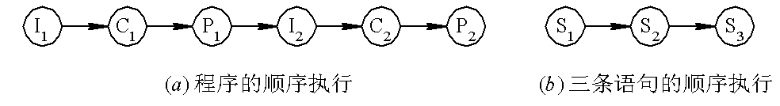

##### 程序的并发执行
并发性：多道程序在同一段时间间隔内同时发生

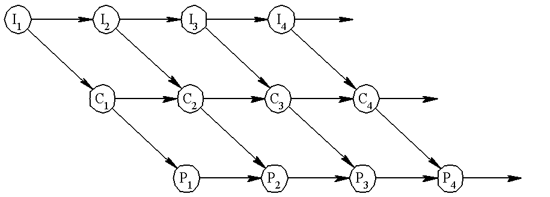

* 间断性：执行——暂停——执行
* 室取封闭性：系统资源共享
* 不可再现性：失去封闭性，结果也可以会不相同
### 进程
1. **定义**：进程是进程实体的运行过程，是系统进行*资源分配*的一个*基本单位*。
	* 程序段
	* 数据
	* PCB
2. **特征**
	* *动态性*：由创建而产生，由调度而执行，由撤销而消亡。
	* *并发性*：多个进程实体同存于内存中，且在一段时间内同时运行。程序并不具有。
	* *独立性*：进程实体是一个能独立运行、独立获得资源和独立接受调度的基本单位。
	* *异步性*：进程按各自独立的、不可预知的速度向前推进。
3. **进程和程序的比较**
	* 程序是有序代码的集合，是一个*静态*的概念。进程是程序的一次执行过程，是一个*动态*概念。
	* 进程是一个状态变化的过程，是*有生命期*的。而程序是*永久*的，可以长久保存。
	* 组成不同。进程由*数据段*、*数据*、*PCB*组成，而程序只是*代码的有序集合*
	* 进程与程序是密切相关的。通过多次执行，**一个程序可对应多个进程**。但进程与它本身所运行的程序只能是一对一的关系。
	* 进程能更真实的描述*并发*，程序不能。
	* *进程可以创建其他进程*，程序不能形成新的程序

#### **进程的三种基本状态及转换**
* 就绪：其他条件满足，仅差CPU
* 执行：获得CPU，执行状态
* 阻塞：由于某事件发生暂时无法执行

 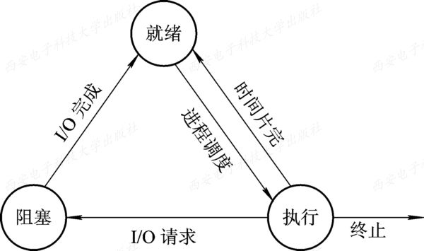

* 创建：进程所需的资源(申请PCB、填写控制信息、分配资源等)尚不能得到满足
* 终止：达到自然结束点或出现了无法克服的错误(回收资源、PCB等)

 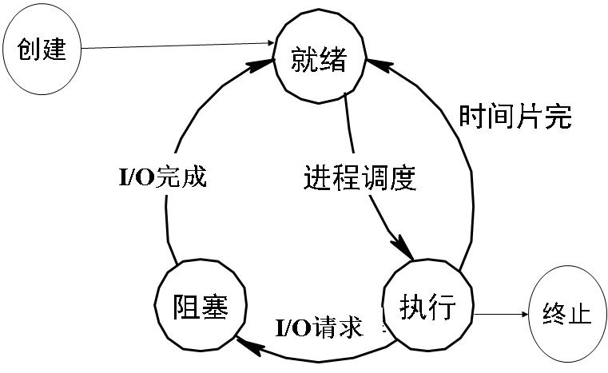
 
* 静止状态：系统不分配CPU
* 引入挂起操作的原因：
	* 终端用户的需求：发现问题希望进程停止以修改
	* 父进程请求
	* 系统负荷的需要		 
 	* 操作系统的需要
 
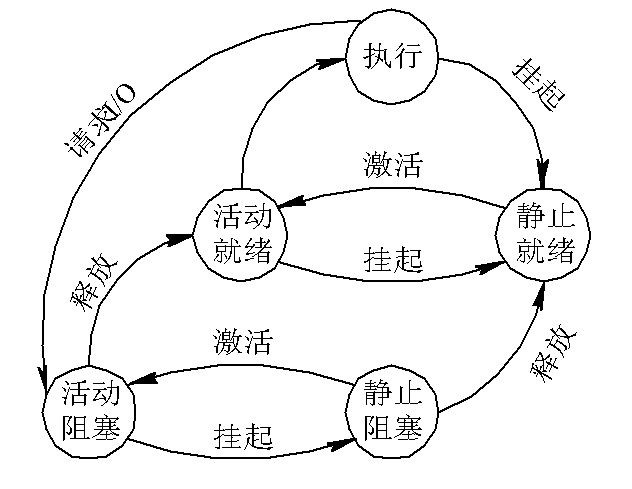

挂起原语：**Suspend**，激活原语：**Active**
* 活动就绪(Readya)：未被挂起的就绪态
* 静止就绪(Readys)：将该进程挂起后的状态
* 活动阻塞(Blockeda)：未被挂起的阻塞态
* 静止阻塞(Blockeds)：活动阻塞状态被挂起后的状态

**五个进程状态的转换**
* NULL->创建
* 创建->活动就绪：分配必要资源
* 创建->静止就绪：考虑系统当前资源状况和性能，安置在外存，不参与调度。
* 执行->终止

##### 进程管理中的数据结构
操作系统中的有：内存表、设备表、文件表和进程表(PCB)。

***PCB的作用***
* 作为独立运行基本单位(进程存在于系统中)的*标志*
* 能实现*间断性运行方式*。现场保护与恢复现场。
* 提供进程*管理*所需要的信息。比如文件或程序、I/O设备等
* 提供进程*调度*所需要的信息。比如当前状态、优先级等
* 实现与其他进程的*同步与通信*。比如信号量、通信队列指针等。

**PCB中的信息**
* 进程标识符
	* 外部标识符：方便用户对进程的访问，通常由字母、数字组成。
	* 内部标识符：方便系统对进程的使用，数字。
* CPU上下文：各种寄存器中的内容
* 进程调度信息
	* 进程状态
	* 优先级
	* 调度所需的其他信息
	* 事件(阻塞原因)
* 进程控制信息
	* 程序和数据的地址
	* 进程同步和通信机制
	* 资源清单：一张除CPU以外的进程所需的全部资源和已分配到资源的清单
	* 链接指针

**进程控制块的组织方式**：线性方式、链接方式(具有相同状态进程的PCB链接成一个队列)、索引(根据进程状态不同建立几张索引表)

#### 进程的创建
`一个进程可以创建另一个进程`
1. 申请空白PCB，获得唯一的数字标识符
2. 分配资源，包括各种物理和逻辑资源
3. 初始化PCB：标识信息、处理机状态、控制信息
4. 如果进程就绪队列能够接纳新进程，插入就绪队列


#### 进程的终止

1. 根据标识符从PCB集合中检索出该进程PCB，读出该进程的状态
2. 若执行态，立即终止该进程的执行，并置调度标志为真，用于指示该进程被终止后应重新进行调度
3. 若有子孙进程，所有子孙进程也终止
4. 被终止进程拥有的所有资源归还父进程或系统
5. 进程(PCB)从队列(链表)中移出

#### 进程的阻塞和唤醒

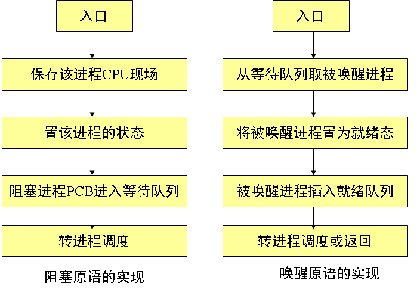

### 进程同步：`互斥` `共享`

***临界资源***：仅允许一个进程使用的资源。
**临界区**：每个进程中访问临界资源的那段代码

```cpp
	while(TURE){
		进入区//检查临界资源是否正在被访问
		临界区
		退出区//将临界区正被访问的标志恢复为未被访问标志
		剩余区
	}
```

***同步机制应遵守的规则***
* *空闲让进*：临界资源处于空闲态应允许一个请求进入临界区的进程*立即进入*
* *忙则等待*：临界资源正在被访问时，其他试图进入的必须等待
* *有限等待*：应保证在有限时间内能进入临界区
* *让权等待*：进程不能进入自己的临界区时应立即释放CPU

### 信号量机制

***整型信号量***

>定义一个用于表示资源数目的整型量S，除初始化外仅能通过wait(S)和signal(S)来访问
```
	wait(S){//申请
		while(S<=0);
		S--;
	}
	signal(S){//释放
		S++;
	}
```
`S=0    表示系统中该类临界资源刚好被全部占用，而且没有进程在等待该临界资源。`
`S<0时会不断的测试`

***记录型信号量***：解决让权等待

>除了一个用于表示资源数目的整形变量value外，增加一个进程链表L，用于链接所有等待进程。

```cpp
	typedef struct{
		int value;
		struct process_control_block *list;//阻塞队列
	}semaphore;
	wait(semaphore *S){
		S->value--;
		if(S->value < 0)
			block(S->list);//阻塞原语
	}
	signal(semaphore *S){
		S->value++;
		if(S->value<=0)
			wakeup(S->list);//唤醒原语
	}
```

***AND型信号量***：解决死锁
>将进程在整个运行过程中需要的所有资源，一次性全部地分配给进程，待进程使用完后再一起释放。只要尚有一个资源未能分配给进程，其它所有可能为之分配的资源，也不分配给他。

```cpp
Swait(S1, S2, …, Sn)
    if S1≥1 and … and Sn≥1 then
        for i=1 to n do
        Si=Si-1;
        endfor
    else
     把进程放入第一个阻塞原因的资源等待队列
    endif
Ssignal(S1, S2, …, Sn)
      for i=1 to n do
      Si=Si+1;
      从对应释放资源的等待队列中唤醒一个进程
  endfor; 
```

**信号量集** ???我这里看不太懂

>在AND型信号量的基础上进行扩充，进程对信号量Si的测试值为ti(用于信号量的判断，即Si≥ ti表示资源数量低于ti时不予分配)，占用值为di(用于信号量的增减，即Si= Si-di和Si= Si+di)。

```
	Swait(S1,t1,d1,…,Sn,tn,dn);
	Ssignal(S1,Dn,…,Sn,dn);
```
* `Swait(S, d, d)。 此时在信号量集中只有一个信号量S， 但允许它每次申请d个资源，当现有资源数少于d时，不予分配。`
* `Swait(S, 1, 1)。 此时的信号量集已蜕化为一般的记录型信号量(S＞1时)或互斥信号量(S=1时)。`
* `Swait(S, 1, 0)。这是一种很特殊且很有用的信号量操作。当S≥1时，允许多个进程进入某特定区；当S变为0后，将阻止任何进程进入特定区。换言之，它相当于一个可控开关。 `

##### 利用信号量实现互斥、前趋(前趋图)关系

*互斥信号量*：初始化mutex=1;
|mutex值|意义|
|:----|:--|
|1|临界资源空闲|
|0|有一个进程进入临界区运行|
|-1|有一个已经在运行，有一个还在等|

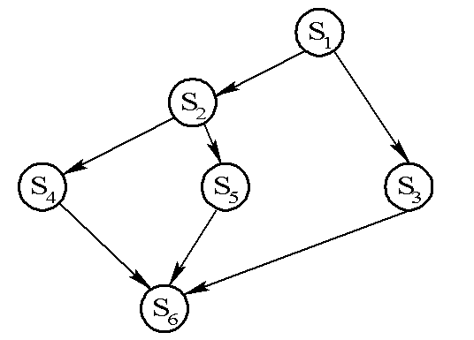
```c
p1(){S1;signal(a);signal(b);}
p2(){wait(a);S2;signal(c)；signal(d);}
p3(){wait(b);S3;signal(e);}
p4(){wait(c);S4;signal(f);}
p5(){wait(d);S5;signal(g);}
p6(){wait(e);wait(f);wait(g);S6;}
main(){
	semaphore a,b,c,d,e,f,g;
	a.value=b.value=c.value=d.value=e.value=f.value=g.value=0;
	p1();p2();p3();p4:();p5();p6();
}
```

#### 生产者-消费者问题：满不能生产，空不能消费
[C语言实现源码](https://github.com/Joki-memeda/MyLearning/blob/master/OS/producer-consumer.cpp)
* ```在每个程序中用于实现互斥的wait(mutex)和signal(mutex)必须成对地出现```
* ```每个程序中的多个wait操作顺序不能颠倒。应先执行对资源信号量的wait操作，然后再执行对互斥信号量的wait操作，否则可能引起进程死锁。```

**信号量解决实际问题步骤**
* 信号量的设置
	* `互斥`
	*  `资源`
* 信号量赋初值
	* 互斥=1
	* 资源=0或N
* P、V操作安排的位置
 
#### 进程通信
`作业上有但是我觉得应该不考`
* 共享存储器系统
* 管道通信系统
* 消息传递系统
* 客户机-服务器系统
 
**实现方式**
* 直接消息传递系统
```
send(receiver,message); //发送一个消息给接收进程
receive(sender,message);//接收sender发来的消息
```
* 信箱通信(间接通信方式)
```
	send(mailbox,message);//将一个消息发送到指定邮箱
	receive(mailbox,message);//从指定邮箱中接收一个消息
```
 
### 线程(进程元、轻型进程)
 **线程与进程的比较**
 * *调度的基本单位*。线程时能独立运行的基本单位，切换时仅需保存和设置少量寄存器的内容。
 * *并发性*。更高效地提高系统资源的利用率和吞吐量。
 * *线程并不拥有系统资源*，仅有一点必不可少的、能保证独立运行的资源，比如TCB等
 * 同一进程中的不同线程间的*独立性*比进程间的低的多。
 * 线程的切换*系统开销*比进程的低得多
 * 支持多处理机系统

**线程运行的三个状态**
* 执行：已获得CPU正在运行
* 就绪：具备除CPU外的各种条件
* 阻塞：暂停状态

***TCB***：线程存在的标志

**多线程OS中的进程属性**
* 进程是一个可拥有资源的基本单位
* 多个线程可并发执行
* 进程已不是可执行的实体

## 处理机调度

>调度实质是一种资源分配，处理机调度是对处理机资源进行分配。


##### 处理机调度的层次

* 高级调度(长程调度、**作业**调度)
* 低级调度(短程调度、**进程**调度)
* 中级调度(**内存**调度)：挂起

##### CPU调度算法的目标
1. 资源利用率
 
2. 公平性：各进程都获得合理的CPU时间，不会发生进程饥饿现象
3. 平衡性：使系统中的各种设备都经常处于忙碌状态
4. 策略强制执行

### 作业(Job)与作业调度
**作业**
不仅包含了通常的*程序和数据*，而且还应配有一份*作业说明书*，系统根据该说明书来对程序的运行进行控制。

**作业步**
每一个加工步骤成为一个作业步。

**作业控制块(JCB)**:作业存在的唯一标志，包含系统对作业管理和调度所需的全部信息

**作业运行的三个阶段和状态**
* 收容状态：输入到外存
* 运行阶段：放回就绪队列，直到运行结束
* 完成阶段：回收资源和JCB，输出结果

**作业调度的主要任务**
>检查系统中的资源能否满足作业对资源的需求，以及按照一定的调度算法，从外存的后备队列中选取某些作业调入内存，并为它们创建进程、分配必要的资源。然后再将新创建的进程排在就绪队列上等待调度。
>* 接纳多少个作业
>* 接纳哪些作业

#### 先来先服务(FCFS)和短作业优先(SJF)
#### 优先级调度算法(PSA)和高响应比优先调度算法(HRRN)
优先级调度算法就是基于作业的紧迫程度由外部赋予优先级，每次从后备队列选择若干个优先级最高的装入内存-。-

高响应比优先算法是结合了FCFS和SJF的算法。优先级相当于响应比RP

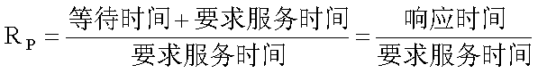

* 作业等待时间相同，服务时间越短，优先级越高，类似SJP算法
* 服务时间相同时，作业的优先权决定于其等待的时间，类似FCFS算法
* 对于长作业的优先级，可以随着等待时间的增加而提高

### 进程调度

***进程调度的任务***
* 保存CPU的现场信息
* 按某种算法选取进程
* 把CPU分配给进程

***进程调度的机制***
* *排队器*：事先将系统中所有就绪进程按照一定方式排成队列，以便于系统快速找到
* *分派器*：把由进程调度程序选定的进程从就绪队列中取出，进行上下文切换并分配CPU
* *上下文切换机制*
	* 保存当前进程的上下文，装入分派程序的上下文
	* 移出分派程序，把新选进程的CPU现场信息装入各个寄存器
	
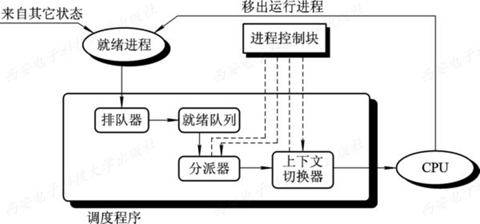

***进程的调度方式***
* 非抢占方式
* 抢占式
	* 时间片原则
	* 优先权原则
	* 短作业优先原则

`后两个不一定必须采用抢占方式，也可以采用非抢占式`

##### 轮转调度算法(RR)
>系统将所有的就绪进程按FCFS策略排成一个就绪队列。系统设置每隔一定时间产生一次中断，去激活进程调度程序进行调度，把CPU分给队首进程并令其执行一个时间片。运行完毕后又把CPU分给下一个队首进程让他也执行一个时间片。这样可以保证所有进程在确定的时间段内，都能获得一个时间片的CPU时间。

***进程切换时机***

* 时间片没用完进程完成：立即激活调度程序，讲它从就绪队列中删除，调度队首进程运行并分配一个新的时间片
* 一个时间片用完时，计时器中断处理程序被激活。如果进程尚未运行完毕，调度程序将其送往就绪队列队尾。

***时间片大小的确定***：时间片的大小对系统性能有很大影响

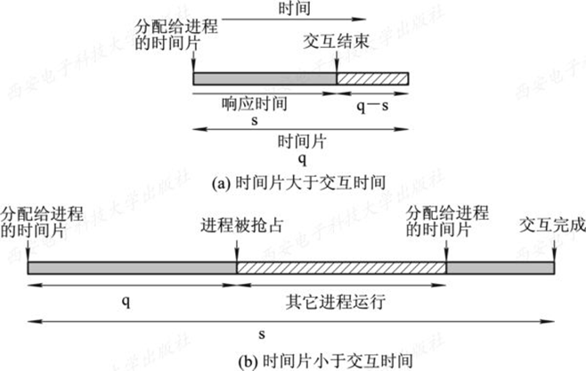

`q：时间片` `s：响应时间`b图分配给他的时间片他要两篇才能完成交互

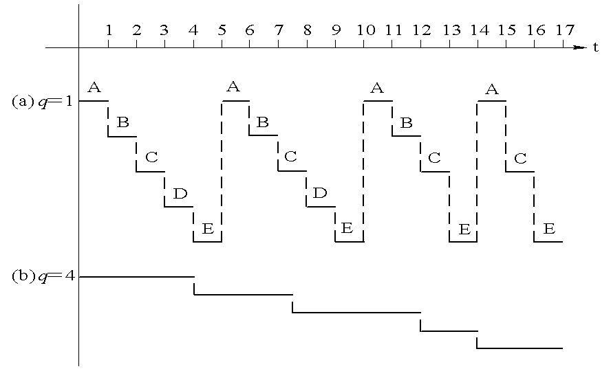

时间片长短进程的运行情况

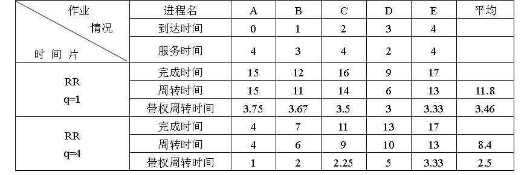

`周转时间=完成时间-到达时间`

`带权周转时间=周转时间/服务时间`

带权周转时间反映作业(进程)长短问题(百度百科说的，我觉得问题很大，应该只有在短作业优先时才反应带权周转时间，等明天头脑清楚再考虑这个问题)带权周转时间应该越大越好。

##### 优先级调度算法

* 非抢占式：系统一旦把处理机分配给就绪队列中优先权最高的进程后，该进程便一直执行下去，直至完成
* 抢占式：只要出现优先级更高的就执行(常用于实时系统)

**优先级的类型**：静态和动态

##### 多就绪队列调度算法

##### 多级反馈队列(multileved feedback queue)调度算法
既能使高优先级的作业得到响应又能使短作业（进程）迅速完成。

1. 设置多个就绪队列，为各个队列赋予不同的优先级。赋予各个队列进程执行时间片的大小的也不同，**优先权越高的队列中，执行时间片就越小**。
2. 只有在优先级高的队列中没有进程时才会到下一个队列。

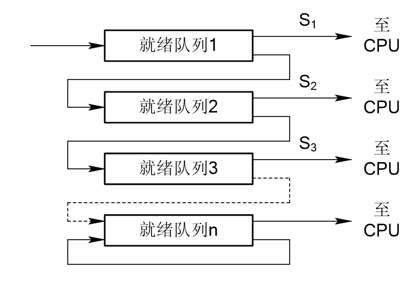

3. 当一个新进程进入内存后，将其放入第一队列队尾，按FCFS排队等待调度。当轮到它执行是，若在该时间片内完成便撤离系统，否则把该进程转入下一队列队尾，直至完成。
4. 在低优先级的队列中的任务在运行时，又有新到达的任务，那么在运行完这个时间片后，CPU马上分配给新到达的任务，即算法支持抢占式。

##### 基于公平原则的调度算法

### 实时调度
*条件*(随便看一看)
* 必要信息
	* 就绪时间
	* 开始截止时间和完成截止时间
	* 处理时间
	* 资源要求
	* 优先级
* 系统处理能力强
* 抢占式调度机制
* 快速切换机制

实时调度算法也有*抢占式*和*非抢占式*

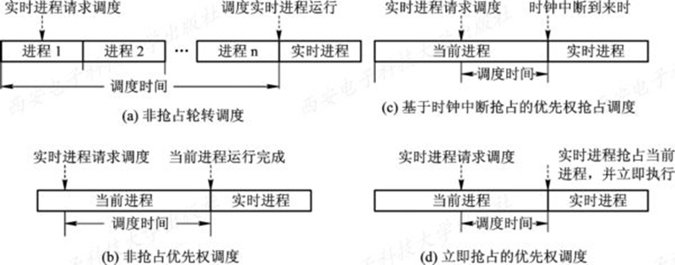

##### 最早截止时间优先(Earliest Deadline First)算法

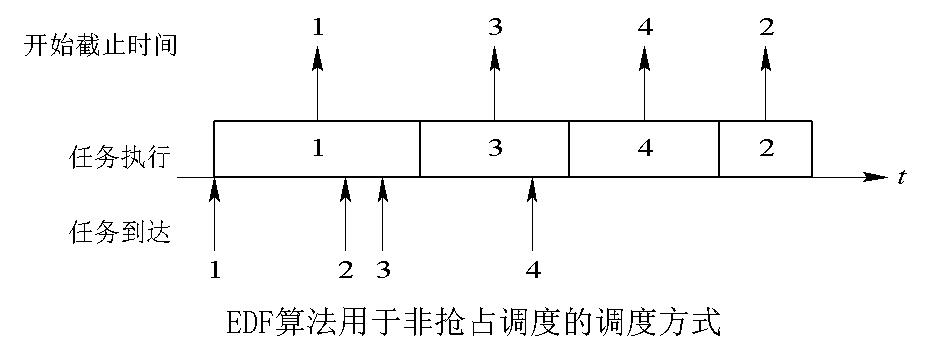

1来了执行1, 执行中2先来3再来，3的截止时间比2提前所以先执行3，执行中4来了截止时间比2还是提前所以先执行4，执行完4最后执行2.

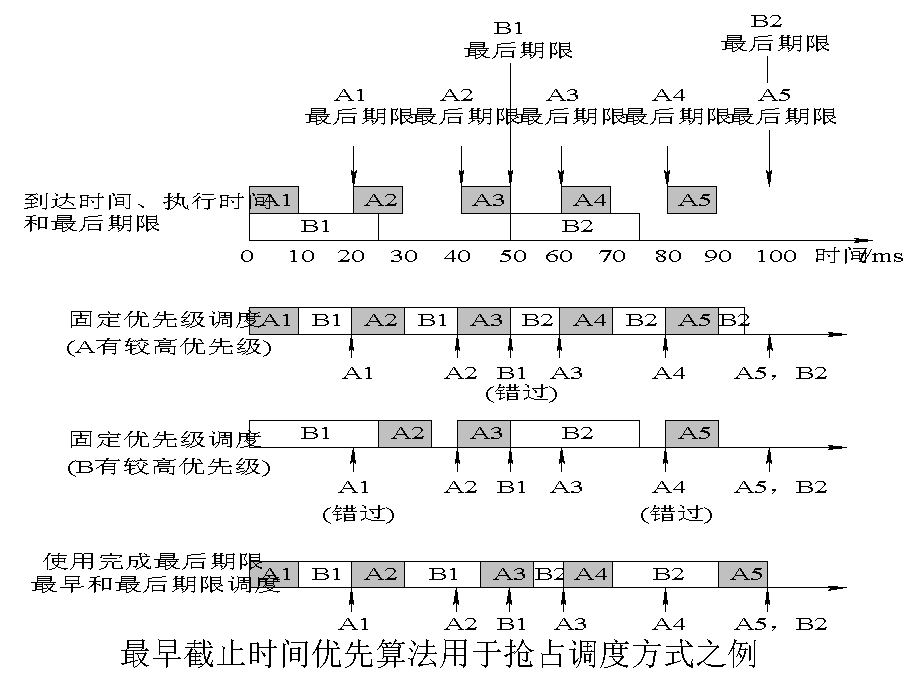

| t|EDF算法描述 A：10s B：25s|
|:--|:---|
|0|A1/B1同时到达,A1截止时间为20，B1截止时间为50，所以执行A1|
|10|A1执行完成,队列中只有B1，所以执行B1|
|20|A2到达，A2截止时间为40,B1为50，所以执行A2|
|30|A2执行完成只有B1所以执行B1|
|40|A3到达，A3截止时间为60，B1截止时间为50所以执行B1再执行5秒|
|45|执行A3|
|50|B2到达，A3截止时间为60，B2截止时间为100，执行A3|
|55|执行B2|
|60|A4到达，最后期限为80所以执行A4|
|70|A4执行结束，执行B2|
|80|A5到达截止时间为100，与B2相同所以执行完B2再执行A5|
|90|B2执行完成，执行A5|
|100|A5执行结束，所有进程都在字截止时间前成功执行完|

##### 最低松弛度优先算法(Least Laxity First)

任务A要求每20 ms执行一次，执行时间为10 ms，任务B要求每50 ms执行一次，执行时间为25 ms

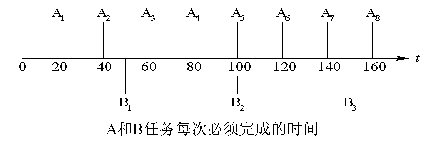

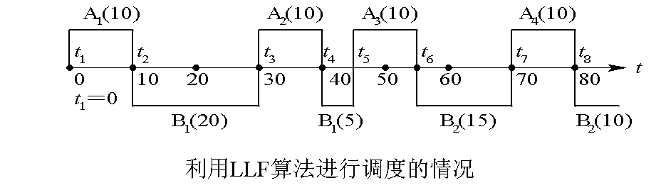这个图是错的，20s时应调度A2，55s时应调度A4


|t|描述|
|:--|:--|
|0|A1松弛度为`20-10=10`，B1为`50-25=25`，所以执行A1|
|10|B1松弛度为`50-25-10=15`，A2为`40-10-10=20`,执行B1|
|20|B1松弛度为`50-20-10=20`,A2为`40-20-10=10`所以执行A2|
|30|B1松弛度为`50-30-10=10`,A3松弛度为`60-30-10=20`,调度B1|
|40|B1松弛度为`50-40-5=5`,A3松弛度为`60-40-10=10`,所以执行B1|
|45|A3松弛度为5，A4松弛度为`80-45-10=25`,B2松弛度为`100-45-25=30`,执行A3|
|55|A4松弛度为15，B2松弛度为`100-55-25=20`,执行A4|
|65|B2松弛度为`100-65-25=10`,A5`100-65-10=15`|
|90|A5松弛度为0所以执行A5|

### 死锁

***定义***：在一组进程发生死锁的情况下，这组死锁进程中的每一个进程，都在等待另一个死锁进程所占有的资源。

##### 资源
**可重用性资源**：可供用户使用多次的资源
* 只能分配给一个进程
* 进程在使用时必须先请求，再使用，最后释放资源
* 数目固定，进程在运行期间既不可创建也不能删除

**临时性资源**(可消耗性资源)：进程在运行期间由进程动态的创建和消耗的资源
* 数目不断变化，有时也可能为0
* 进程在运行中可请求多个可消耗性资源，消耗后不再将它们返回该资源类

**可抢占性资源和不可抢占性资源**

#####引起死锁的原因
* 竞争不可抢占性资源
* 竞争可消耗性资源
* 进程推进顺序不当

##### 产生死锁的必要条件
* 互斥条件
* 请求和保持条件
* 不可抢占条件
* 循环等待条件

处理死锁的方法：*预防*、*避免*、*检测*、*解除*

#### 预防死锁
破坏必要条件中的其中一个，互斥不能变，所以破坏其他三个。

* *破坏请求和保持条件*：
1. 第一种协议：所有进程在开始运行之前，必须一次性地申请其在整个运行过程中所需的全部资源
2. 第二种协议：允许一个进程只获得运行初期所需的资源后，便开始运行。

* *破坏不可抢占条件*：当一个已经保持了某些不可被抢占资源的进程，提出新的资源请求而不能得到满足时，必须释放已经保持的所有资源。
* *破坏循环等待条件*：对系统所有资源类型进行线性排序，并赋予不同的序号。

#### 避免死锁
##### 银行家算法
***数据结构***
* 可利用资源向量Available
* 最大需求矩阵Max
* 分配矩阵Allocation
* 需求矩阵Need

算法思想：
>(1) 如果Request i[j]≤Need[i, j]，便转向步骤(2)； 否则认为出错，因为它所需要的资源数已超过它所宣布的最大值。　　
>(2) 如果Request i[j]≤Available[j]，便转向步骤(3)； 否则，表示尚无足够资源，Pi须等待。
>(3) 系统试探着把资源分配给进程Pi   　
>```
>Available[j]=Available[j] - Request i[j];　  　
>Allocation[i, j]=Allocation[i, j]+Request i[j]; 
>Need[i, j] = Need[i, j] - Request i[j];
>```
>系统执行安全性算法，检查此次资源分配后系统是否处于安全状态。若安全，才正式将资源分配给进程Pi，以完成本次分配；否则，将本次的试探分配作废，恢复原来的资源分配状态，让进程Pi等待。


##### 安全性算法
* 设置两个向量
	* 工作向量Work：系统可供给进程继续运行所需的各类资源数目
	* Finish：系统是否有足够的资源分配给进程

* 从进程集合中找满足下列条件的进程
	* `FINISH[i] = false;`
	* `Need[i][j]<=Work[i][j]`

* 当进程Pi获得资源执行完，释放出分配给它的资源
```
	Work[j] = Work[j]+Allocation[i][j];
	Finish[i]=true;
	go to step2; 
```

* 如果所有进程的`Finish[i]=true`都满足，则表示系统处于安全状态；否则，系统处于不安全状态。

[银行家算法C语言实现](https://github.com/Joki-memeda/MyLearning/blob/master/OS/banker.cpp)
