## 输入输出系统

***功能***

* 隐藏物理设备的细节
* 与设备的无关性
	* 使用逻辑名访问设备
	* 有效的提高OS的可移植性
* 提高CPU和I/O设备的利用率 `并行`
* 对I/O设备进行控制
* 确保对设备的正确共享
	* 独占设备
	* 共享设备
* 错误处理

***I/O系统的层次结构和模型***
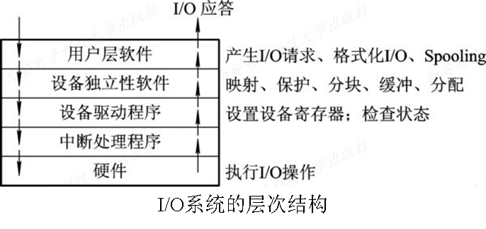

*I/O系统的分层*：

* 中断处理程序：I/O系统底层，直接与硬件交互
* 设备驱动程序：次底层，进程与设备控制器间的通信
* 设备独立性软件：I/O独立于具体使用的物理设备(与设备无关性)

***I/O设备***

* 存储设备：磁盘、硬盘等
* 输入输出设备：鼠标键盘、显示器等

按传输速率分类
* 低速设备：键盘、鼠标、语音输入输出等
* 中速设备：激光打印机等
* 高速设备：磁带机、光盘机等

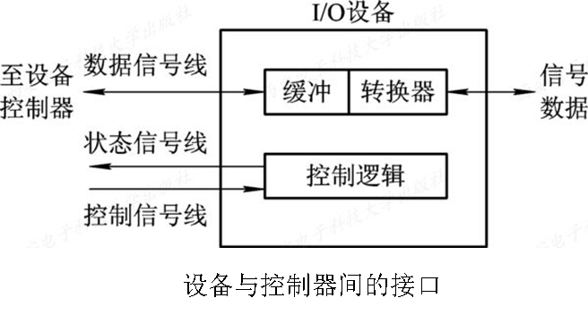

***设备控制器***

*功能*：
* 接受和识别命令：控制寄存器
* 数据交换：数据寄存器
* 表示和报告设备的状态：状态寄存器
* 地址识别：地址译码器
* 数据缓冲区：解决速度不匹配问题
* 差错控制

*组成*：
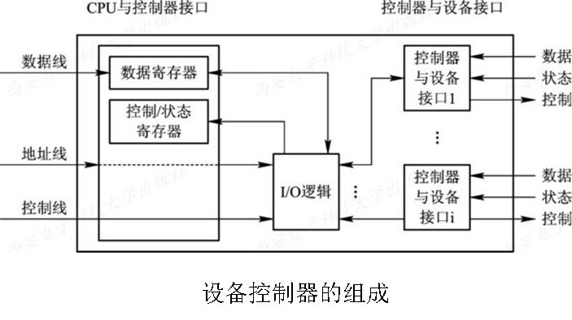

#### I/O通道
***定义***：为减轻CPU的负担，处理一些I/O任务。

CPU发送`通道指令`给通道，通道发出`中断`与CPU通信。

通道是一种`特殊的处理机`，可以执行I/O指令。

通道`没有自己的内存`，与CPU共享内存。

*类型*：因为外围设备类型较多传输速率相差非常大，所以有多种类型

* 字节多路通道：子通道按`时间片轮转方式`共享主通道，子通道完成`一个字节`的数据传输立即让出通道给别的子通道。适用于`低速设备`

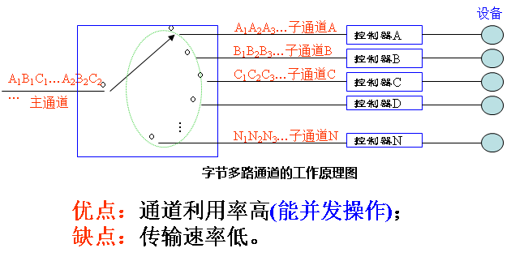

* 数组选择通道：一段时间内只能执行一道通道程序，数据传送方式按数组进行。`磁盘机、磁带机等`
* 数组多路通道：前两种结合。`并发` `利用率高、传输速率高` `硬件成本高`

***瓶颈***问题：通道贵所以少，成了I/O的瓶颈(最窄的地方)，造成系统吞吐量下降。

解决方法：增加通道与设备控制器间的通路。

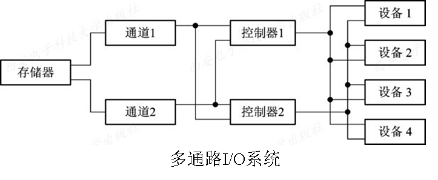

### 中断

***中断***：CPU对I/O设备发来的中断信号的一种相应。

***陷入***：CPU内部事件所引起的中断。

***中断向量表***：为每种设备配以相应中断处理程序，`程序入口`放在中断向量表的一个表项中，每个设备的中断请求规定一个`中断号`对应一个表项。

***中断优先级及CPU处理方式***

* 屏蔽中断：处理一个中断时屏蔽所有中断
*  嵌套中断
	*  多个不同优先级同时请求时，优先相应优先级最高的
	*  高优先级中断可以抢占正在运行的低优先级中断

***中断处理程序***

1. 测定是否有未响应的中断信号
2. 保护被中断进程的CPU环境
3. 转入相应的设备处理程序
4. 中断处理
5. 恢复CPU现场并退出中断

##### 设备驱动程序

*功能*

* 接受与设备无关的软件发来的命令和参数
* 检查I/O请求的合法性
* 发出I/O命令
* 及时响应由设备控制器发来的中断请求

*特点*

* 实现在与设备无关的软件和设备控制器之间通信和转换
* 与设备控制器以及I/O设备的硬件特性紧密相关
* 与I/O设备所采用的I/O控制方式紧密相关
* 其中一部分必须用汇编语言书写
* 驱动程序应允许可重入

***处理过程***

1. 把抽象要求转换为具体要求
2. 对服务请求进行校验
3. 读出和检查设备的状态
4. 传送必要参数
5. 启动I/O设备

***对I/O设备的控制方式***

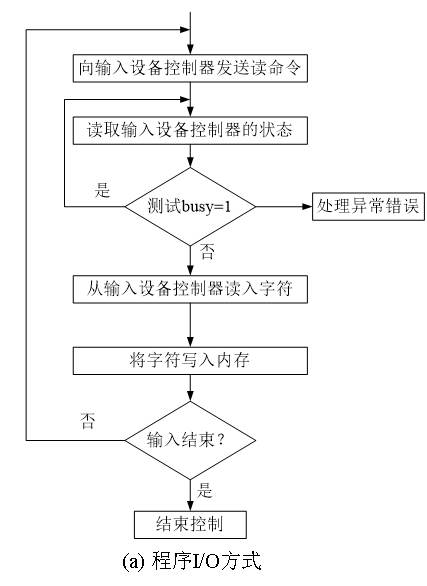
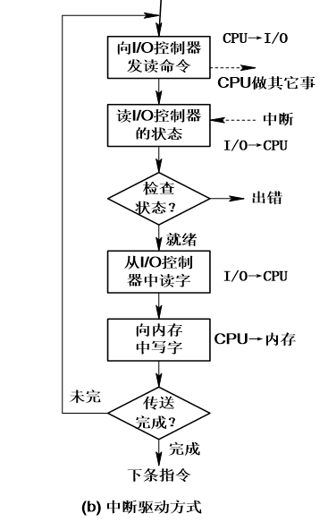

**直接存储器访问方式(Direct Memory Access)**

* 数据传输单位是`块`
* 所传送数据是`从设备直接送入内存`，或者相反
* 整块数据的传送在控制器的控制下完成

*组成*：主机与DMA控制器接口、DMA控制器与块设备接口、I/O控制逻辑

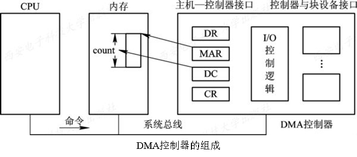

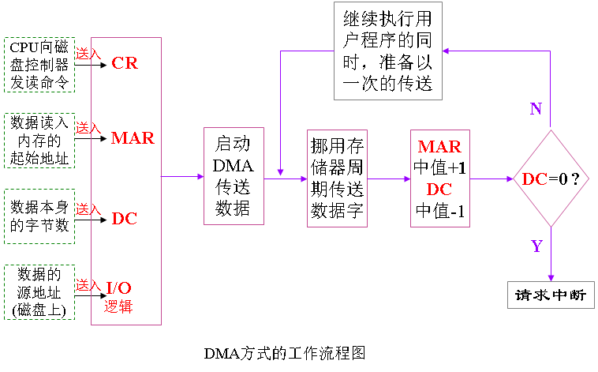

**I/O通道控制方式**：收到CPU发出的通道指令后，执行通道程序完成CPU指定的I/O任务。

通道程序：一系列通道指令构成。包含操作码、内存地址、计数、通道程序结束位、记录结束标志。

##### 与设备无关的I/O软件

***I/O重定向***：用于I/O操作的设备可以更换而不必改变应用程序

* 设备驱动程序的统一接口
* 缓冲管理
* 差错控制
* 对独立设备的分配与回收
* 独立于设备的逻辑数据块 

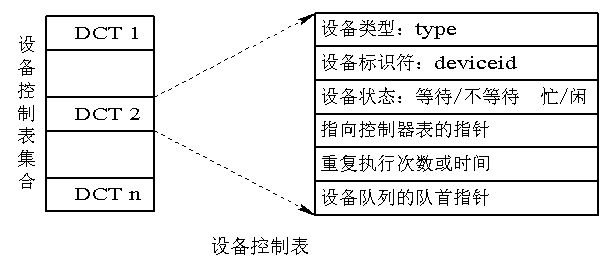

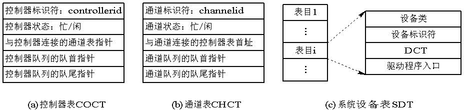

##### 用户层的I/O软件

***假脱机(Spooling)***

*概念*：将一台物理I/O设备`虚拟`为多台逻辑I/O设备。

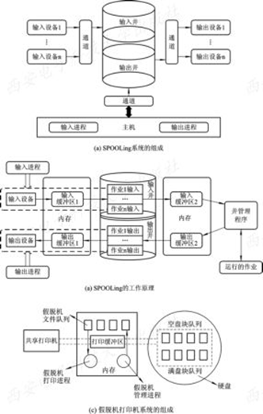

*组成*：

* 输入井和输出井：磁盘上开辟的两个存储区
* 输入缓冲区和输出缓冲区：内存上开辟的两个缓冲区
* 预输入进程和缓输出进程
* 井管理程序：控制作业与磁盘井之间信息的交换

*特点*：

* 提高了I/O速度
* 将独占设备改为共享设备
* 实现了虚拟设备功能

###缓冲区

***单缓冲区***
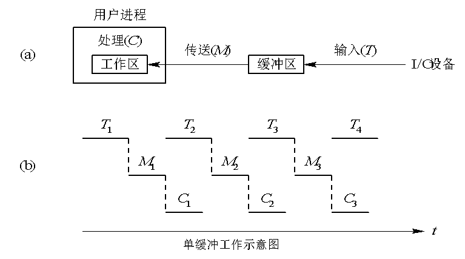
CPU和I/O设备串行工作，降低了CPU和I/O设备的利用率。
***双缓冲区***
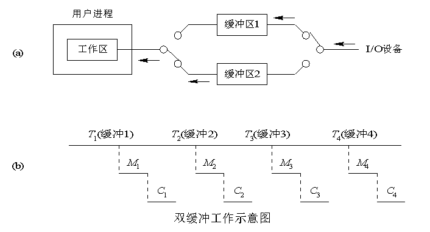
先送第一缓冲区，满了送第二缓冲区，这个时候可以把第一缓冲区中的数据送入用户进程让CPU进行计算。

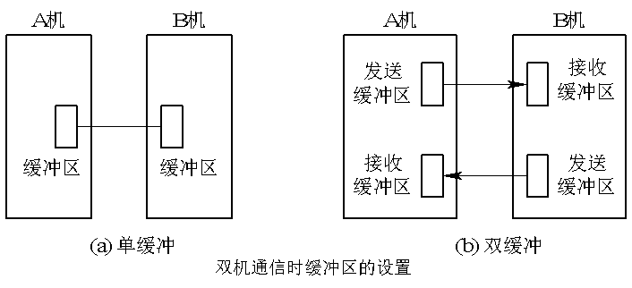

***环形缓冲区***

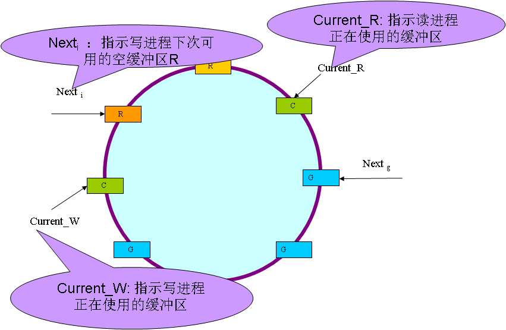
* R：装输入数据的空缓冲区
* G：已装满数据的缓冲区
* C：计算进程正在使用的工作缓冲区

*使用*：Getbuf使用缓冲区C中的数据。计算进程提取完数据后Releasebuf释放缓冲区C

***缓冲池***

缓冲区：一组内存块的链表
缓冲池：用于管理多个缓冲区

* 空缓冲队列emq。 
* 输入队列inq。 
* 输出队列outq。 

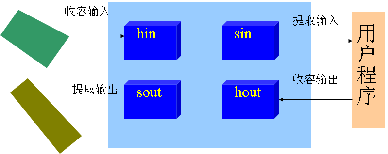

### 磁盘

*数据的组织格式*：磁盘设备包括一个或多个物理盘片，每个盘片有两个存储面，每个盘面上有若干个磁道，磁道间有必要的间隙。

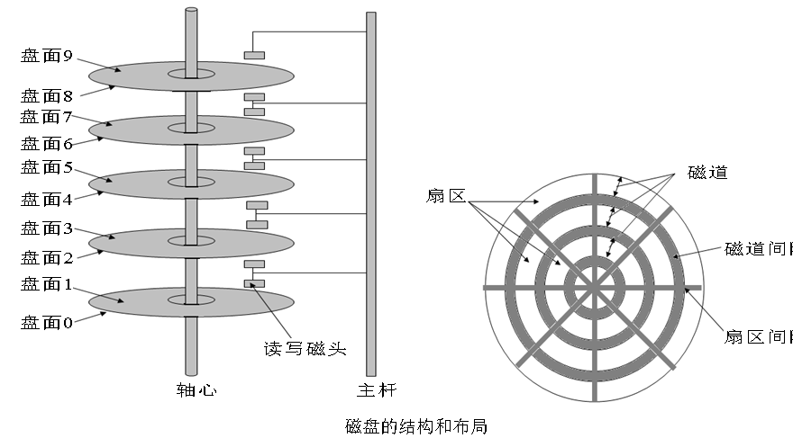

*类型*：固定头磁盘(主要用于大容量)、移动头磁盘(微机)

***磁盘访问时间***

磁盘工作时以恒定速率旋转，磁头必须能移动到指定磁道上。

* 寻道时间：磁头移动到指定磁道上的时间
* 旋转延迟时间：指定扇区移动到磁头下面的时间
* 传输时间：数据写入或读出经历的时间

#### 磁盘调度算法

***先来先服务***

***最短寻道时间优先***

***扫描算法***

***循环扫描算法***