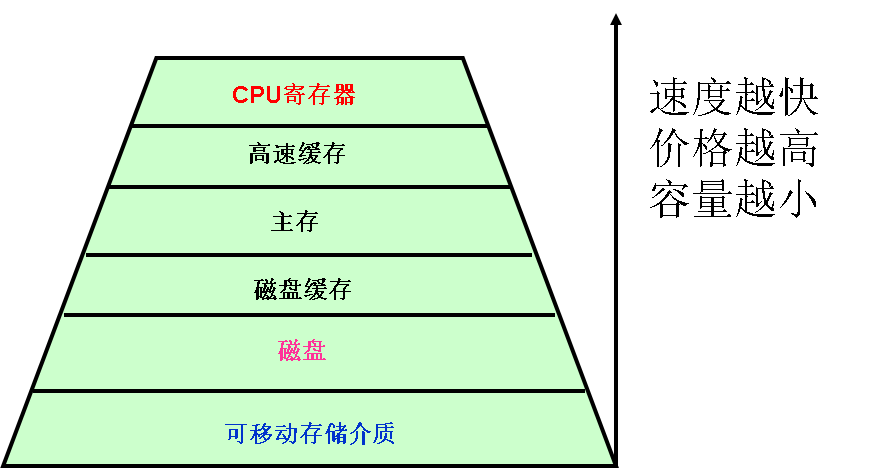
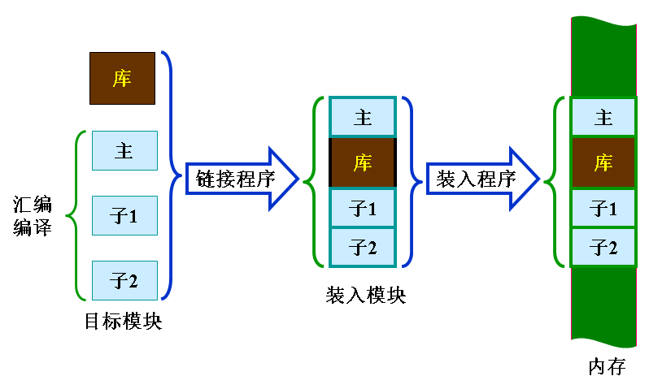
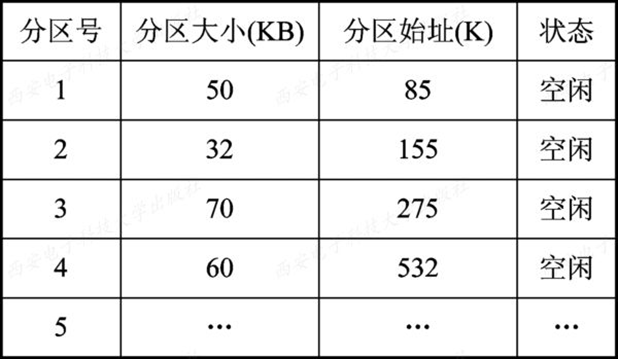
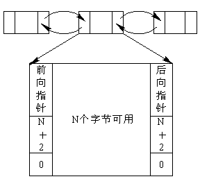
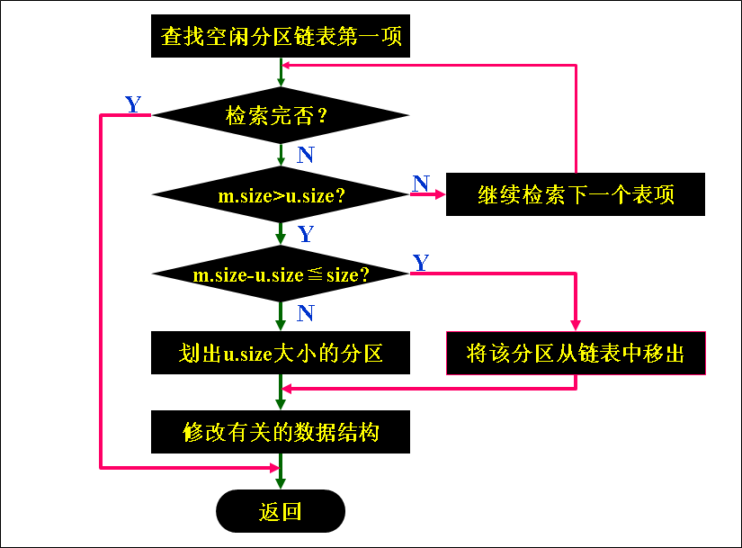
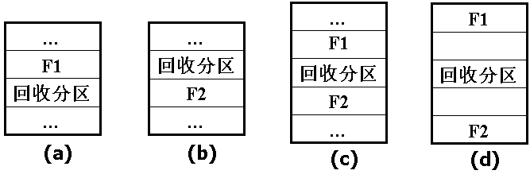
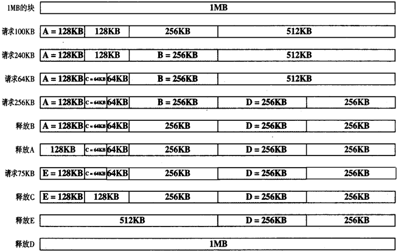
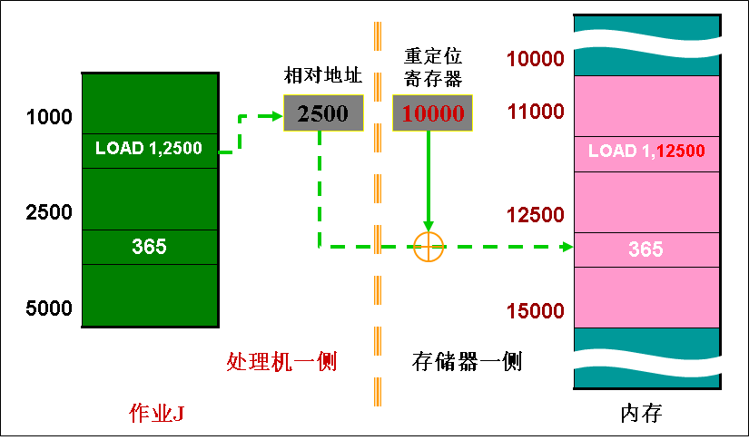
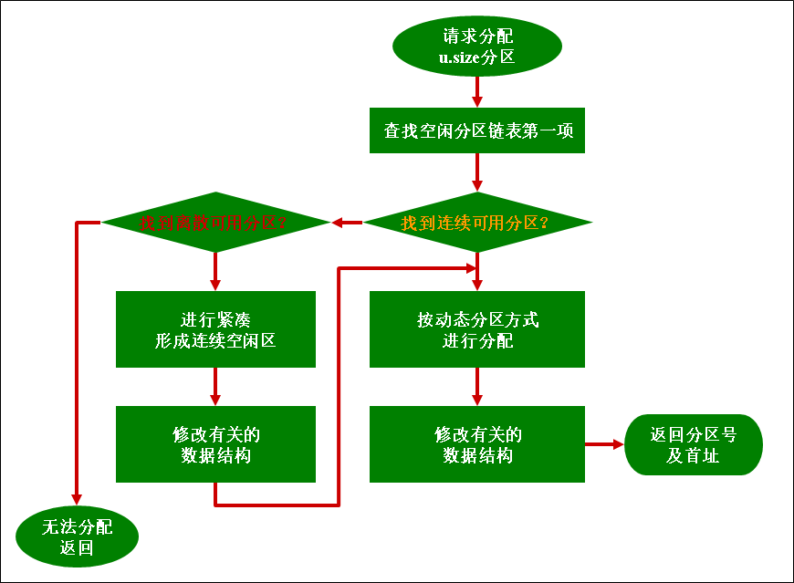

## 存储器管理篇

CPU寄存器/cache/主存/磁盘缓存：**可执行存储器**，信息掉电丢失。

磁盘/可移动存储介质：**辅存**，通过I/O设备实现对它的访问

***寄存器***

* CPU的组成部分，用来*暂存指令*、*数据*和*地址*。容量小，价格昂贵。
* 控制部件
	* 指令寄存器
	* 程序计数器
* 算数及逻辑部件
	* 累加器
* 通常以"字"为单位

***主存储器***：保存进程运行时的程序和数据。CPU直接与之通信。

***高速缓存(CACHE)***:解决**CPU与主存**速度不匹配。

* 一级Cache：紧靠内存，速度最快，容量最小
* 二级Cache：容量稍大速度稍低

***磁盘缓存***：解决**主存与辅存**速度不匹配，虚拟技术。

>将一段时间内常用的磁盘数据放在内存的某个区域；或将CPU处理完后需要输出的数据暂存于内存的某个区域。

#### 程序的装入和链接

***逻辑地址(相对地址)*** ：用户编程时会用的地址空间

从0开始编号(`地址` `段号:段内地址`)

***物理地址(绝对地址)*** ：实际的内存地址

***重定位***

*概念*：把程序装入内存时修改程序中所有与地址有关的项。`逻辑地址变换为物理地址`

*类型*

* 静态重定位：程序执行前一次性变化地址并装入内存
* 动态重定位：CPU每次访问内存时由*动态地址变化机制(硬件)*自动执行

##### 程序的装入

*方式*

* 绝对装入：装入程序直接按照装入模块中的地址把程序装到内存。逻辑地址与内存地址相同无需变化。`单道程序环境`
* 可重定位装入(静态重定位)：**装入内存时**进行地址转换。一旦程序装入内存，不允许在内存中移动。
* 动态运行时装入(动态重定位)：**程序执行时**进行地址转换。`重定位寄存器`

##### 程序的链接

把程序相关的`目标模块`和`系统调用模块(库函数)`链接成`装入模块`。

* 修改相对地址
* 变化外部调用符号

*方式*

* 静态链接方式：程序运行前
* 装入时动态链接：装入内存时边装入边链接
	* 便于修改、更新和共享
* 运行时动态链接
	* 加快装入过程，节省内存控件

#### 连续分配方式

##### 单一连续分配
内存分为*系统区*和*用户区*。系统区通常在低址部分，其他全是用户区。

* 只用于单用户单任务OS中。
* 无需存储保护

##### 固定分区分配

内存的用户空间划分为**若干个固定大小的区域**，每个分区只允许装入一道程序。

* 允许多个分区并发执行
* 当有空闲分区时从外存后备队列选择适当大小的作业进入内存

*划分分区的方法*：

* 分区大小相等：死板
* 分区大小不等：满足不同作业的需求

***内存分配***：
* 分区使用表

* 分区按大小排队
* 由内存分配程序检索分区使用表，找到合适的分区

##### ***动态分区分配***
根据进程大小动态分配内存空间。

* 已占用区和空闲分区并不绝对
* 必须用某种数据结构记录分区的情况
* 程序进入内存必须分配空闲分区、装入程序并修改相应数据结构
* 进程被装入时需要重定位

***数据结构***

* 空闲分区表

* 空闲分区链：双向链表

***分区分配操作***
1. 分配内存
	* m.size：空闲分区大小
	* u.size：请求的分区大小

2. 回收内存
	* 回收区*与插入点的前一个空闲分区相邻接*：合并，修改前一分区大小
	* *与插入点的后一个空闲分区相邻*接：合并，回收区首地址作为新空闲去首址，大小为`回收区+F2`
	* *与插入点的前后两个空闲分区相邻接*：三个合并，首址为前空闲分区首地址，大小为`F1+回收区大小+F2`
	* *不与任何一个相邻接*：增加新的表项

######  基于顺序搜索的动态分区分配算法

***首次适应算法***：从头开始找，第一个能找到的能放下的空闲分区，分割。

***循环首次适应算法***：从上次找到的空闲分区的下一个空闲分区开始查找，如果最后一个不能满足要求，返回到第一个空闲分区。

以上两种空闲分区都是按照*地址递增*的顺序排列

***最佳适应算法***：分区按照大小由小到大排列，找到第一次满足要求的空闲分区，分割。会导致碎片非常小，难以利用。

***最坏适应算法***：每次分配最大的空闲分区，分割后的空闲分区会比较大.

###### 基于索引搜索的动态分区分配算法

***快速适应算法***：又称分类搜索法，对每一类具有相同容量的所有空闲分区设立`空闲分区链表`，	同时在内存中设立一张`管理索引表`。

*算法思想*：根据进程长度找到能容纳它们的最小空闲区链表，分配第一块即可。

***伙伴系统***：系统总是为进程分配大小为2的i次方的一个空闲分区。

`内存空间需要不断地进行分裂和合并，频繁的伙伴分区合并操作会浪费很多时间。`

***Hash算法***：构造一张以空闲分区大小为关键字的哈希表，该表每一个表项记录了一个对应的空闲分区链表表头指针

##### 动态可重定位分区分配

***紧凑***：移动内存中的作业使他们相邻接，把分散的碎片合并在一起。

每次移动程序或数据都必须重定位，对地址加以修改。

***动态重定位***：内存中增加一个`重定位寄存器`，地址变换在程序执行期间进行。

当系统对内存进行"紧凑"时，只要用新的物理地址替换原来的起始地址就可以。

***动态重定位分区分配算法***：当该算法不能找到一个足够大的空闲分区满足进程需求时，如果所有碎片加起来容量总和大于需求，进行紧凑，分配紧凑后的分区。

##### 对换：挂起，中级调度

*概念*：把内存中暂时不能运行的进程或者暂时不用的程序和数据调出到外存上，腾出空间后，把已具备运行条件的进程或进程所需要的程序和数据调入内存。

*实现方法*：以进程为单位`滚进滚出`

#### 离散分配方式

##### 分页存储管理方式

##### 分段存储管理方式

