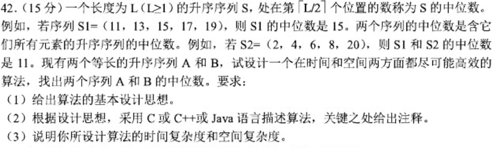
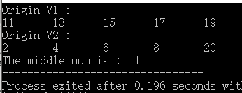
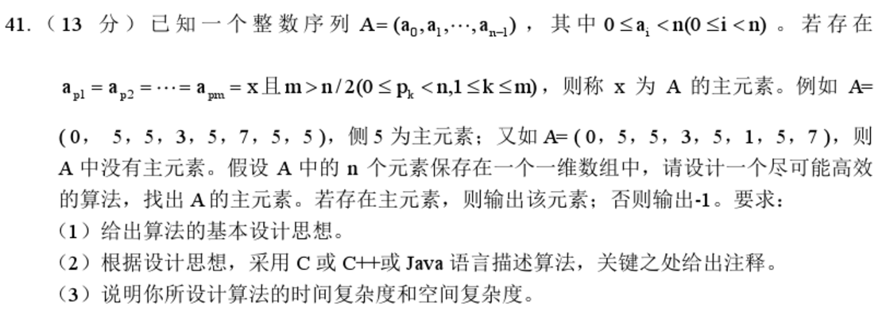

```c
typedef int ElemType;
//使用静态分配的方式创建一维数组：数组的大小和空间固定，一旦占满再加入新的数据会导致程序崩溃。 
typedef struct{
	ElemType data[MAXSIZE];
	int length;
}Vector;

/*算法思想：借助辅助数组v_temp存储原表的前p个元素，并把原顺序表中p之后的元素顺序前移，然后将v_temp中暂存的p个数的元素依次放回到原顺序表的后续单元。*/
Vector* CircleLeftMove(Vector *v , int p){
	Vector *v_temp = (Vector*)malloc(sizeof(Vector));
	v_temp->length =  p;
	int i;
	for(i = 0;i < v->length ;i++){
		v_temp->data[i] = v->data[i];
		v->data[i] = v->data[i+p];
	}
	for(i = 0 ; i < p ;i++){
		v->data[v->length - p + i] = v_temp->data[i];
	}
	return v;
}
/*时间复杂度：O(n) 空间复杂度：O(p)*/
```


解2

```c
/*算法思想：1. 把顺序表中的前p个元素逆序存储，
			2. 再把顺序表中的后length-p个元素逆序存储，
			3. 然后把整个顺序表逆序存储。
比如：v = 1 2 3 4 5 6 7 p = 3
	1. v = 3 2 1 4 5 6 7
	2. v = 3 2 1 7 6 5 4
	3. v = 4 5 6 7 1 2 3*/
Vector* Reverse(Vector *v , int from, int to){
	int i ; 
	ElemType temp ;
	for( i = 0 ; i < (to-from+1)/2 ; i++){
		temp = v->data[from+i];
		v->data[from+i] = v->data[to-i];
		v->data[to-i] = temp;
	}
	return v;
}

Vector* CircleLeftMove2(Vector *v , int p){
	Reverse(v,0,p-1);
	Reverse(v,p,v->length-1);
	Reverse(v,0,v->length-1);
}
/*时间复杂度：O(n) 空间复杂度：O(1)*/
```




```c
/*算法思想： 
		1.若v1.data[mid1] == v2.data[mid2]，则mid1和mid2即为所求中位数，立即返回。
		2.若v1.data[mid1] < v2.data[mid2]2，则序列1中比mid1还要小数必不可能为所求中位数，故舍弃序列1中较小的一半
						(若序列元素个数为奇数则舍弃中位数前的元素，若为偶数则舍去包括中位数在内的元素)，
						同理，这时也要舍弃序列2中较大的一半
						（两次舍弃的长度需相等，这样才能保证同升序且等长）。
		3.若v1.data[mid1] > v2.data[mid2], 则舍弃序列1中大于mid1的数，同时也要舍弃序列2中较小的一半
						(若序列元素个数为奇数则舍弃序列2中位数的元素，若为偶数则舍去包括中位数在内的元素)。
			直到逻辑上的序列只含一个元素时，较小者即为所求中位数。*/
int getMidByCompare(Vector v1,Vector v2){
	int num1 = 0,num2 = 0; //num结点始终指向序列中的第一个元素的下标 
	int end1 = v1.length - 1;
	int end2 = v2.length - 1;//end结点始终指向序列中的最后一个元素的下标 
	int mid1 , mid2;
	while(num1 != end1 || num2 != end2){
		mid1 = (num1 + end1)/2;//逻辑上的中位数下标 
		mid2 = (num2 + end2)/2;
		if(v1.data[mid1] == v2.data[mid2]){
			return v1.data[mid1];
		}
		if(v1.data[mid1] < v2.data[mid2]){
			if((num1+end1) %2 == 0){
				//v1的元素个数为奇数 
				num1 = mid1; //舍弃序列1中位数前的元素
				end2 = mid2;
			}else{
				num1 = mid1 + 1; //舍弃序列1中位数及中位数前的元素
				end2 = mid2;
			}
		}else{//序列1的中位数大于序列2的中位数 
			if((num2+end2)%2 == 0){
				end1 = mid1;//舍弃序列1中比中位数大的元素
				num2 = mid2; 
			}else{
				end1 = mid1;
				num2 = mid2+1; //舍弃序列2的中位数及比中位数小的元素 
			}
		}
	}
	return v1.data[num1] < v2.data[num2] ? v1.data[num1] : v2.data[num2];
}
/*时间复杂度：O(log2n) 空间复杂度：O(1)*/ 
```





```c
/*算法思想： 
		从数组的第一个元素开始遍历，为每个元素设置一个count值表示数组中该元素值的元素个数，
		和后面的元素比较，当值相等时，count+1，当某个元素的count值大于数组长度一半时立刻返回该元素的值。
		当某个元素的count值等于数组长度一半时立刻返回-1，因为必不可能存在其他的主元素。*/
int getMain(int a[],int length){
	int i,j;
	for(i = 0; a[i] <length;.i++){
		int count = 1;
		for( j = i+1; a[j] <length;j++){
			if(a[i] == a[j]){
				count++;			
			}
		}
		if(count > length/2){
				return a[i];
		}else if(count == length/2){
			return -1;
		}
	}
	return -1;
}
/*时间复杂度：O(n^2) 空间复杂度：O(1)*/ 
```

```c
/*其他解法：先排序再统计O(nlong2n)*/
/*最优解：标记一个可能成为主元素的元素。然后重新计算是否为主元素。
		1. 选取候选的主元素（数列中出现次数最多的元素）：
		依次扫描所给数组中的每个整数，将遇到的第一个元素保存到main中，
		记录该元素出现的次数为1；若遇到下一个整数仍等于main,则count+1，否则count-1。
		当count == 0时，将遇到的下一个整数保存到main中，count重新设置为1，开始新一轮计数。
		重复上述过程直到扫描完所有数组元素。
		2.判断main是否为真正的主元素：再次遍历数组，统计main元素出现的次数，
		如果大于数组长度一半则返回main否则返回-1.*/ 

int getMain(int a[],int length){
	int i, main , count = 1;
	main = a[0];
	for(i = 1;i < length;i++){
		if(a[i] == main){
			count++ ;
		}else{
			if(count>0){
				count--;
			}else{
				main = a[i];
				count = 1;
			}
		}
	}
	if(count > 0){
		for(i = count = 0;i<length;i++){
			if(a[i] == main){
				count++;
			}
		}
	}
	if(count > (length/2)){
		return main;
	}else return -1;
} 
/*时间复杂度：O(N),空间复杂度O(1)*/
```

---------------------

参考资料：《王道数据结构考研复习指导》