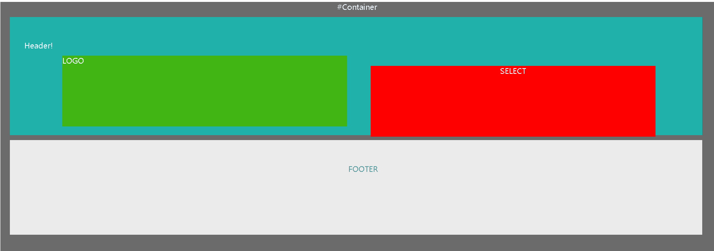
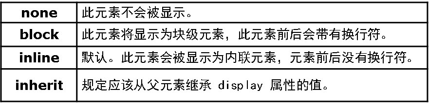
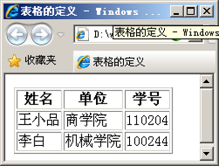
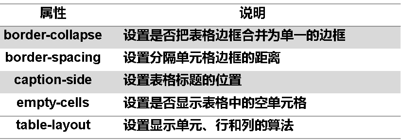

##CSS篇
> CSS（Cascading Style Sheet）层叠样式表，也称为级联样式表，用来设计网页风格。
      在网页制作时采用CSS技术，可以有效地对页面的布局、字体、颜色、背景和其他效果实现更加精确的控制。
      只要对相应的代码做一些简单的修改，就可以改变同一页面的不同部分，或者不同网页的外观和格式。

##### 基本语法
选择符Selector+  声明部分Declaration
```vbscript-html
<style type="text/css">
   /*  定义body样式  */
	body{background:black;color:red;}
	.div{padding:50px;}
	.pic{float:right;	padding:20px;}
</style>
```
##### 选择器
* 标记选择器——对HTML的标记重定义
```css
p,h1{font-size:30px;color:blue;font-family:黑体;}!
```
* 类选择器——以"."开头，可以任意命名。应用时生效。
```css
.div1,.file{background:red;color:white;}
```
* ID选择器——以"#"开头，可任意命名。
```css
#div1{background:red;color:white;}
```
* 伪选择器：最大的作用是对链接`<a>`的不同状态定义不同的效果
```css
a:link{color:#339999;text-decration:none;}
a:visited{color:#33cc00;text-decration:none}
a:hover{color:red;text-decration:underline;}
a:active{color:blue;text-decration:underline;}
```
>*ID选择器与类选择器的区别*
* 类选择器可以给任意多的标记定义样式，ID选择器只能使用一次
* ID选择器优先级大于类选择器

######CSS选择器声明
* 集体声明 
```css
h1,h2,h1,h2,h3,h4,h5,h6,p,h2.special,#one{
     color:red;font-family:黑体;}
```
* 全局声明
```css
*{color:purple;font-size:16px;
     margin:0 auto;padding:0;}
```
* 派生选择符
```css
li strong{ font-style:italic; font-weight:normal;}
      strong{font-weight:bold;}
```
###### CSS定义与引用
* 内联样式（行内样式表）
`<标记 style="属性: 属性值; 属性: 属性值;…">`
* 内部样式表
```html
<head>
<style type="text/css">
     <!--
.div1,.div3{background:#99ffff;width:200px;height:100px;}   
#div2{background:#00cc00;width:200px;height:100px;}
p,h1{font-size:18px; color:#003366;}
      -->
 </style>  </head>
```
* 导入外部样式表
```html
<style type="text/css">
  @import url("外部样式表的文件名称");
  p,p1{font-size:18px; color:blue}
</style>
```
注：`@import应放在style元素最前面`
`import语句后面一定要加;`

* 链接外部样式表
```html
<link type="text/css" rel="stylesheet" href="外部样式表的文件名称"/ >
```
注：`<link>标记放在头部，不适用style标记`
`外部样式表优先级低于内部样式表`
`同时链接几个外部样式表时按"最近优先原则"`

##### CSS继承与层叠
*继承*：子标签继承父标签的样式
```html
div{color:blue;font-weight:bold;}
   <div>
     <p>  继承标记div的样式</p>
   </div>
```
*优先级*：行内样式>ID样式>类样式>标记样式

##### DIV
*定义*：块级元素。前后均有换行符，可定义文档中的分区或节。
|属性|值|描述|
|:---|:---|:---|
|position|`static/absoulute/relative/fixed`|定位|
|width/height| |div宽度/高度|
|border|`粗细 形状 颜色`|边框|
|z-index|`值越大越在上层`|图层层叠|
|clear|`left/right/both/none`|清楚浮动及允许浮动|
|float|`left/right/none`|允许左、右、不浮动|

###### DIV嵌套的一个实例
```html
<!doctype html>
<html>
<head>
<meta charset="utf-8">
<title>DIV布局-1507084212赵琦</title>
<style type="text/css">
	html,body{height: 100%}
	#container{background:#6B6B6B;
	text-align:center;
	color:aliceblue;
	z-index: 0;
	height: 100%;
	width:100%;}
	#header{background: #20b2aa;
	z-index: 1;
	margin-left: 20px;
	margin-right: 20px;
	margin-top: 10px;
	text-align: left;
	color: aliceblue;
	width: 95%;
	height:200px;
	padding-left: 30px;
	padding-top:50px;}
	#logo{background: #40b513;
	z-index: 2;
	margin-left: 80px;
	margin-top: 10px;
	margin-bottom: 10px;
	margin-right: 30px;
	height: 150px;
	width: 600px;}
	#select{background: #FF0000;
	z-index: 2;
	text-align: center;
	margin-left: 650px;
	margin-bottom: 10px;
	margin-right: 30px;
	height: 150px;
	width: 600px; */}
	#footer{
		background: #EBEBEB;
		color: cadetblue;
		z-index: 1;
		width: 95%;
		height: 150px;
		padding-left: 30px;
	padding-top:50px;
		margin-left: 20px;
	margin-right: 20px;
	margin-top: 10px;
	}
	</style>
</head>
<div id="container" class="">
#Container
	<div id="header" class="">
	Header!
		<div id="logo" class="">
		LOGO
			<div id="select" class="">SELECT</div>
		</div>
	</div>
	<div id="footer" class="">
		FOOTER
	</div>
</div>
<body>
</body>
</html>
```

##### SPAN——行内元素
`<span id="" class="" >行内内容</span>`
> DIV与SPAN的区别
>*  span为一行，div是一块
> * div可包含span，span不可包含div
> * div和span可通过display属性相互转化

*display*：规定元素应该生成的显示框的类型。
`使用不慎可能违反HTML中已经定义的显示层次结构`

```css
<style type="text/css">
p {display: inline} /* 块级元素转为行内元素 */
div {display: none}  /* 隐藏图层  */
</style>
```

#####表格
```html
<body>
<table border="1">
    <caption>插入表格标题</caption>
 <tr>每行
      <th >姓名</th>表头
    <th >单位</th>
    <th>学号</th>
  </tr>
  <tr>
      <td>王小品</td>
    <td>商学院</td>单元格
    <td>110204</td>
  </tr>
```

表格结构：`<thead><tbody><tfoot>`
单元格跨行/列：`rowspan\colspan`

##### 框架
可以将浏览器分割成多个小窗口，在每个小窗口可以显示不同网页。
```<html>
    <head></head>
    <frameset rows=“20%,60%,*” cols=“，”>
	<frame src="http://www.163.com"  >
	<frame src="http://www.sina.com.cn" >
           ……
    </frameset>
</html>
```
##### 表单
>利用表单可以在HTML页面中插入一些表单控件(元素)，如文本框、提交按钮、重置按钮、单选按钮、复选框、下拉列表框等，完成各类信息的采集。
```
<form method="post" action="">
     <input type="text" name="">
     <textarea name="" rows="" cols=""></textarea>
      <select name="">
        <option value="" selected> </option >
    </select>
</form>
```
*fieldset*：域和域标题，使用此标签可对表单元素进行合理分组
```html
<fieldset>
<legend align="center">基本信息</legend>
姓名: <input name="name" type="text">
性别: <input name="sex" type="text">
</fieldset>
```