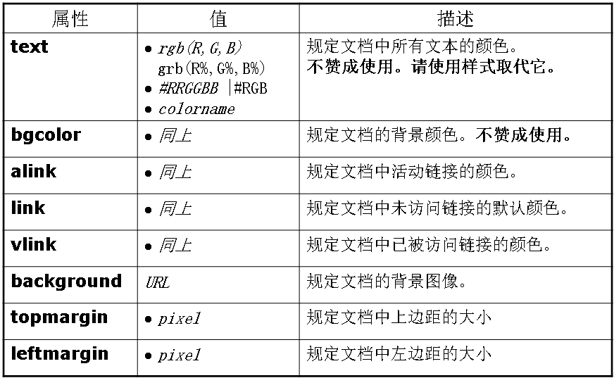
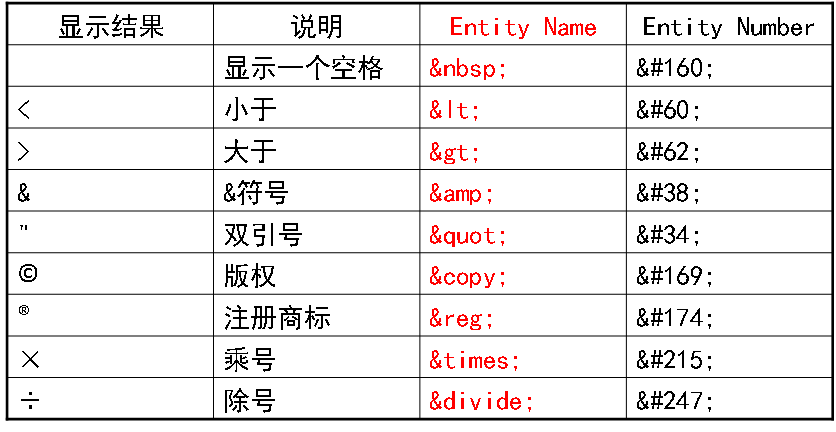
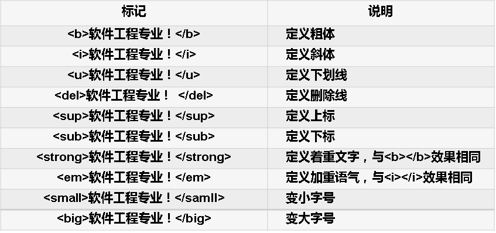

## HTML
#### 基本结构
由head和body两个部分组成。<head>中可定义标题、元信息、样式等；<body>中可定义段落、标题字、超链接、脚本、表格、表单等元素，主体内容是网页要显示的信息。
```html
<html>
	<head></head>
	<body></body>
</html>
```

*页面标题* `<title>Hello</title>`
*元信息*：描述一个HTML网页文档的属性。例如作者、日期和时间、关键词、页面刷新等。
```html
<meta name="" content="">
<meta http-equiv="" content="">
```
**`name` 与`content`**属性用于描述网页，便于搜索引擎机器人查找分类。
**`http-equiv`与`content`**用于提供HTTP协议的响应头报文，通常为页面加载前提供给浏览器等设备使用。

| 属性 | 值 | 描述 |
|:------|---:-|---:-|
|http-equiv|content-type|提供编码信息|
||refresh|刷新与跳转页面|
||no-cache|页面缓存|
||expires|网页缓存过气时间
|name|description|网页简短描述|
||keywords|网页关键词|
||generator|定义编辑器|
|scheme||用于翻译content属性值的格式|

*主体body* 
```htmlbars
<body
leftmargin="50px" topmargin="50px"    text="#000000" bgcolor="#339999"  
link="blue" alink="white" vlink="red"
background="body_image.jpg">
```



#### 语法
* 单个标签`<标记名称>`或`<标记名称/>` 常用：`<br>换行` `<hr>水平分割线`
* 成对标记 `<标记名称>内容</标记名称>`
* 注释
```html
.<comment> </comment>!
<!-- 注释信息 -->
```
*标题字* `<h1>-<h6>`
*空格* ：通过代码控制来添加`&nbsp;`
*特殊字符*

*常见文本修饰*

*字体*
`<font face="字体1,字体2" size="-7~+7" color=""></font>`
*段落*会自动在其前后创建一些空白
`<p align=""> </p>`
~~*居中显示*`<center>居中显示的内容</center>`~~
*预格式化标记* `<pre></pre>`浏览器完整保留设计者在源文件中所定义的格式。

##### 列表
|列表类型|标记符号|
|:----------|---:----|
|无序列表|`<ul></ul>`|
|有序列表|`<ol></ol>`|
|定义列表|`<dl></dl>`|
|~~菜单列表~~|~~`<menu></menu>`~~|
|~~目录列表~~|~~`<dir></dir>`~~|

*无序列表(Unordered List)*

```html
 <ul type=“disc | circle | square"> 
		<li type="">项目名称</li> 
    	<li type="">项目名称</li> 
		<li type="">项目名称</li> 
</ul> 
<!--disc - ●； circle -○； square -■>
```
*有序列表(Ordered List)*
```html
<ol type=“1|A|a|I|i" start=“n"> 
	<li type=""  value="n">项目名称</li> 
    <li type=""  value="n">项目名称</li> 
    <li type=""  value="n">项目名称</li> 
</ol>
```
*定义列表(Definition List)*
```HTML
<dl>
	<dt>项目1</dt> 
       <dd>说明1</dd> 
       <dd>说明2</dd> 
</dl>
```
##### 超链接
*超链接*：从网页指向一个目标的连接关系。目标可以是文件、链接、电子邮件、页面的不同位置。
`<a href=“url” name=“” title=“提示信息” target=“窗口名称”>超链接标题</a>`
*路径* 
* 绝对路径：文件的完整路径
* 相对路径：相对于当前文件的路径
* 根路径：从网站的最底层开始起

##### 多媒体
*图片*
 ``
*文字滚动*
`<marquee>滚动内容</marquee>`
|属性|值|描述|
|:---|:--|:------------:|
|direction|`up/down/left`|滚动方向|
|behavior|`scroll/slide/alternate`|滚动方式|
|scrollamount|sp|滚动文字每次移动的长度|
|scrolldelay|ms|延迟时间|
*背景音乐*
`<bgsound src="背景音乐地址" loop="播放次数">`
    infinite和-1表示无限次数
*其他多媒体文件*
`<embed src="URL" width="" height="" autostart="true|false" loop="true|false"></embed>`