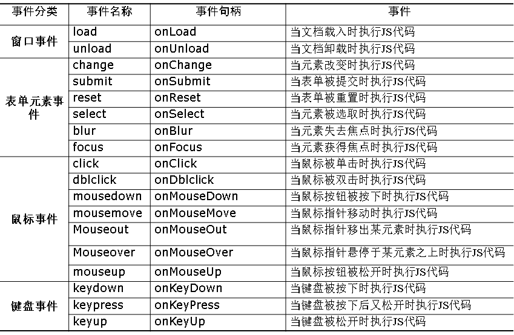
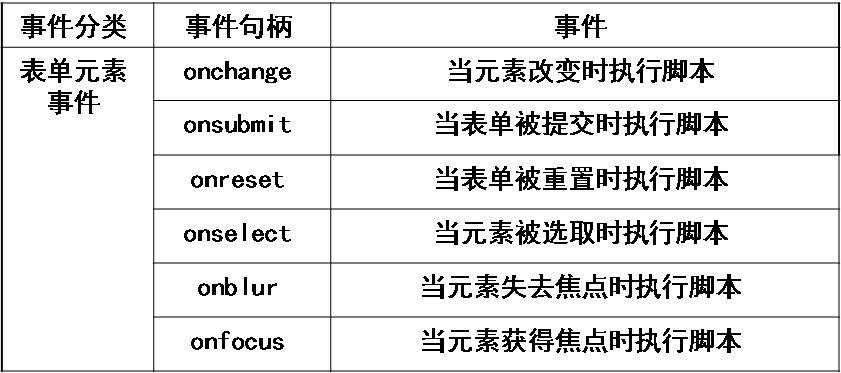
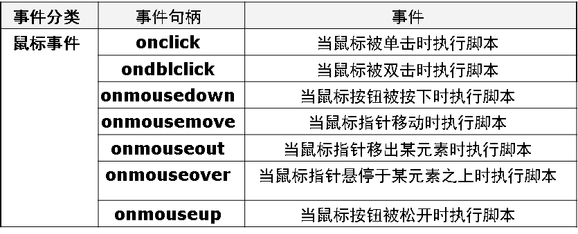
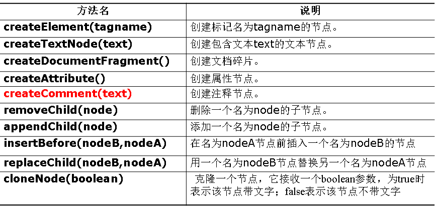
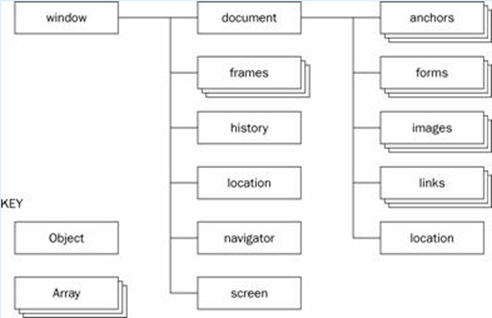

##JavaScript篇
#### 概述
>JavaScript是一种基于对象和事件驱动、安全性、轻量级、解释型、弱类型的客户端脚本语言。 决定WEB页面的行为，具有客户端数据验证、用户交互等功能

*特点*：
* 简单性：小程序、无需编译、解释性、弱数据类型
* 安全性：浏览器无法访问本次硬盘数据
* 动态性：JS可直接对用户提交的信息作出回应
* 跨平台性
`js代码不能独立存在，只能依附于HTML代码`
```javascript
<body>
	<script type="text/javascript">
	document.write("第一个JavaScript实例!");
       </script>		
   </body>
```

*JS代码放置位置*：
* 头部：JS脚本插入在头部时，JavaScript通常需要定义为函数格式
	* `function 函数名(参数1,参数2,…，参数n){函数体语句;}`
* 主体：JS脚本在主体时，可被立即执行。
* 单独的js文件：此时在`< script ></script >`标记之间的所有JS语句都被忽略，不会执行。
	* `<script type=“text/javascript src=“外部JS文件”></script>`

* 直接在事件处理代码中
	* `<input type="button" onclick="alert('直接在事件处理代码中加入JavaScript代码')" value="直接调用JavaScript代码">`
*警告框*：alert()
*确认框*：confirm()
*提示框*：prompt()

------中间很长是基础知识----


#### 事件处理
* 静态：一个标记可以同时指定多个事件处理程序，事件处理程序既可以是`<script>`标记中的自定义函数，还可以直接将事件处理代码写在此位置。
	* ` <input type="button" value="直接通过JS语句输出信息"  onclick="alert('单击按钮，直接输出信息')">`<input type="button" value="直接通过JS语句输出信息"  onclick="alert('单击按钮，直接输出信息')">
* 动态指定：时间处理程序在JS中动态指定 
	* `<input id=“input” type=“button” name=“mybutton" value="提交" > document.getElementById(‘input’).onclick=function(){return clickHandler();}  //动态分配一个事件句柄`
#### 事件
*表单事件*

*鼠标事件*

### 对象
* 本地对象：独立于宿主环境的ECMA-262定义的类（引用类型）
	* Object、Founction、Array、String等
* 内置对象：由ECMAScript实现提供的、不依赖于宿主环境的对象，在ECMAScript运行之前就已经创建好的对象
	* Global和Math。使用时Math.Random()
* 宿主对象：ECMASCRIPT实现的宿主环境提供的对象。所有的BOM和DOM对象都是宿主对象
	* document、window、frames等
* 自定义对象
### DOM
*HTML DOM规范*
* 整个文档是一个文档节点
* 每个HTML标签是一个元素节点(Element Node)
* 包含在HTML元素中的文本是文本节点(Text Node)
* 每一个HTML属性是一个属性节点(Attribute Node)
* 注释为注释结点

###BOM
>客户端浏览器这些预定义的对象统称为浏览器对象，它们按照某种层次组织起来的模型统称为浏览器对象模型（BOM-Browser Object Model）。浏览器对象模型 (BOM) 使 JavaScript 有能力与浏览器“对话”。

