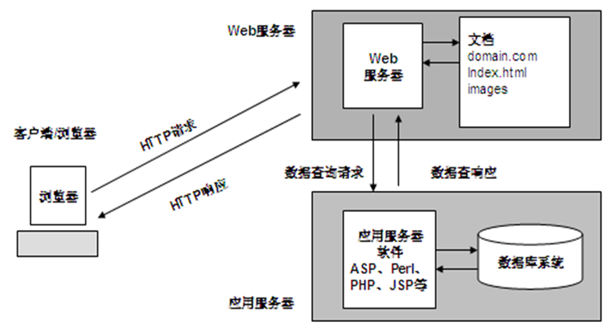
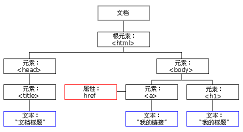

##WEB前端复习笔记

*WEB的特点*
* 易导航和图形化
* 平台无关性
* 分布式结构
* 动态性
* 交互性

*WEB工作原理*

##### 静态网页
>纯粹HTML格式的网页通常被成为静态网页。是指没有后台数据库、不含程序和不可交互的网页。

* 每个静态网页都有一个固定的URL，文件扩展名为`.html` `.htm`，不含有“？”
* 静态网页是实实在在保存在服务器上的文件
* 内容相对稳定，容易被搜索引擎检查
* 无需连接数据库，开启页面速度快，功能也相对局限

##### 动态网页
> 结合了HTML以外的高级程序设计语言和数据库技术进行的网页编程技术生成的网页，实现了网站内容和风格的高校、动态和交互式管理。

* 一般以数据库技术为基础
* 并不是独立存在于服务器上的网页文件，只有当用户请求时服务器才返回一个完整的网页。
* 搜索引擎不抓取“？”后的内容
#### html
>HTML是SGML(Standard Generalized Markup Language,标准通用标记语言)下的一个子集，也是一种标准规范，通过标记符号来标记显示的网页中的各个部分。
>html是构成web页面的基础。

*URL*
统一资源定位符（Uniform Resource Locator)，网页地址，因特网上标准的资源的地址
`协议类型://服务器地址(端口号)/路径/文件名`
`http://info.cern.ch/www20/0002`

| 协议类型 | 含义|
|-----:| :------------:|
| http  |超文本传输协议|
|https|加密传送的超文本传输协议|
|ftp|文件传输协议|
|mailto|电子邮件地址|
|ldap|轻型目录访问协议搜索|
|news|Usenet新闻组|
|file|当地电脑或网上分享的文件|
|gopher|Internet查找协议|

*WEB网站*：Internet上提供Web访问服务的站点。必须为Web服务器配置ip地址和域名才能对外提供web服务。
*Hyper Link*：超链接是指从一个网页指向另一个目标的连接关系，这个目标可是网页也可以是相同网页上的不同位置。
`<a href="http://baike.baidu.com">百科</a>`<a href="http://baike.baidu.com">百科</a>

#### CSS
> 层叠样式表(Cascading Style Sheet)。可以有效地对页面布局、字体、颜色、背景和其他效果实现更加精确的控制。

#### JAVAScript
>使网页和用户之间实现一种实时性的、动态的、交互性的关系，是一种由LiveScript发展而来的客户端脚本语言。

*组成*
* 核心（ECMAScript）
* 文档对象模型（DOM：`Document Object Model`）
* 浏览器对象模型（BOM:`Browser Object Model`）
##### DOM

> 文档对象模型 （DOM） 是中立于平台和语言的接口，它允许程序和脚本动态地访问和更新文档的内容、结构和样式。

##### BOM
>浏览器对象模型定义了JavaScript可以进行操作的浏览器的各个功能部件的接口，提供访问文档各个功能部件（如窗口本身、屏幕功能部件、浏览历史记录等）的途径以及操作方法。

#### 其他
*AJAX*：浏览器与Web服务器之间使用异步数据传输，可以使网页从服务器请求少量信息而不是整个页面。
*JQuery*；跨浏览器的JS库，简化HTML与JS之间的操作。